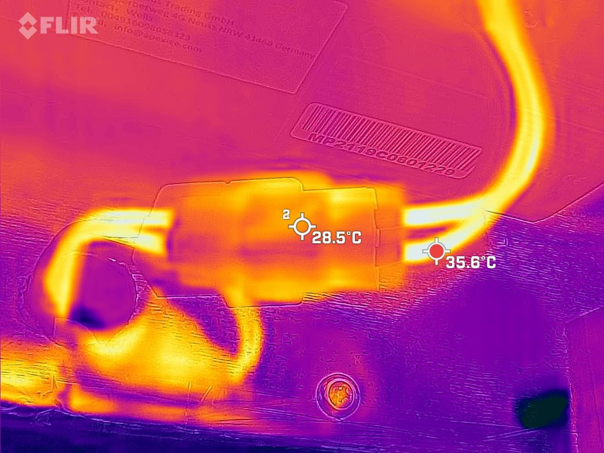

# ANYCUBIC Mega Pro improvements

## Enclosure

For increase quality of printed details, avoids [warping](https://all3dp.com/2/3d-print-warping-what-it-is-how-to-fix-it/) (which almost always happening if printing without enclosure with filaments like "polycarbonate"), decrease smell in room from filament during printing and for some other benefits I decided to make enclosure for "ANYCUBIC Mega Pro" 3d printer.

I found [tutorial how create enclosure based on Ikea Lack tables](https://all3dp.com/2/ikea-3d-printer-enclosure-tutorial/) and as base tutorial I used "[Two door enclosure for Anycubic i3 mega with Ikea Lack tables](https://www.thingiverse.com/thing:2978880)" and most details I took from here. But instead of using plexiglass for all 4 walls I used it only for front door and for rest 3 walls I used 30 gauge galvanized steel sheets. This allowed me made almost fully isolated enclosure (only front door was made from plexiglass which has very small air gaps) which also well fire-resistant compare to version where all walls made from plexiglass. Also, due to use metal sheets for walls this enclosure has more space and as result I don't need separate filament holder as it has enough space for using native holder.

I used 3 [Ikea Lack tables](https://www.ikea.com/us/en/p/lack-side-table-white-30449908/) which allowed me keep in one place all related to 3d printing stuff. For covering 3 sides, 1 top and 1 bottom walls I was needed 3 x [24in x 3ft 30 gauge galvanized steel sheets](https://www.lowes.com/pd/IMPERIAL-24-in-x-3-ft-Galvanized-Steel-Sheet-Metal/3234805) and I used it on 99.9%. Remnants of metal I used for covering bottom of the middle Ikea table which is used for Power Supply and will be used for other electronical components in future (like Raspberry Pi, Arduinos, etc) which will control temperature, motion and other sensors, camera, lights, etc.

But, then I decided to buy one more steel sheet and cover top of the middle table to have everything inside enclosure from metal (except door), see photos below.

Most of tools which I used during assembling this enclosure on that photo:

But few more words about "acrylic cutter". With cutter which on photo it's very hard to cut big plexiglass sheets as big risk to broke it. Therefore, I bought [Oscillating Tool (also known as multi tool)](https://www.amazon.com/dp/B088GWJYV9?psc=1&ref=ppx_yo2ov_dt_b_product_details) and with "Segment Saw Blade" it was very easy to cut it.

For laying cables between middle and top tables I used "Screw Grommet" with 22mm diameter (to be able to pave USB cable in case if I'll decide to use [OctoPrint](https://all3dp.com/topic/Octoprint/)) and filled the hole by [3M Fire Barrier](https://www.amazon.com/gp/product/B002FYAMPM/ref=ppx_yo_dt_b_search_asin_title?ie=UTF8&psc=1).

For connecting printer with Power Supply I used wire 14 AWG.

### Materials

- 3 x [Ikea Lack tables](https://www.ikea.com/us/en/p/lack-side-table-white-30449908/)
- 4 x [24in x 3ft 30 gauge galvanized steel sheets](https://www.lowes.com/pd/IMPERIAL-24-in-x-3-ft-Galvanized-Steel-Sheet-Metal/3234805)
- 1 x [OPTIX 0.08-in T x 18-in W x 24-in L Clear Sheet](https://www.lowes.com/pd/OPTIX-0-08-in-T-x-18-in-W-x-24-in-L-Clear-Acrylic-Sheet/3143523)
- 1 x [Nashua 322 Silver Duct Tape 1.89-in x 50.3 Yard(S)](https://www.lowes.com/pd/Nashua-322-1-89-in-x-50-3-yd-Silver-Heavy-Duty-Duct-Tape/1002867284)
- 4 x M3x16 screws with nuts (for Hinge Brackets)
- #2 phillips 6x1" screws (see photo below)
- #2 phillips 3/4" screws (see photo below)
- 1 x Simpson Strong-Tie 16-in 20-Gauge Galvanized Steel Foundation Strap (for mounting Power Supply to the bottom of the middle table)
- 1 x [4 Outlet Mountable Power Strip with Switch](https://www.amazon.com/dp/B07XXLPNJ7?ref=ppx_yo2ov_dt_b_product_details&th=1)
- 1 x [Bergen Industries Inc PS313163 3-Wire Appliance and Power Tool Cord, 3 ft, 16 AWG, 13A/125V AC, 1625w,Black](https://www.amazon.com/dp/B07BQCMPF2?psc=1&ref=ppx_yo2ov_dt_b_product_details)

### Dimensions

- 3 x walls (from steel sheets): 54.5cm x 54.5cm
- 1 x door (from acrylic sheet): 44cm x 49.6cm

**Note:** These dimensions are approximate for understanding the size of enclosure. For real use them should be measured based on real built enclosure.

### Printed details

- 1 x Base Front Right
- 2 x Base_Rear and 1 x Base Front_Left
- 1 x Door Handle
- 1 x Door Stop
- 2 x Hinge Bracket
- 1 x Hinge Front Left Bottom and Rear Right Top
- 1 x Hinge Front Left Top and Rear Right Bottom
- 1 x Leg Extension Front_ Left
- 1 x Leg Extension Front Right
- 2 x Leg Extension Rear
- 1 x Screw Grommet 22mm (for laying cables between middle and top tables)
- 4 x Bottom Table Leg Mount

Designed in "Autodesk Fusion 360". Files (Cura, f3d and stl) in [files](files/) directory. It took ~1 week for printing (if printing during the day by 5-8 hours) and will use at least ~75% of filament.

For almost all details I used [Overture PETG filament](https://www.amazon.com/dp/B07PDV9RC8?ref=ppx_yo2ov_dt_b_product_details&th=1). Exception was for "Screw Grommet" and "Door Handle" which I concidered should be more safe (more fire resistent), therefore, for them I used [Polymaker PolyMax PC-FR (Flame Retardant Polycarbonate) filament](https://www.amazon.com/gp/product/B07YDY6SX2/ref=ppx_yo_dt_b_search_asin_title?ie=UTF8&th=1) with which I printed with this enclosure and in result I had printed details without any warping.

#### Print settings

| Parameter | Overture PETG | PolyMax PC-FR |
| --- | --- | --- |
| Layer Height | 0.2 mm | 0.1 mm |
| Initial Layer Height | 0.3 mm | 0.2 mm |
| Infill | 25% | 50% |
| Infill Pattern | Grid | Grid |
| Printing Temperature | 235 °C | 260 °C |
| Build Plate Temperature | 80 °C | 100 °C |
| Print Speed | 45 mm/s | 30 mm/s |
| Intitial Layer Speed | 20 mm/s | 20 mm/s |
| Travel | Enable Retraction | Enable Retraction |
| Retraction distance | 6 mm | 4 mm |
| Retraction speed | 40 mm/s | 35 mm/s |
| Combing Mode | Not in Skin | Off |
| Cooling | Enable Print Cooling | Disabled |
| Fan Speed | 50% | - |
| Initial Fan Speed | 0% | - |
| Support | - | Generate Support (only for "Door Handle") |
| Support Placement | - | Everywhere |
| Support Overhang Angle | - | 63° |
| Build Plate Adhesion Type | "Brim" (for big/thick details), for other - "None" | Brim |
| Brim width | 6 mm | 8 mm |

### Photos

## ToDo

- [OctoPrint](https://all3dp.com/topic/Octoprint/)
- LED Lights
- Internal and external thermometers
- Other sensors like smoke, motion, etc.
