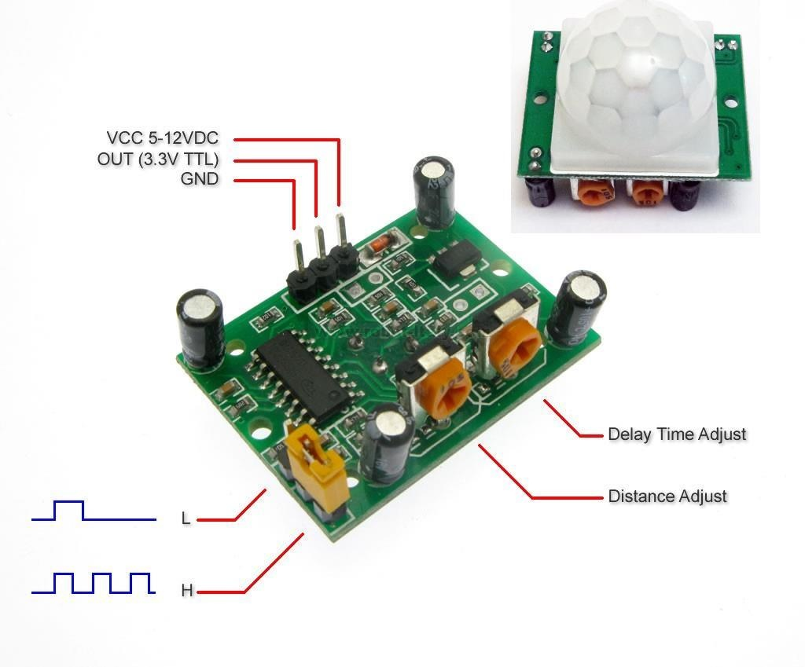
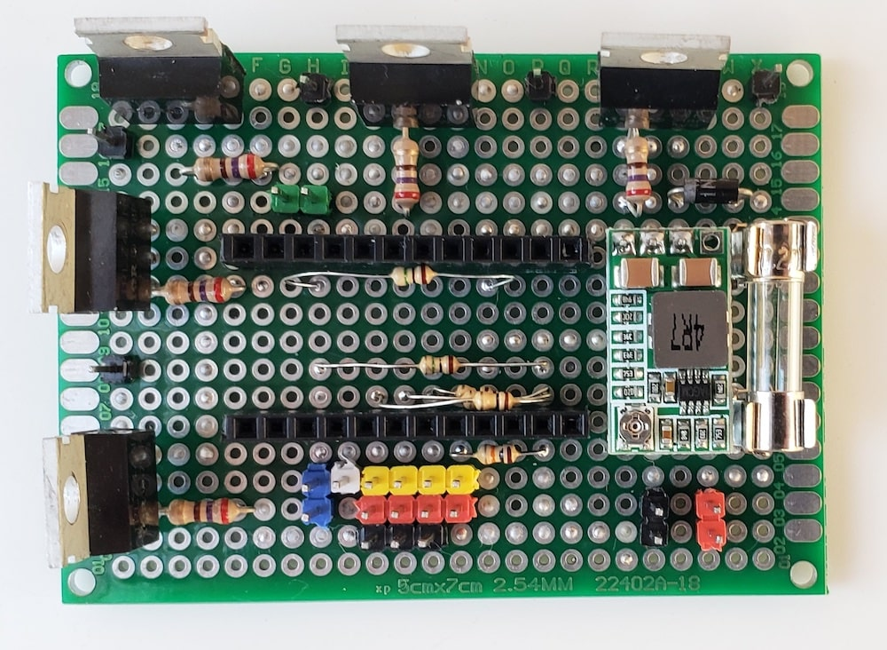

# Cameras and lamps control

## Description

Cameras and lamps control module was developed for remote and automatic on/off cameras and lamps with ability send data to server via [PJON protocol](https://github.com/gioblu/PJON).

Entire control box consists from 3 modules:

- Cameras and lamps control module;
- Module of fuses;
- Ethernet switch

### Main functions

- 2 outputs for cameras which can be controlled remotely;
- 2 PWM outputs for lamps which can be controlled remotely and automatically (motion + light sensors);
- for each motion sensor can be defined any lamp for control in automode;
- for each lamp can be defined any light sensor for control in automode;
- can be enabled "blinking mode" for any sensor in lamp automode (see description in "commands" table, 'S-m-[1-3]-b');
- lamps blinking via remote control (see description in "commands" table, 'L-[1-2]-b');
- change lamps brightness to 50% and "motion time" to 5 seconds when power supply from battery (see in "commands" table, 'B');
- enable "alarm output" on defined time (up to 120 seconds) by command from server (see in "commands" table, 'A');
- send messages to server if motion detected (can be configured for each sensor separately);
- control and send data from/to server via [PJON protocol](https://github.com/gioblu/PJON)

### PJON Specification

- PJON TxRx Bus Server ID: _1_
- PJON Tx Bus Server ID: _6_
- PJON Bus Device ID: _25-29_
- PJON Strategy: _SoftwareBitBang_

## Requirements and components

- 1 x Arduino Pro Mini 328 - 5V/16MHz
- 2 x HW-613 Mini DC-DC 3A Step Down Power Supply Module
- 5 x IRLZ44N
- 5 x 270 Om resistors
- 3 x 10k resistor
- 3 x 100k resistors
- 2 x 1 MOm resistors
- 1 x 1N4001 diode
- 2 x light sensors (GL5528)
- 4 x motion sensors (HC-SR501)
- 1 x 0.2A fuse (control module)
- 2 x 0.5A fuse (ethernet switch and alarm output)
- 4 x 1A (lamps and cameras)
- 1 x 5A (common fuse)
- 1 x thermal fuse 10A 65°C
- 1 x ABS Plastic IP65 Waterproof (150x110x70mm)

| Arduino PIN | Component | Notes |
| --- | --- | --- |
| D2 (Ext. Int.) | - | - |
| D3 (PWM) | IRLZ44N switch | Lamp 1 |
| D4 | - | - |
| D5 (PWM) | IRLZ44N switch | Camera 1 |
| D6 (PWM) | IRLZ44N switch | Lamp 2 |
| D7 | [PJON v13.0](https://github.com/gioblu/PJON/tree/13.0/src/strategies/SoftwareBitBang) | Communication with Server (TxRx) |
| D8 | - | - |
| D9 (PWM) | IRLZ44N switch | Camera 2 |
| D10 (PWM) | - ||
| D11 (PWM) | - ||
| D12 | [PJON v13.0](https://github.com/gioblu/PJON/tree/13.0/src/strategies/SoftwareBitBang) | Communication with Server (TX only) |
| D13 | IRLZ44N switch | Alarm output (can be used for enable siren) |
| A0 | Motion sensor 1 ||
| A1 | Motion sensor 2 ||
| A2 | Motion sensor 3 ||
| A3 | Light sensor 1 (GL5528) ||
| A4 | Light sensor 2 (GL5528) ||
| A5 | Light sensor 3 (GL5528) ||

### Components photos and schematics

| Name | Schema / Photo |
| --- | --- |
| IRLZ44N switch |   |
| Motion sensor |  |
| Multiple motion sensors |  |
| Light sensor |   |
| HW-613 |   |
| Ethernet switch |  |

## Commands

| Command | Description | EEPROM | Auto-push | Notes |
| --- | --- | --- | --- | --- |
| L-[1-2] | Read value of lamps | - | - | see below |
| L-[1-2]=[0-100] | Lamps brightness | - | - | %, value from 0 to 100  default: 0 |
| L-[1-2]-a | Read value of automode | - | - | see below |
| L-[1-2]-a=[0-2] | Disable/enable automode: Motion + Light sensor | + | + | 0 - disable 1 - enable 2 - enable with auto-push value when status changed default: 0 |
| L-[1-2]-a-b | Read value of "max brightness" for lamps automode | - | - | see below |
| L-[1-2]-a-b=[0-100] | Define "max brightness" for lamps automode | + | - | %, value from 0 to 100 default: 100 |
| L-[1-2]-a-f | Read value of "fade speed" in "automode" | - | - | see below |
| L-[1-2]-a-f=[0-9] | Define "fade speed" for "automode", 0 - disabled, 9 - very slow | + | - | value from 0 to 9 default: 0 |
| L-[1-2]-a-l | Read value of "light sensor" for lamp in automode | - | - | see below |
| L-[1-2]-a-l=[1-3] | Define "light sensor" for lamp | + | - | 1-3 - num of light sensor default for L-1: 1 default for L-2: 2 |
| L-[1-2]-b | Read value of "lamp blinking" | - | - | see below |
| L-[1-2]-b=[0-2] | Disable/enable "lamp blinking" | - | - | 0 - disable 1 - strobe 2 - once per second default: 0 |
| S-m-[1-3] | Read value of motion sensors | - | + | 0 - motion not detected 1 - motion detected |
| S-m-[1-3]-a | Read value of "auto push when status changed" for motion sensors | - | - | see below |
| S-m-[1-3]-a=[0,1] | Configure "auto push when status changed" for motion sensors | + | - | 0 - disable 1 - enable default: 0 |
| S-m-[1-3]-b | Read value of "lamp blinking" for lamps automode | - | - | see below |
| S-m-[1-3]-b=[0-2] | Define "lamp blinking" mode for lamps automode | - | - | 0 - disable 1 - strobe 2 - one blink per second default: 0 |
| S-m-[1-3]-l | Read value of "lamp" for motion sensors in automode | - | - | see below |
| S-m-[1-3]-l=[1-2] | Define lamp for motion sensors | + | - | 1-2 - num of lamp default for S-m-1: 1 default for S-m-2: 2 default for S-m-3: 2 |
| S-m-[1-3]-t | Read value of "time" for motion sensors. This time will added to sensor configured time after switch it to LOW state | - | - | see below |
| S-m-[1-3]-t=[0-180] | Define "time" for motion sensors | + | - | Sec., value from 0 to 180 default: 0 (disable)) |
| S-l-[1-3] | Read value of light sensors | - | + | %, value from 0 to 100 |
| S-l-[1-3]-a | Read value of "auto push" for light sensors | - | - | see below |
| S-l-[1-3]-a=[0-6] | Configure "auto push" for light sensors | + | - | 0 - disable 1-5 - minutes 6 - when status changed (not often 1 minute) default: 0 |
| S-l-[1-3]-b | Read value of "brightness limit" for light sensors | - | - | see below |
| S-l-[1-3]-b=[0-100] | Define "brightness limit" for light sensors | + | - | %, value from 0 to 100 default: 0) |
| C-[1-2] | Read value of cameras | - | - | see below |
| C-[1-2]=[0,1] | Cameras control | + | - | 0 - turn OFF 1 - turn ON default: 0 |
| A | Read value of alarm | - | - | see below |
| A=[0-120] | Disable/enable alarm | - | - | Sec., value from 0 to 120 default: 0 (disable)) |
| B | Read value of "power supply from battery" | - | - | see below |
| B=[0,1] | Disable/enable "power supply from battery" | - | - | 0 - disable 1 - enable default: 0 |

If enabled "S-m-[1-3]-a" and "S-m-[1-3]-b", answer "L-1<101" - strobe, "L-1<102" - one blink per second

***EEPROM*** - memory values are kept when the board is turned off 
***Auto-push*** - periodically send data to server

**Note:** Motion sensors (HC-SR501) configuration: timer and sensitivity set to the minimum, the trigger jumper set to H.

## Device Photos

### Cameras and lamps control module

### Module of fuses

### Assembled

