# Cameras and lamps control

- [Cameras and lamps control](#cameras-and-lamps-control)
  - [Description](#description)
    - [Main functions](#main-functions)
    - [PJON Specification](#pjon-specification)
    - [Examples](#examples)
  - [Requirements and components](#requirements-and-components)
    - [Components](#components)
  - [Commands](#commands)
  - [Device Photos](#device-photos)

## Description

### Main functions

- Local (automode):
  - Turn ON/OFF Lamp(s) when PIR state changed and will be reached brightness limit (on light sensor). Lamps can be enabled/disabled separately or together.
- Remote:
  - Camera control;
  - Lamp(s) control (by motion + light brightness). Lamp brightness can be changed by depends of input voltage (useful for accumulator battery);
  - Detecting motion;
  - Measuring light brightness/input voltage;
  - Alarm modes (if voltage not less than voltage low limit). 1 - blinking lamps in turn, 2 - blinking lamps together
  - Device can be configured and controlled from server and sending data to it by [PJON](https://github.com/gioblu/PJON) protocol.

### PJON Specification

- PJON Bus Server ID: _1_
- PJON Bus Device ID: _22_
- PJON Strategy: _SoftwareBitBang_

### Examples

- Configure "Lamp 1" to "_automode_" for control by "motion + light brightness": _L-1-a=1_
- Define time equal 15 seconds for duration of enable "motion sensor 1": _S-m-1-t=15_
- Define "brightness limit" equal 20% for "light sensor" (lamp(s) will be enabled when brightness below this limit and will be detected motion): _S-l-b=20_

## Requirements and components

- Camera, turned on house
- 2 x 10W Led Lamp
- 2 x motion sensors
- Light sensor
- DC-DC step down convertor (HW-613)
- 3 x IRLZ44N
- 3 x 270 Om resistors
- 2 x 10k resistor
- 1 x 100k resistor

**Controller:** Arduino Pro Mini 328 - 5V/16MHz

| Arduino PIN | Component | Notes |
| --- | --- | --- |
| RX, TX |     |     |
| D2 (Ext. Int.) |     |     |
| D3 (PWM) | IRLZ44N | Camera |
| D4  |     |     |
| D5 (PWM) | IRLZ44N | Lamp 1 (turned on gate) |
| D6 (PWM) |     |     |
| D7  | PJON v11.2 ([SoftwareBitBang](https://github.com/gioblu/PJON/tree/11.2/src/strategies/SoftwareBitBang)) | Communication with Server (tx + rx) |
| D8  |     |     |
| D9 (PWM) | IRLZ44N | Lamp 2 (turned on house) |
| D10 (PWM) | Motion sensor 1 | Turned on gate |
| D11 (PWM) | Motion sensor 2 | Turned on house |
| D12 | PJON v11.2 ([SoftwareBitBang](https://github.com/gioblu/PJON/tree/11.2/src/strategies/SoftwareBitBang)) | Communication with Server (only tx) |
| D13 |     |     |
| A0  | Light sensor (GL5528) |     |
| A1  |     |     |
| A2  |     |     |
| A3  | Voltmeter: r1=100k, r2=10k | Voltage of line (99.85k, 9.75k) |

### Components

| Name | Schema/ Photo |
| --- | --- |
| IRLR2905 | [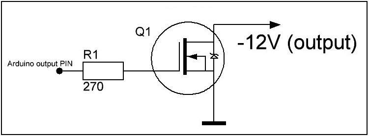](images/cameras-lamps-control_1.jpg) [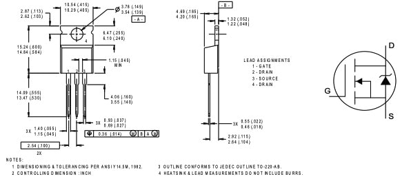](images/cameras-lamps-control_2.jpeg) |
| Voltmeter |  |
| Motion sensor | [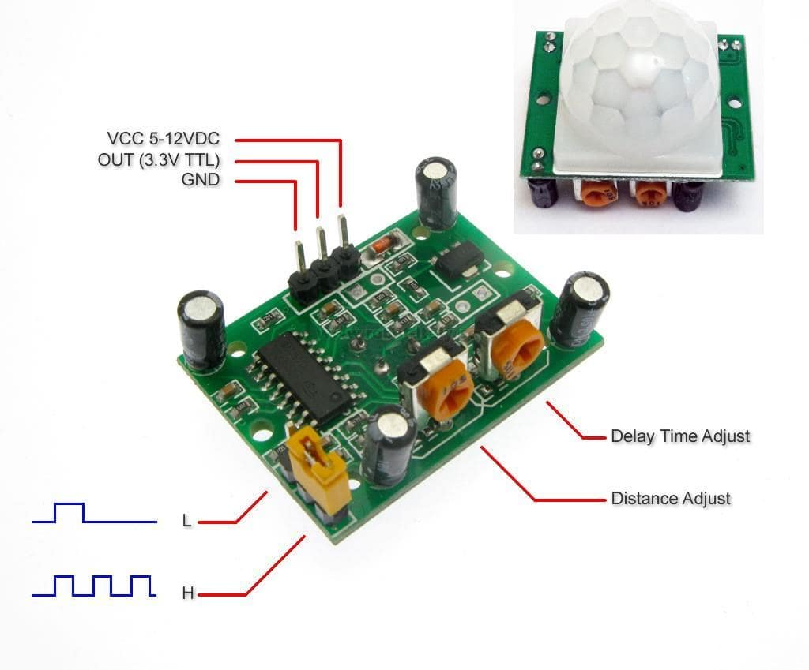](images/cameras-lamps-control_4.jpeg) |
| Light sensor | [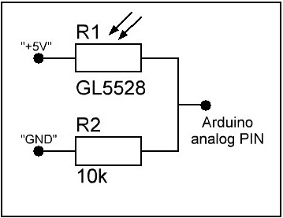](images/cameras-lamps-control_5.jpeg) [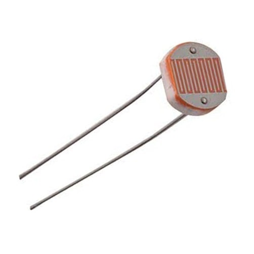](images/cameras-lamps-control_6.jpeg) |

## Commands

| Command | Description | EEPROM | Auto push/ Automode | Notes |
| --- | --- | --- | --- | --- |
| L-\[1-2\] | Read status of Lamps 1 and 2 | -   | -   | %, value from 0 to 100 |
| L-\[1-2\]=\[0-100\] | 0-100% of brightness Lamps 1 and 2 | -   | -   | %, value from 0 to 100 (default: 0) |
| L-\[1-2\]-a | Read value of automode | -   | -   | 0 - disabled; 1 - enabled; 2 - voltage controlled |
| L-\[1-2\]-a=\[0,1,2\] | Disable/Enable automode: Motion + Light sensor   Voltage control: automode + Lamp brightness control depends of voltage input | +   | \+ (when status changed push Lamp value, if "events" enabled) | 0 - disable; 1 - enable; 2 - voltage control (default: 0) |
| L-\[1-2\]-a-b | Read value of "max brightness" for automode of Lamp | -   | -   | %, value from 0 to 100 |
| L-\[1-2\]-a-b=\[0-100\] | Define "max brightness" for automode of Lamp | +   | -   | %, value from 0 to 100 (default: 100) |
| L-a-m | Read value of Lamps control mode for "automode" | -   | -   | 1 - separate lamps control; 2 - common lamps control |
| L-a-m=\[1,2\] | 1 - control via separate motion sensors; 2 - two lamps will be On/Off at the same time (if enabled "automode") if one of motion sensor will be triggered | +   | -   | Default value: 1 |
| L-a-f | Read value of "fade speed" for "automode" | -   | -   | value from 1 to 30 |
| L-a-f=\[1-30\] | Define "fade speed" for "automode", 1 - very slow; 30 - very fast | +   | -   | value from 0 to 30 (default: 5) |
| S-m-\[1-2\] | Read value of Motion sensors 1 and 2 | -   | \+ (push value when status changed) | 0 - motion not detected; 1 - motion detected |
| S-m-\[1-2\]-a | Read value of "auto push" for Motion sensors 1 and 2 | -   | -   | 0 - disabled; 1 - enabled |
| S-m-\[1-2\]-a=\[0,1\] | Disable/Enable "auto push" for Motion sensors 1 and 2 | +   | -   | 0 - disable; 1 - enable (default: 0) |
| S-m-\[1-2\]-t | Read value of "time" for Motion sensors 1-2 | -   | -   | Sec., value from 0 to 120 |
| S-m-\[1-2\]-t=\[0-120\] | Define "time" for Motion sensors 1 and 2 | +   | -   | Sec., value from 0 to 120 (0 - disable "loop read"), (default value: 0) |
| S-l | Read value of Light sensor | -   | \+ (auto push every 1 minute) | %, value from 0 to 100 |
| S-l-a | Read value of automode (auto push) for Light sensor | -   | -   | 0 - disabled; 1 - enabled |
| S-l-a=\[0,1\] | Disable/Enable automode (auto push) for Light sensor | +   | -   | 0 - disable; 1 - enable (default: 0) |
| S-l-b | Read value of "brightness limit" for Light sensor | -   | -   | %, value from 0 to 100 |
| S-l-b=\[0-100\] | Define "brightness limit" for Light sensor | +   | -   | %, value from 0 to 100 (default: 0) |
| C   | Read status of Camera | -   | -   | 0 - turned OFF; 1 - turned ON |
| C=\[0,1\] | OFF/ON Camera | +   | -   | 0 - turn OFF; 1 - turn ON (default: 0) |
| V   | Read value of voltage on line | -   | \+ (auto push every 1 minute) | V   |
| V-a | Read value of automode (auto push) for voltage on line | -   | -   | 0 - disabled; 1 - enabled |
| V-a=\[0,1\] | Disable/Enable automode (auto push) for read values of voltage on line | +   | -   | 0 - disable; 1 - enable (default: 0) |
| V-l-l | Read voltage low limit | -   | -   | V, value from 9 to 11.5 |
| V-l-l=\[9-11.5\] | Define voltage low limit | +   | -   | V, value from 9 to 11.5 (default 10.7) |
| V-l-h | Read voltage high limit | -   | -   | V, value from 11.5 to 14 |
| V-l-h=\[11.5-14\] | Define voltage high limit | +   | -   | V, value from 11.5 to 14 (default 12.0) |
| A   | Read value of alarm | -   | -   | 0 - disabled; 1 or 2 - triggered |
| A=\[0,1,2\] | Alarm Disabled/Triggered1 (blinking of lamps in turn)/Triggered2 (blinking lamps together) | +   | -   | 0 - disabled (default); 1 or 2 - triggered |
| E   | Read value of events | -   | -   | 0 - disabled; 1 - enabled |
| E=\[0,1\] | Events Disable/Enable | +   | -   | 0 - disable (default); 1 - enable |

_**EEPROM**_ \- memory whose values are kept when the board is turned off;  
_**Auto push**_ \- send data to server

## Device Photos

[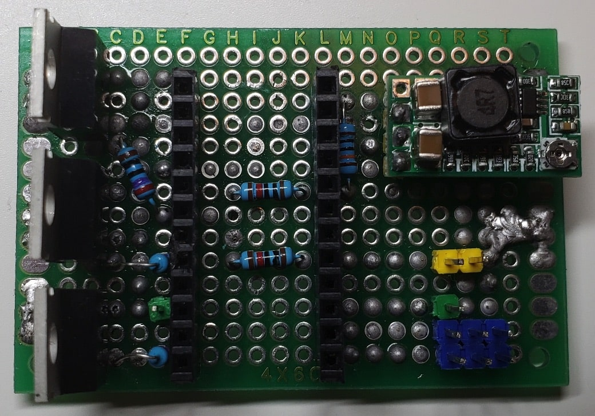](images/cameras-lamps-control_7.jpeg)
[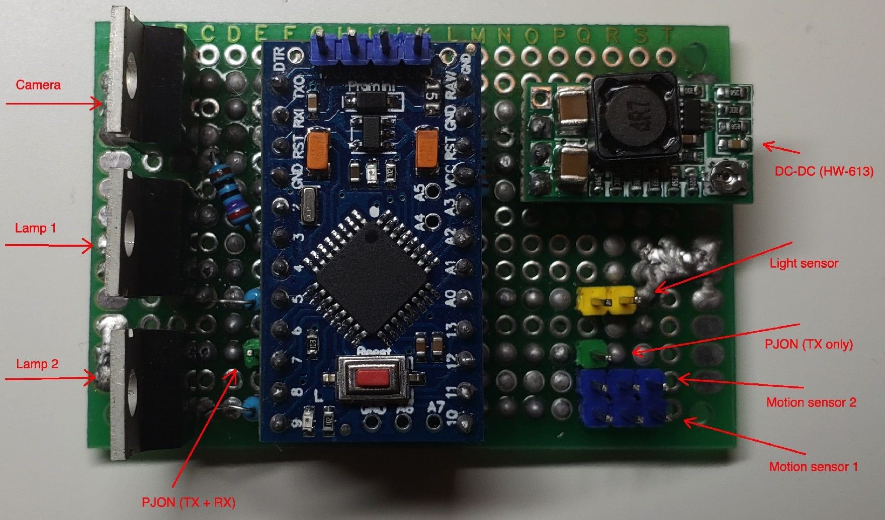](images/cameras-lamps-control_8.jpeg)
[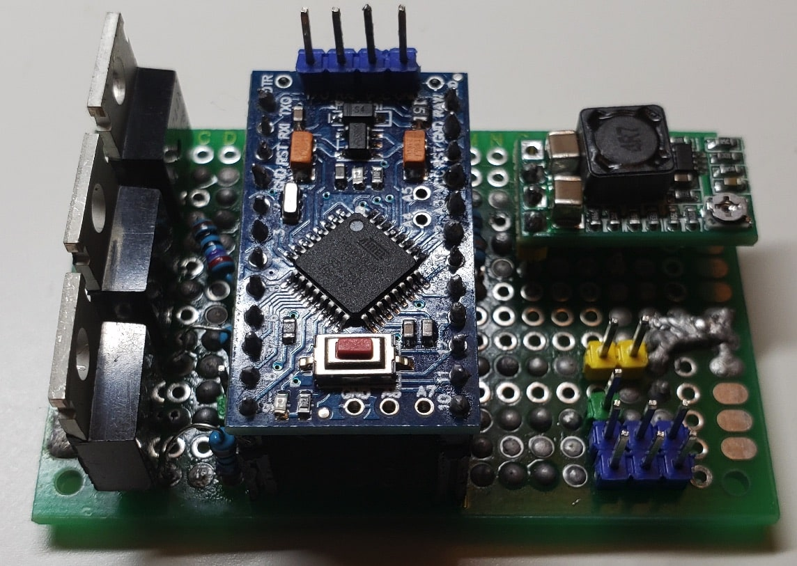](images/cameras-lamps-control_9.jpeg)
[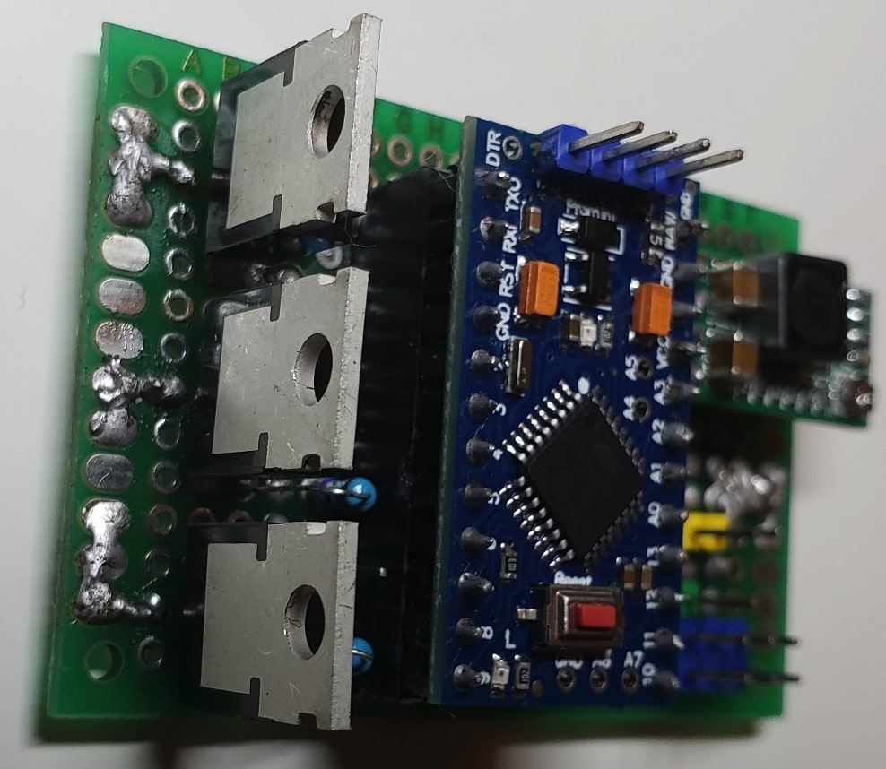](images/cameras-lamps-control_10.jpeg)
[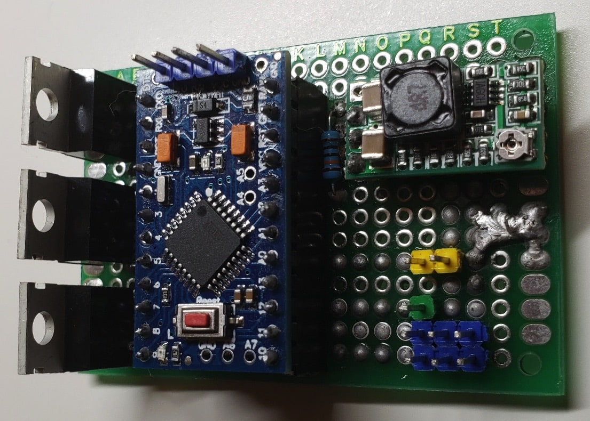](images/cameras-lamps-control_11.jpeg)
[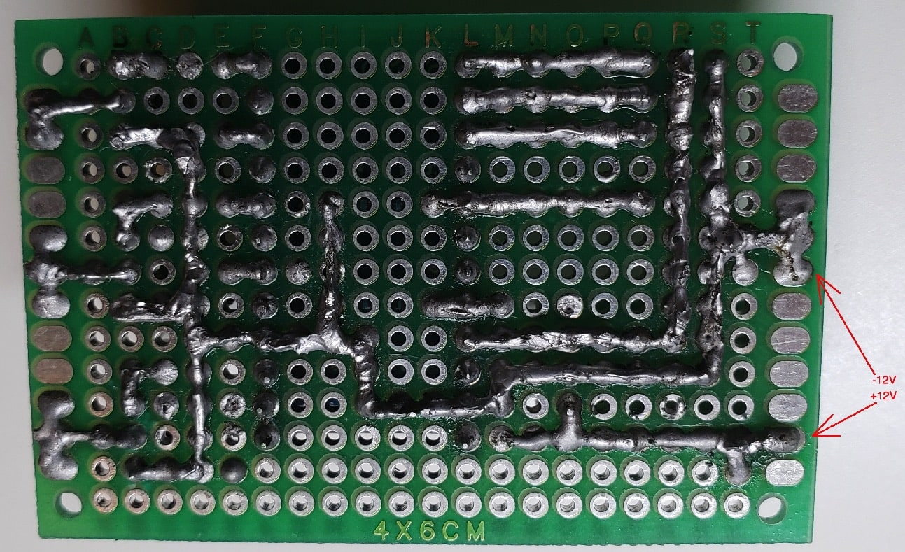](images/cameras-lamps-control_12.jpeg)
