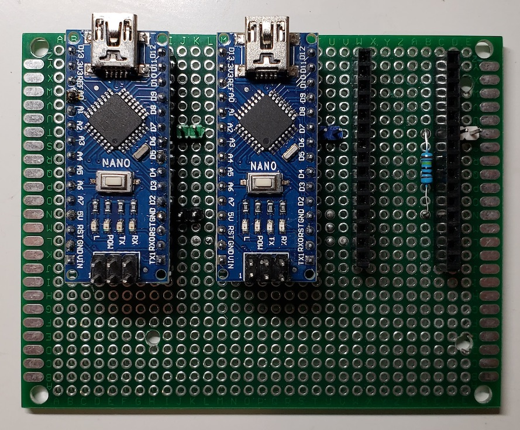
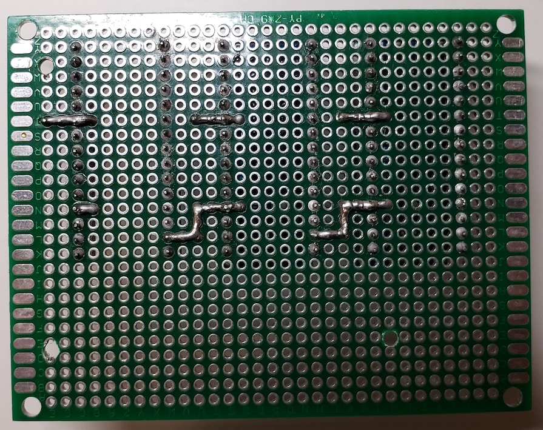

# Routers

Routers for make possible communication between different devices with different [PJON](https://github.com/gioblu/PJON) strategies.

- [Serial-SoftwareBitBang_RxTx_busA](Serial-SoftwareBitBang_RxTx_busA) - router for communication between RPi (through Serial) and remote devices (through SoftwareBitBang) by transmit-receive messages
- [Serial-SoftwareBitBang_Tx_busB](Serial-SoftwareBitBang_Tx_busB) - router for receiving messages from remote devices (connected via SoftwareBitBang) to RPi (through Serial)

Compatible with [PJON v13.0](https://github.com/gioblu/PJON/tree/13.0/src/strategies/SoftwareBitBang)

## Device Photos

