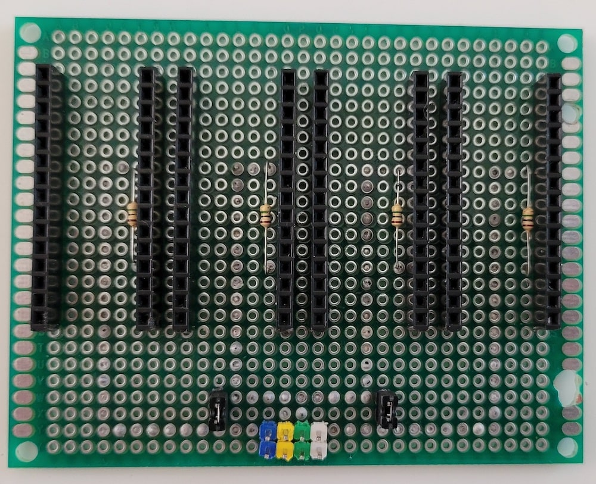
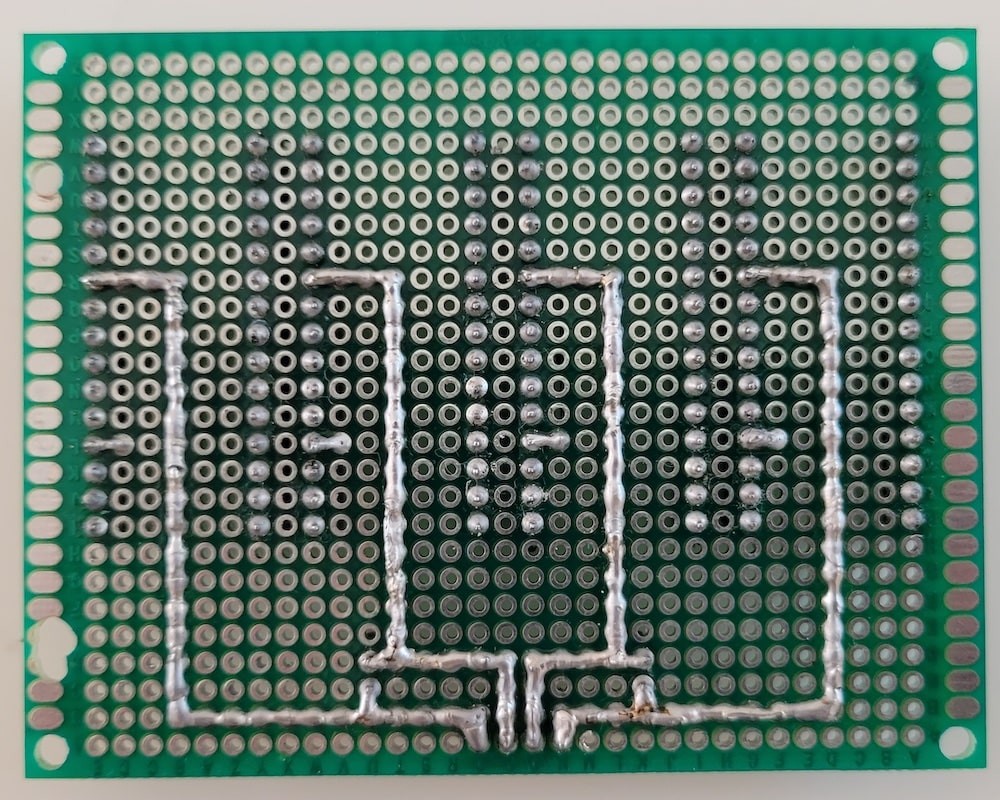
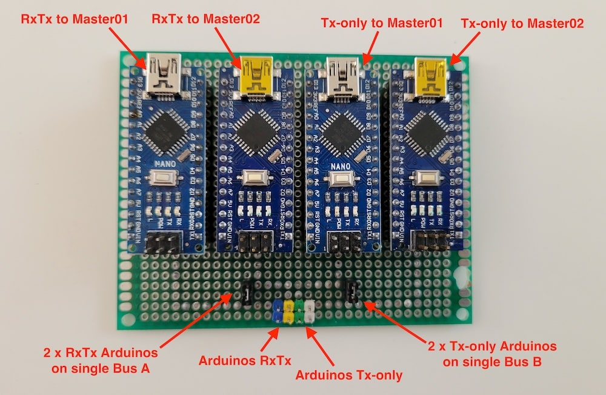
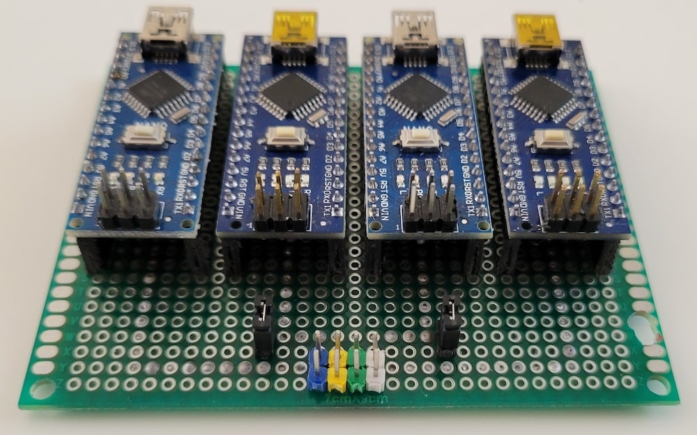
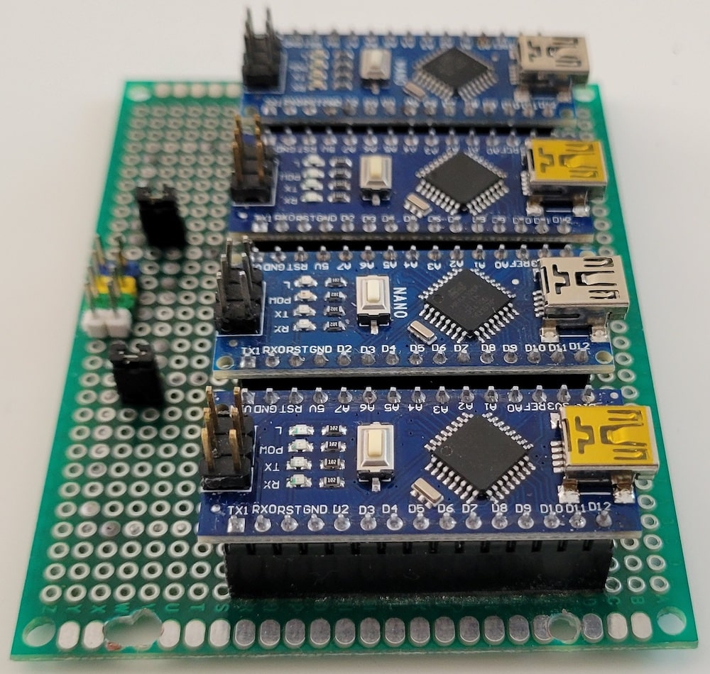
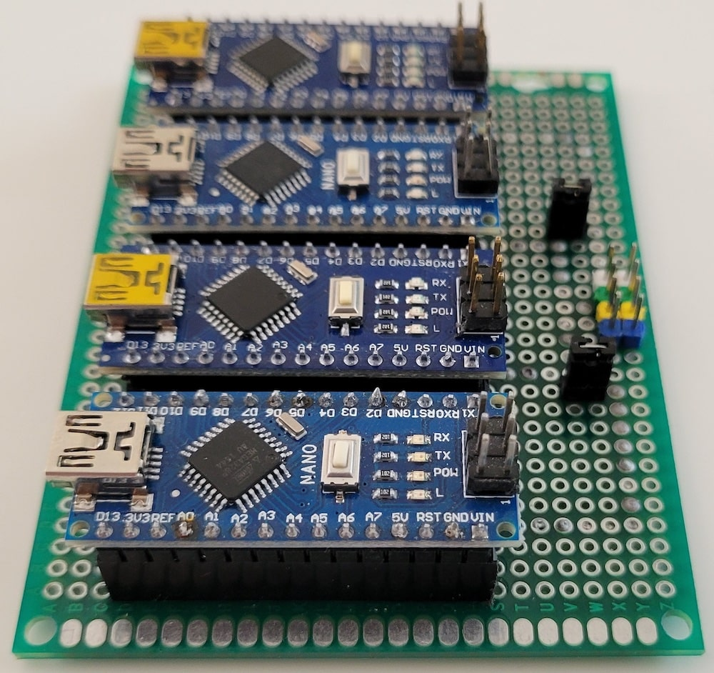
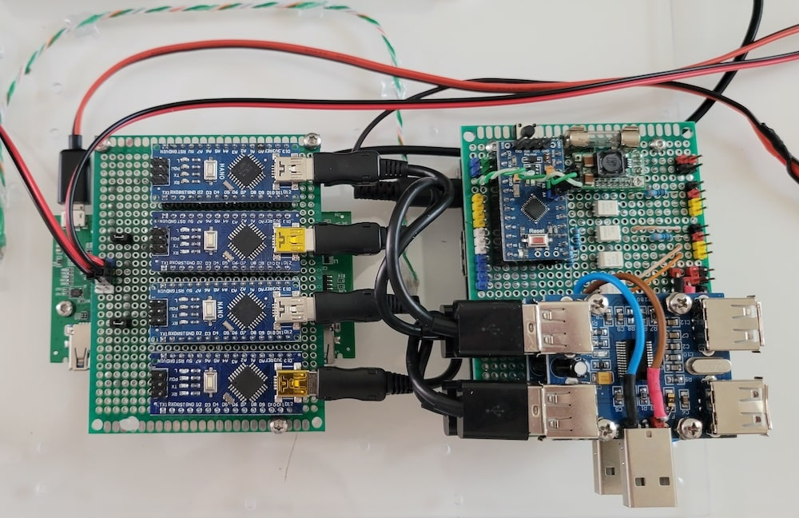

# PJON routers

Routers use for make possible communication between different devices with different [PJON](https://github.com/gioblu/PJON/tree/13.0/src/strategies) strategies via [PJON-gRPC](https://github.com/Halytskyi/PJON-gRPC).

- 2 x [Serial-SoftwareBitBang_RxTx_busA](Serial-SoftwareBitBang_RxTx_busA) - routers for communication between RPi (through Serial) and remote devices (through SoftwareBitBang) by transmit-receive messages
- 2 x [Serial-SoftwareBitBang_Tx_busB](Serial-SoftwareBitBang_Tx_busB) - routers for receiving messages from remote devices (connected via SoftwareBitBang) to RPi (through Serial)

For High Availability, one pair of [Serial-SoftwareBitBang_RxTx_busA](Serial-SoftwareBitBang_RxTx_busA) and [Serial-SoftwareBitBang_Tx_busB](Serial-SoftwareBitBang_Tx_busB) connected to Master01, another one - to Master02

Compatible with [PJON v13.0](https://github.com/gioblu/PJON/tree/13.0) and [PJON-gRPC v4.0](https://github.com/Halytskyi/PJON-gRPC/tree/4.0)

## Device Photos

