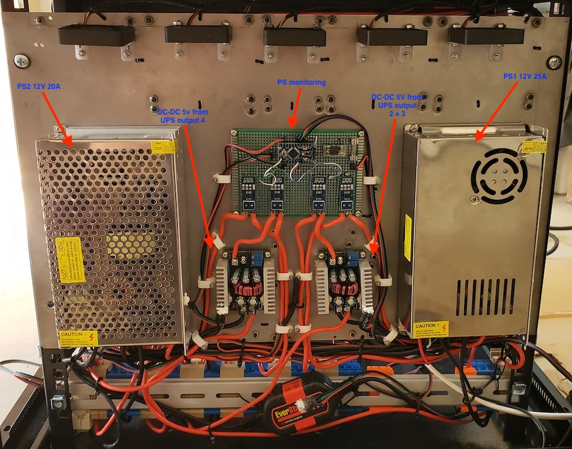
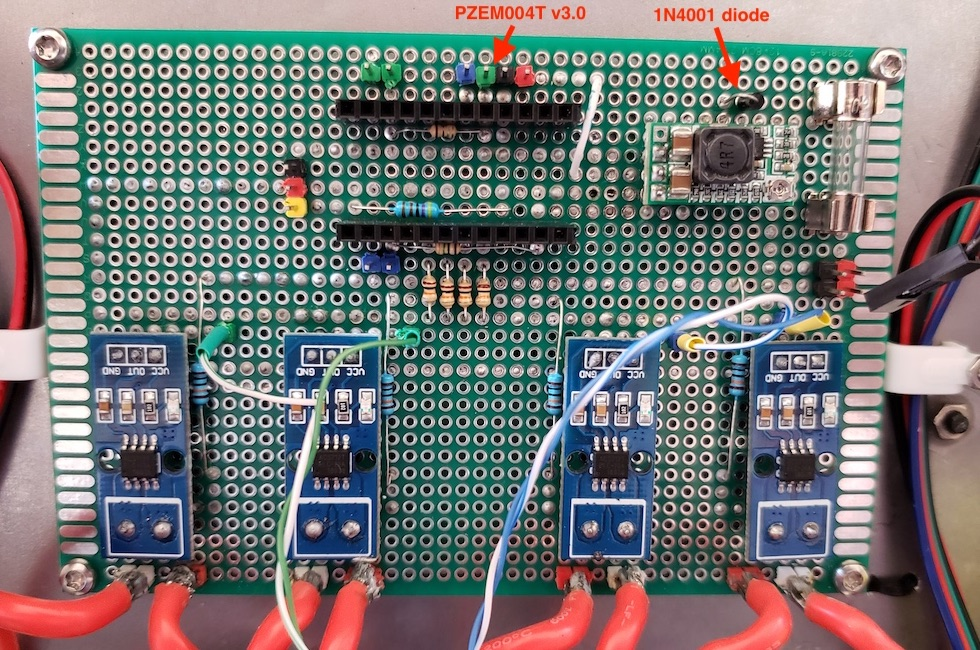
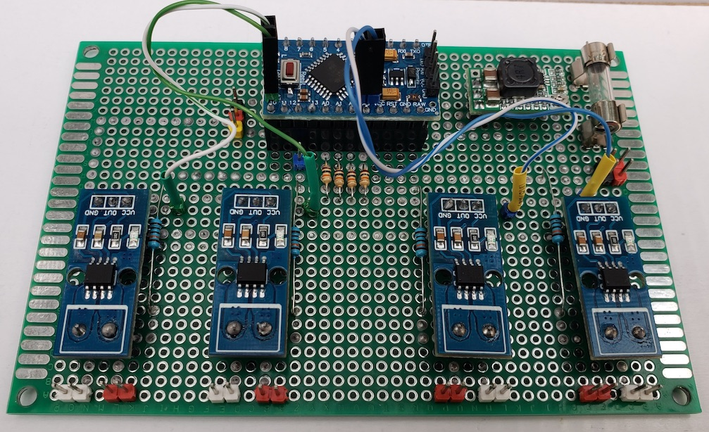

# Power Supply Monitoring

## Description

Power Supply Monitoring module was developed for measure voltage, current and power consumption on AC line and PS outputs with ability send data to server via [PJON protocol](https://github.com/gioblu/PJON).

## Main functions

- measure voltage, curent and power consumption on PS outputs and dc-dc converters;
- measure AC line parameters: Voltage, Current, Power, Energy, Frequency and Power factor;
- measuring temperature on PS outputs and dc-dc converters;
- send data to server via [PJON protocol](https://github.com/gioblu/PJON)

## PJON Specification

- PJON TxRx Bus Server ID: _1_
- PJON Tx Bus Server ID: _6_
- PJON Bus Device ID: _15_
- PJON Strategy: _SoftwareBitBang_

## Requirements and components

- 1 x Arduino Pro Mini 328 - 5V/16MHz
- 1 x HW-613 Mini DC-DC 3A Step Down Power Supply Module
- 4 x ACS712-20A modules
- 4 x 10k resistors
- 4 x 100k resistors
- 4 x DS18B20
- 1 x PZEM004T v3.0
- 2 x 1 MOm resistors
- 1 x 1N4001 diode

| Arduino PIN | Component | Notes |
| --- | --- | --- |
| D2 (Ext. Int.) | Rx (Connects to the Tx pin on the PZEM) | [PZEM004T v3.0](https://innovatorsguru.com/pzem-004t-v3) |
| D3 (PWM) | Tx (Connects to the Rx pin on the PZEM) | [PZEM004T v3.0](https://innovatorsguru.com/pzem-004t-v3) |
| D4 | - ||
| D5 (PWM) | - ||
| D6 (PWM) | - ||
| D7 | [PJON v13.0](https://github.com/gioblu/PJON/tree/13.0/src/strategies/SoftwareBitBang) | Communication with Server (TxRx) |
| D8 | - ||
| D9 (PWM) | - ||
| D10 (PWM) | 1-Wire | Temperature sensors |
| D11 (PWM) | - ||
| D12 | [PJON v13.0](https://github.com/gioblu/PJON/tree/13.0/src/strategies/SoftwareBitBang) | Communication with Server (Tx only) |
| D13 | - ||
| A0 | Voltmeter: r1=100k, r2=10k | 12V 20A PS output (V-1) |
| A1 | Voltmeter: r1=100k, r2=10k | 5V DC-DC (from UPS 4) output (V-2) |
| A2 | Voltmeter: r1=100k, r2=10k | 5V DC-DC (from UPS 2+3) output (V-3) |
| A3 | Voltmeter: r1=100k, r2=10k | 12V 25A PS output (V-4) |
| A4 | ACS712-20A | 12V 20A PS output (I-1) |
| A5 | ACS712-20A | 5V DC-DC (from UPS 4) output (I-2) |
| A6 | ACS712-20A | 5V DC-DC (from UPS 2+3) output (I-3) |
| A7 | ACS712-20A | 12V 25A PS output (I-4) |

### Components photos and schematics

| Name | Schema / Photo |
| --- | --- |
| Voltmeter |  |
| ACS712 |   |
| HW-613 |   |
| DS18B20 |  |
| PZEM-004T v3 |  |

## Commands

| Command | Description | EEPROM | Auto-push | Notes |
| --- | --- | --- | --- | --- |
| V-[1-4] | Read value of voltage for 1-4 outputs | - | + (auto-push every 1 minute) | Volt |
| V-[1-4]-a | Read value of auto-push voltage for 1-4 outputs | - | - | 0 - disabled 1 - enabled |
| V-[1-4]-a=[0,1] | Disable/enable auto-push for read values of voltage for 1-4 outputs | + | - | 0 - disable 1 - enable default: 0 |
| I-[1-4] | Read value of current for 1-4 outputs | - | + (auto-push every 1 minute) | Amper |
| I-[1-4]-a | Read value of auto-push current for 1-4 outputs | - | - | 0 - disabled 1 - enabled |
| I-[1-4]-a=[0,1] | Disable/enable auto-push for read values of current for 1-4 outputs | + | - | 0 - disable 1 - enable default: 0 |
| P-[1-4] | Read value of power consumption for 1-4 outputs | - | + (auto-push every 1 minute) | Watt (Volt * Amper) |
| P-[1-4]-a | Read value of auto-push power consumption for 1-4 outputs | - | - | 0 - disabled 1 - enabled |
| P-[1-4]-a=[0,1] | Disable/enable auto-push for read values of power consumption for 1-4 outputs | + | - | 0 - disable 1 - enable default: 0 |
| T-[1-4] | Read value of temperature on PS outputs and dc-dc converters | - | + (auto-push every 1 minute) | °C |
| T-[1-4]-a | Read value of auto-push for temperature on PS outputs and dc-dc converters | - | - | 0 - disabled 1 - enabled |
| T-[1-4]-a=[0,1] | Disable/Enable auto-push for read values of temperature on PS outputs and dc-dc converters | + | - | 0 - disable 1 - enable default: 0 |
| L-[v,c,p,e,f,pf] | Read value of AC line parameters | - | + (auto-push every 1 minute) | Voltage (V) Current (A) Power (W) Energy (kWh) Frequency (Hz) Power factor |
| L-[v,c,p,e,f,pf]-a | Read value of auto-push AC line parameters | - | - | 0 - disabled 1 - enabled |
| L-[v,c,p,e,f,pf]-a=[0,1] | Disable/enable auto-push for read values of AC line parameters | + | - | 0 - disable 1 - enable default: 0 |

where, 
[V,I,P]-1 - 12V 20A PS output 
[V,I,P]-2 - 5V DC-DC (from UPS 4) output 
[V,I,P]-3 - 5V DC-DC (from UPS 2+3) output 
[V,I,P]-4 - 12V 25A PS output 
T-1 - 12V 20A PS 
T-2 - 5V DC-DC (from UPS 4) 
T-3 - 5V DC-DC (from UPS 2+3) 
T-4 - 12V 25A PS 
***EEPROM*** - memory values are kept when the board is turned off 
***Auto-push*** - periodically send data to server

## Device Photos

### UPS schema and common photo

### Board version 2

**Note:** added [PZEM004T v3.0](https://innovatorsguru.com/pzem-004t-v3) and [PJON filters](https://github.com/gioblu/PJON/wiki/Mitigate-interference) (1MOm resistors and diode)

### Board version 1

