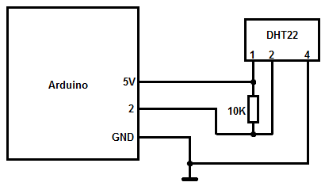
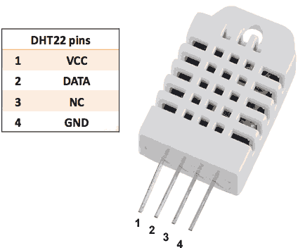

# Server Rack Cooling System

## Description

Server Rack Cooling System was developed for rack fans control depends from temperature with ability control and send data from/to server via [PJON protocol](https://github.com/gioblu/PJON).

## Main functions

- 4 PWM outputs for fans, can be extended up to 6;
- fans control by commands from server;
- fans control automatically in depends from temperature. Can be chosen 1 of 2 modes: fan on/off without speed control and with speed control (fan speed will be gradually changed by PWM and depends from temperature sensors (check every 10 sec.) and defined low/high limits);
- measure temperature in 4 (6) zones (near each fan location);
- measure temperature and humidity outside;
- turn off all fans by external 5V HIGH signal (for example from fire alarm) or by command (A). Normal functionality after that can be resumed only by command via PJON;
- control and send data from/to server via [PJON protocol](https://github.com/gioblu/PJON)

## PJON Specification

- PJON TxRx Bus Server ID: _1_
- PJON Tx Bus Server ID: _2_
- PJON Bus Device ID: _20_
- PJON Strategy: _SoftwareBitBang_

## Requirements and components

- 1 x Arduino Pro Mini 328 - 5V/16MHz
- 1 x HW-613 Mini DC-DC 3A Step Down Power Supply Module
- 4 x IRLR2905
- 4 x 270 Om resistors
- 2 x 1 MOm resistors
- 1 x 1N4001 diode
- 4 x DS18B20
- 1 x DHT22
- 1 x 4.7k resistor
- 1 x 10k resistor
- 1 x 3A fuse

| Arduino PIN | Component | Notes |
| --- | --- | --- |
| D2 (Ext. Int.) | - | - |
| D3 (PWM) | IRLR2905 fan switch | Fan 1: Back (5 x 50x50) |
| D4 | Alarm input | For external 5V HIGH signal |
| D5 (PWM) | IRLR2905 fan switch | Fan 2: Left (2 x 120x120) |
| D6 (PWM) | IRLR2905 fan switch | Fan 3: Center (2 x 120x120) |
| D7 | [PJON v13.0](https://github.com/gioblu/PJON/tree/13.0/src/strategies/SoftwareBitBang) | Communication with Server (TxRx) |
| D8 | 1-Wire | Temperature sensors |
| D9 (PWM) | IRLR2905 fan switch | Fan 4: Right (2 x 120x120) |
| D10 (PWM) | - | - |
| D11 (PWM) | - | - |
| D12 | [PJON v13.0](https://github.com/gioblu/PJON/tree/13.0/src/strategies/SoftwareBitBang) | Communication with Server (TX only) |
| D13 | - | - |
| A0 | - | - |
| A1 | - | - |
| A2 | - | - |
| A3 | DHT22 | Outside temperature and humidity |
| A4 | - | - |
| A5 | - | - |
| A6 | - | - |
| A7 | - | - |

### Components photos and schematics

| Name | Schema / Photo |
| --- | --- |
| Fan switch |   |
| DS18B20 |  |
| HW-613 |   |
| DHT22 |   |

## Commands

| Command | Description | EEPROM | Auto-push | Notes |
| --- | --- | --- | --- | --- |
| F-[1-4] | Read value of fan speed | - | + (auto push every 1 minute) | 0 - fan disabled 1-100 - fan speed (%) |
| F-[1-4]=[0-100] | Define fan speed | + | - | 0 - disable fan (default) 1-100 - fan speed (%) |
| F-[1-4]-a | Read value of "auto push" for fan speed | - | - | 0 - disabled 1 - enabled |
| F-[1-4]-a=[0,1] | Disable/Enable "auto push" for fan speed (useful for automatic mode) | + | - | 0 - disable (default) 1 - enable |
| F-[1-4]-ac | Read value of automatic fan control mode | - | - | 0 - disabled 1 - enabled without speed control 2 - enabled with speed control |
| F-[1-4]-ac=[0-2] | Disable/Enable automatic fan control mode | + | - | 0 - disable (default) 1 - enable without speed control 2 - enable with speed control |
| F-[1-4]-tl | Read value for "temperature low limit" of temperature sensors | - | - | °C, if temperature is less than defined value - correspond fan is stopped |
| F-[1-4]-tl=[20-25] | Define "temperature low limit" for temperature sensors | + | - | °C, value from 20 to 25 (default: 22) |
| F-[1-4]-th | Read value for "temperature high limit" of temperature sensors | - | - | °C, if temperature is greater than defined value - correspond fan speed is 100% |
| F-[1-4]-th=[26-39] | Define "temperature high limit" for temperature sensor 1 (transformer) | + | - | °C, value from 26 to 39 (default: 30) |
| T-[1-4] | Read temperature of sensors 1-4 | - | + (auto push every 1 minute) | °C |
| T-[1-4]-a | Read value of "auto push" for 1-4 sensors | - | - | 0 - disabled 1 - enabled |
| T-[1-4]-a=[0,1] | Disable/Enable "auto push" for 1-3 sensors | + | - | 0 - disable (default) 1 - enable |
| O-[t,h] | Read temperature, humidity outside sensor | - | + (auto push every 1 minute) | °C, % |
| O-[t,h]-a | Read value of "auto push" for outside temperature, humidity sensor | - | - | 0 - disabled 1 - enabled |
| O-[t,h]-a=[0,1] | Disable/Enable "auto push" for outside temperature, humidity sensor | + | - | 0 - disable (default) 1 - enable |
| A | External alarm status | - | + (auto push every 1 minute if status "1") | 0 - no alarm 1 - alarm |
| A=[0,1] | Disable/enable external alarm | + | - | 0 - disable 1 - enable |

***EEPROM*** - memory values are kept when the board is turned off 
***Auto-push*** - periodically send data to server

## Device Photos

