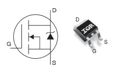
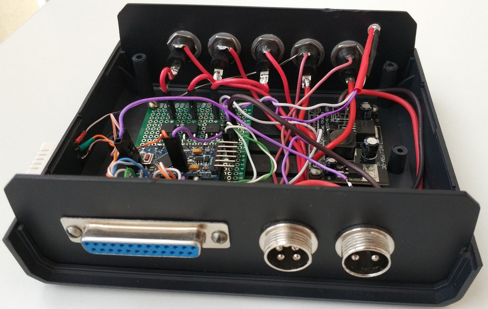

# Multifunctional device for hallway

## Description

### Main functions

- control of led lamps in hallway (by motion + light brightness). Lamp brightness can be changed by depends of input voltage (useful for accumulator battery)
- detecting motion
- measuring light brightness/temperature/humidity/input voltage
- cameras control
- device can be configured and controlled from server and sending data to it by [PJON protocol](https://github.com/gioblu/PJON)

### PJON Specification

- PJON Bus Server ID: _1_
- PJON Bus Device ID: _21_
- PJON Strategy: _SoftwareBitBang_

### Examples

- Configure Lamp 1 to "automode" for control by "motion + light brightness": _L-1-a-1_
- Define time equal 15 seconds for duration of enable motion sensor 1: _S-m-1-t-15_
- Define "brightness limit" equal 20% for light sensor 1 (Lamp 1 will be enabled if brightness will be below this limit and will be detected motion): _S-l-1-b-20_

## Requirements and components

**Controller:** Arduino Pro Mini 328 - 5V/16MHz

| Arduino PIN | X3 | Component | Notes |
| --- | --- | --- | --- |
| D2 (Ext. Int.) | 2 | Motion sensor 1 | Hallway |
| D3 (PWM) | - | IRLR2905 | Lamp 1 |
| D4 | 4 | Motion sensor 2 | Entrance door |
| D5 (PWM) | - | IRLR2905 | Lamp 2 (not installed) |
| D6 (PWM) | - | IRLR2905 | Lamp 3 (not installed) |
| D7 | 7 | [PJON v11.2](https://github.com/gioblu/PJON/tree/11.2/src/strategies/SoftwareBitBang) | Communication with Server (TX + RX) |
| D8 | 8 | DHT22 | Cellar |
| D9 (PWM) | 9 | Motion sensor 3 | Left corner |
| D10 (PWM) | 10 |||
| D11 (PWM) | 11 || Corner camera 1 |
| D12 | 12 | [PJON v11.2](https://github.com/gioblu/PJON/tree/11.2/src/strategies/SoftwareBitBang) | Communication with Server (only TX) |
| D13 | 13 || Corner camera 2 |
| A0 | 14 |||
| A1 | 15 | Light sensor 1 (GL5528) | Hallway |
| A2 | 16 | Light sensor 2 (GL5528) | Outside |
| A3 | 17 |||
| A4 | - | DHT22 | Local (on device) |
| A5 | - | Front led + R 510 Om | Led on front panel |
| A6 | - | Voltmeter: r1=100k, r2=10k | Voltage of line (101k, 10.09k) |
| A7 | - |||
| - | 22 | 3.3V | Output 3.3V |
| - | 24 | 5V | Output 5V |
| - | 25 | GND | GND |

### Connectors (Rear panel)

| # | PIN | Description |
| --- | --- | --- |
| X1 | 1   2 | +12V input   -12V input |
| X2 | 1   2   3   4 | +12V output   -12V output (Arduino D3)   -12V output (Arduino D5)   -12V output (Arduino D6) |

### Fuses (Front panel)

| # | Value | Description |
| --- | --- | --- |
| 1 | 0.2A | 3.3V output |
| 2 | 0.2A | 5V output |
| 3 | 5A | X2: 2 pin |
| 4 | 5A | X2: 3 pin |
| 5 | 5A | X2: 4 pin |

### Components

| Name | Schema / Photo |
| --- | --- |
| Switch |   |
| Voltmeter |  |
| Motion sensor |  |
| Light sensor |   |
| DHT22 |   |

## Commands

| Command | Description | EEPROM | Autopush / Automode | Notes |
| --- | --- | --- | --- | --- |
| L-[1-3] | Read status of Lamps 1, 2 and 3 | - | - | %, value from 0 to 100 |
| L-[1-3]-[0-100] | 0-100% of brightness Lamps 1, 2 and 3 | - | - | %, value from 0 to 100 (default: 0) |
| L-1-a | Read value of automode | - | - | 0 - disabled; 1 - enabled; 2 - voltage controlled |
| L-1-a-[0,1,2] | Disable/Enable automode: Motion 1 + Light 1 sensors; Voltage control: automode + Lamp 1 brightness control depends of voltage input; Voltage low limit: 10.7V (below this limit lamp 1 won't be enabled); Voltage high limit: 12V (above this limit lamp 1 won't be change brightness) | + | + (when status changed push L-1 value) | 0 - disable; 1 - enable; 2 - voltage control (default: 0) |
| L-1-a-b | Read value of "max brightness" for automode of Lamp1 | - | - | %, value from 0 to 100 |
| L-1-a-b-[0-100] | Define "max brightness" for automode of Lamp1 | + | - | %, value from 0 to 100 (default: 100) |
| S-[t,f,h]-[1,2] | Read [temperature, feeling temperature, humidity] of 1, 2 sensors | - | + (auto push every 1 minute) | °C, °C, % (cellar, local) |
| S-[t,f,h]-[1,2]-a | Read value of automode (auto push) for 1 and 2 sensors | - | - | 0 - disabled; 1 - enabled |
| S-[t,f,h]-[1,2]-a-[0,1] | Disable/Enable automode (auto push) for 1 and 2 sensors | + | - | 0 - disable; 1 - enable (default: 0) |
| S-[t,f,h]-[1,2]-m | Read value of "maximum errors" for 1 and 2 sensors | - | - | Value from 0 to 99 |
| S-[t,f,h]-[1,2]-m-[0-99] | Define "maximum errors" for 1 and 2 sensors. Automode for sensor will be disabled if during sensor read will be detected more errors then defined | + | - | Value from 0 to 99 (default: 10) |
| S-[t,f,h]-[1,2]-e | Read value of "errors" for 1 and 2 sensors. Count of errors which happened during sensor read | - | + (push "automode" sensor status and errors count when reached maximum) | Value from 0 to 99 |
| S-m-[1-3] | Read value of Motion sensors 1-3 | - | + (push value when status changed) | 0 - motion not detected; 1 - motion detected |
| S-m-[1-3]-a | Read value of "auto push" for Motion sensors 1-3 | - | - | 0 - disabled; 1 - enabled |
| S-m-[1-3]-a-[0,1] | Disable/Enable "auto push" for Motion sensors 1-3 | + | - | 0 - disable; 1 - enable (default: 0) |
| S-m-[1-3]-t | Read value of "time" for Motion sensors 1-3 | - | - | Sec., value from 0 to 120 |
| S-m-[1-3]-t-[0-120] | Define "time" for Motion sensors 1-3 | + | - | Sec., value from 0 to 120 (0 - disable "loop read", default value: 0) |
| S-l-[1,2] | Read value of Light sensors 1 and 2 | - | + (auto push every 1 minute) | %, value from 0 to 100 |
| S-l-[1,2]-a | Read value of automode (auto push) for Light sensors 1 and 2 | - | - | 0 - disabled; 1 - enabled |
| S-l-[1,2]-a-[0,1] | Disable/Enable automode (auto push) for Light sensors 1 and 2 | + | - | 0 - disable; 1 - enable (default: 0) |
| S-l-[1-2]-b | Read value of "brightness limit" for Light sensors 1-2 | - | - | %, value from 0 to 100 |
| S-l-[1-2]-b-[0-100] | Define "brightness limit" for Light sensors 1-2 | + | - | %, value from 0 to 100 (default: 0) |
| C-[1,2] | Read status of Cameras 1 and 2 | - | - | 0 - turned OFF; 1 - turned ON |
| C-[1,2]-[0,1] | OFF/ON Cameras 1 and 2 | + | - | 0 - turn OFF; 1 - turn ON (default: 0) |
| V | Read value of voltage on line | - | + (auto push every 1 minute) | V |
| V-a | Read value of automode (auto push) for voltage on line | - | - | 0 - disabled; 1 - enabled |
| V-a-[0,1] | Disable/Enable automode (auto push) for read values of voltage on line | + | - | 0 - disable; 1 - enable (default: 0) |
| V-l-l | Read voltage low limit | - | - | V, value from 9 to 11.5 |
| V-l-l=[9-11.5] | Define voltage low limit | + | - | V, value from 9 to 11.5 (default 10.7) |
| V-l-h | Read voltage high limit | - | - | V, value from 11.5 to 14 |
| V-l-h=[11.5-14] | Define voltage high limit | + | - | V value from 11.5 to 14 (default 12.0)|

***EEPROM*** - memory values are kept when the board is turned off 
***Autopush*** - send data to server

## Device Photos

