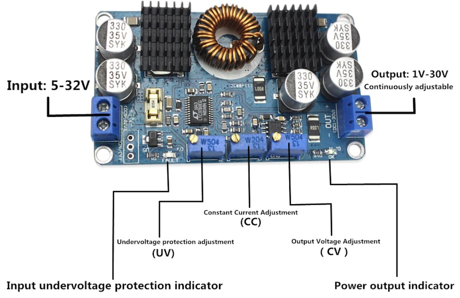
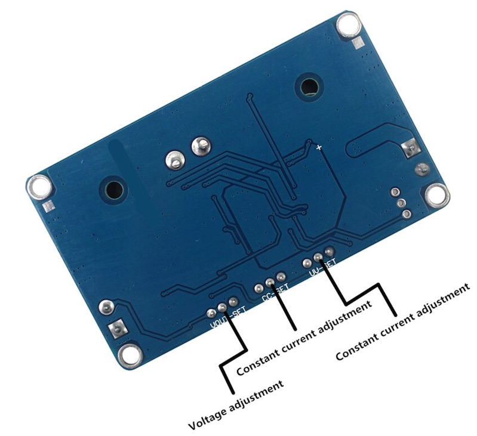
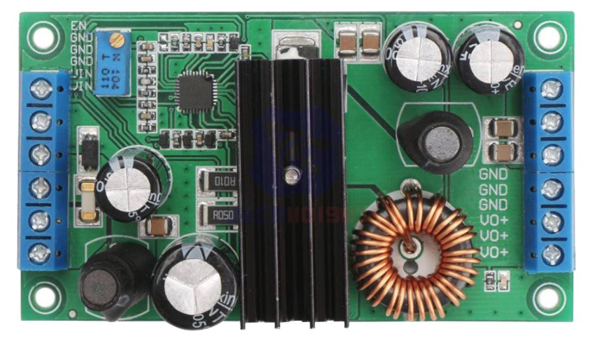
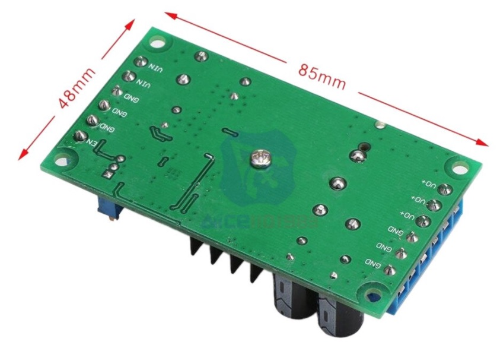
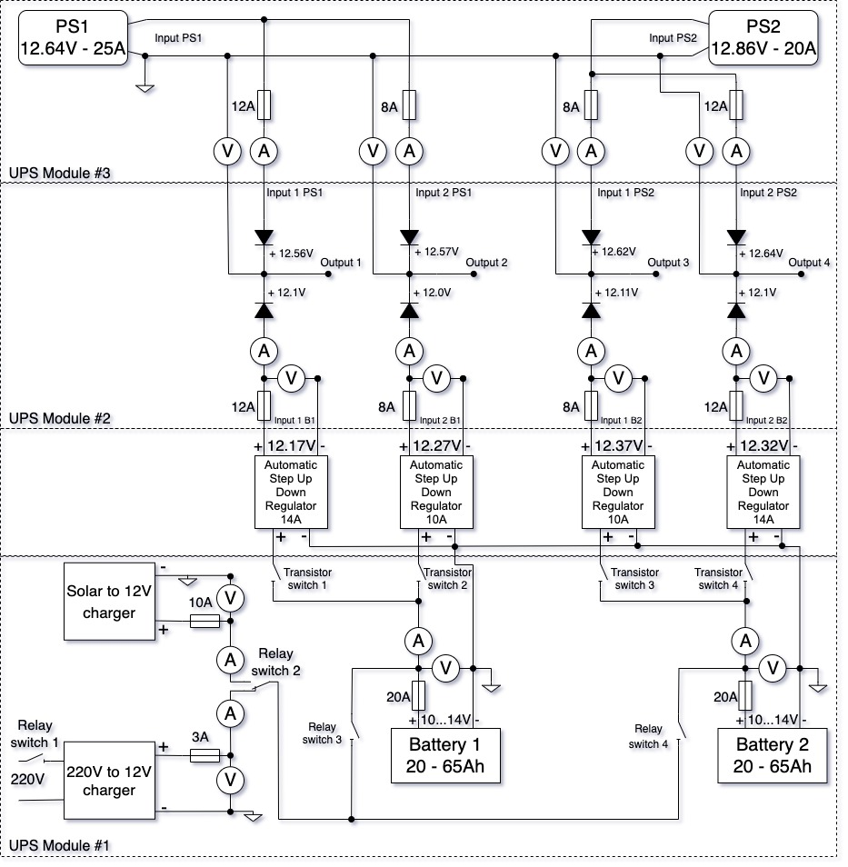
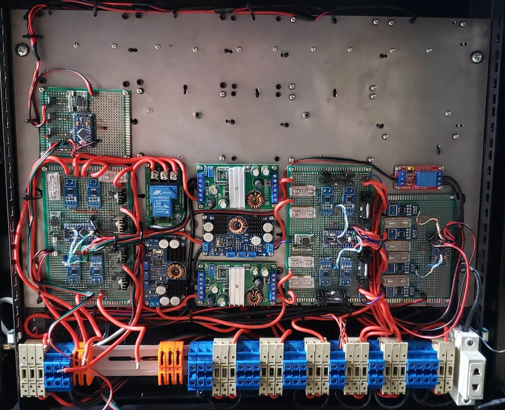

# Low voltage UPS for smart home

## Description

This UPS was designed for smart home with separate two power supply lines and batteries for each line which include two inputs for chargers. For almost on each inputs and outputs measuring voltage, current and power consumption with ability to send data to server via [PJON protocol](https://github.com/gioblu/PJON).

## Main functions

UPS consists from 3 modules

[Module #1](module1) - control outputs and charge batteries 
[Module #2](module2) - UPS function (mixing voltage from batteries and power supplies) 
[Module #3](module3) - measuring voltage, curent and power consumption module

## Components photos and schematics

| Name | Schema / Photo |
| --- | --- |
| Automatic step UP/DOWN Regulator LTC3780 10A |   |
| Automatic step UP/DOWN Regulator LTC3780 14A |   |

## Device circuit

## Devices Photos

