# Low voltage UPS for smart home - Module #1

## Main functions

- control charge process for 2 batteries from PS or Solar chargers. Start batteries charge if voltage >5V and <12.8V. At one time can charge 1 battery;
- if voltage on PS charger <13.0V after enable it will be enabled 1 hour delay and send error message (charger broken or no main voltage);
- solar charge will be enabled if voltage on Solar input will be >=13.0V;
- stop charge batteries if current consumption from them >0.1A;
- measuring batteries temperature, don't start batteries charge if temperature >42°C and stop charge if >45°C;
- measuring PS charger temperature, don't start batteries charge if PS charger temperature >50°C and stop charge if >60°C;
- enable batteries outputs if voltage >12.0V, disable if batteries discharged (less 11.5V)
- measuring batteries temperature, don't enable outputs if batteries temperature >42°C and disable outputs if >45°C;
- measuring voltage, current and power consumption on batteries and chargers with ability sending data to server via [PJON protocol](https://github.com/gioblu/PJON);
- module and outputs can be configured and controlled from server via [PJON protocol](https://github.com/gioblu/PJON)

## PJON Specification

- PJON TxRx Bus Server ID: _1_
- PJON Tx Bus Server ID: _6_
- PJON Bus Device ID: _16_
- PJON Strategy: _SoftwareBitBang_

## Requirements and components

- 1 x Arduino Pro Mini 328 - 5V/16MHz
- 4 x IRF4905 transistors
- 4 x BC547 transistors
- 4 x 1k resistors
- 14 x 10k resistors
- 4 x 100k resistors
- 4 x ACS712-20A modules
- 3 x DS18B20 (for batteries and PS charger)
- 2 x 1 MOm resistors
- 1 x 1N4001 diode
- 1 x HW-613 Mini DC-DC 3A Step Down Power Supply Module (for ACS712 and Arduino devices, 5V output)
- 1 x 0.5A fuse (arduino, relays, etc)
- 1 x 3A fuse (power supply charger)
- 1 x 10A fuse (solar charger)
- 1 x 20A fuse (near battery)
- 1 x 20A fuse (near battery)
- 1 x 5V 10A relay for PS charger (switch 1, outside of board)
- 1 x 5V 30A relay for chargers (switch 2, outside of board)
- 2 x 5V 30A relay for batteries (switch 3 and 4, on DIN rail)

| Arduino PIN | Component | Notes |
| --- | --- | --- |
| D2 (Ext. Int.) Relay switch 3 | - | Charger switch for Battery 1 |
| D3 (PWM) | Relay switch 4 | Charger switch for Battery 2 |
| D4 | Relay switch 1 | Enable/disable PS charger |
| D5 (PWM) | Relay switch 2 | Select charger type |
| D6 (PWM) | 1-Wire | Temperature sensors |
| D7 | [PJON v13.0](https://github.com/gioblu/PJON/tree/13.0/src/strategies/SoftwareBitBang) | Communication with Server (TxRx) |
| D8 | - | - |
| D9 (PWM) | Transistor switch 4 | Output 4 |
| D10 (PWM) | Transistor switch 3 | Output 3 |
| D11 (PWM) | Transistor switch 2 | Output 2 |
| D12 | [PJON v13.0](https://github.com/gioblu/PJON/tree/13.0/src/strategies/SoftwareBitBang) | Communication with Server (TX only) |
| D13 | Transistor switch 1 | Output 1 |
| A0 | ACS712-20A | Solar charger |
| A1 | Voltmeter: r1=100k, r2=10k | Solar charger. 10k=9.76k, 100k=99.9k |
| A2 | ACS712-20A | Power supply charger |
| A3 | Voltmeter: r1=100k, r2=10k | Power supply charger. 10k=9.66k, 100k=98.8k |
| A4 | ACS712-20A | To transistor switch 6 |
| A5 | Voltmeter: r1=100k, r2=10k | To transistor switch 6. 10k=9.9k, 100k=98.6k |
| A6 | ACS712-20A | To transistor switch 5 |
| A7 | Voltmeter: r1=100k, r2=10k | To transistor switch 5. 10k=9.76k, 100k=99.7k |

### Components photos and schematics

| Name | Schema / Photo |
| --- | --- |
| Switch | [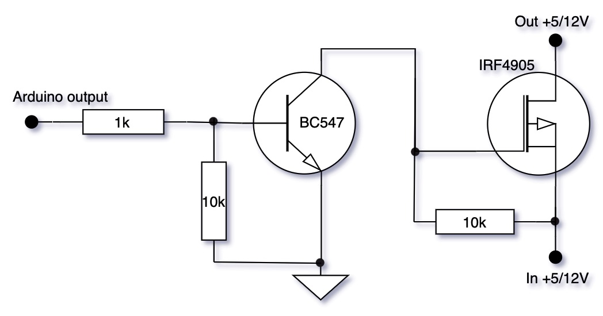](images/Switch.jpg)   |
| Voltmeter |  |
| ACS712 |   |
| HW-613 |   |
| DS18B20 | [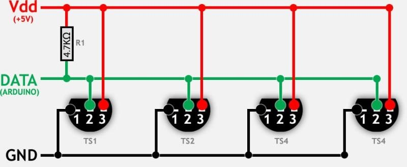](images/DS18B20.jpg) |
| 5V 10A relay | [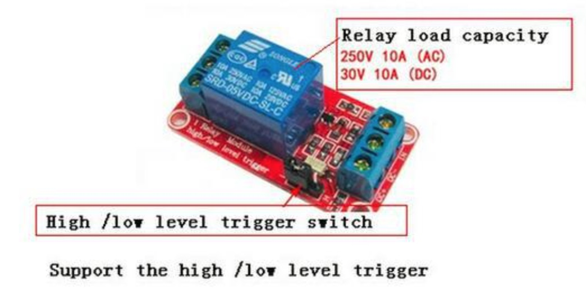](images/5v10a_relay.jpg) |
| 5V 30A relay | [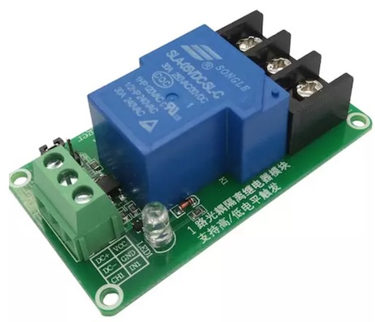](images/5v30a_relay.jpg) |
| 5V 30A DIN rail relay | [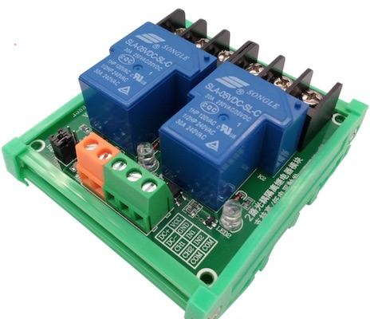](images/5v30a_relay_din.jpg) |

## Commands

| Command | Description | EEPROM | Auto-push | Notes |
| --- | --- | --- | --- | --- |
| C | Read value of charger type | - | - | 0 - PS charger 1 - Solar charger |
| C=[0,1] | Select charger type | - | - | 0 - PS charger 1 - Solar charger default: 0 |
| C-p | Read value of PS charger state | - | - | 0 - disabled 1 - enabled |
| C-p=[0,1] | Disable/enable PS charger | - | - | 0 - disable 1 - enable default: 0 |
| C-a | Read value of charger automode | - | - | 0 - disabled 1 - enabled |
| C-a=[0,1] | Disable/enable charger automode | + | - | 0 - disable 1 - enable default: 1 |
| C-a-m | Read value of charger automode messages | - | - | 0 - disabled 1 - "status" messages only 2 - "status" and "state" messages Status template: "C-a-m<B-[1-2]:\<status>" Possible "status": 0 - disabled 1 - everything is ok "I-[3,4]=value" - battery current consumption >0.1A "T-[1-3]=value" - temperature on batteries or PS charger not ok "C-p=2" - no output from PS charger |
| C-a-m=[0-2] | Disable/enable charger automode messages | + | - | 0 - disable 1 - "status" messages only 2 - "status" and "state" messages default: 0 |
| B-[1-2] | Read state of Batteries switch charger | - | - | 0 - disabled 1 - enabled |
| B-[1-2]=[0,1] | Disable/enable Batteries switch charger | - | - | 0 - disable 1 - enable default: 0 |
| O-[1-4] | Read value of outputs status | - | - | 0 - disabled 1 - enabled |
| O-[1-4]=[0,1] | Disable/enable outputs | - | - | 0 - disable 1 - enable default: 0 |
| O-a | Read value of outputs control automode | - | - | 0 - disabled 1 - enabled |
| O-a=[0,1] | Disable/enable outputs control automode | + | - | 0 - disable 1 - enable default: 1 |
| O-a-m | Read value of outputs control automode messages | - | - | 0 - disabled 1 - "status" messages only 2 - "status" and "state" messages "O-a-m<B-[1-2]:\<status>" Possible "status:" 1 - everything is ok "V-[3,4]=value" - batteries voltage < 11.5V "T-[1-2]=value" - temperature on batteries not ok  |
| O-a-m=[0-2] | Disable/enable outputs control automode messages | + | - | 0 - disable 1 - "status" messages only 2 - "status" and "state" messages default: 0 |
| T-c-[1-3] | Read value of temperature control | - | - | 0 - disabled 1 - enabled |
| T-c-[1-3]=[0,1] | Disable/enable temperature control | + | - | 0 - disable 1 - enable default: 1 T-c-1 - Battery 1 T-c-2 - Battery 2 T-c-3 - PS charger  |
| T-[1-2] | Read value of temperature on batteries | - | + (auto-push every 1 minute) | °C T-1 - Battery 1 T-2 - Battery 2  |
| T-[1-2]-a | Read value of auto-push for temperature on batteries | - | - | 0 - disabled 1 - enabled |
| T-[1-2]-a=[0,1] | Disable/enable auto-push for read values of temperature on batteries | + | - | 0 - disable 1 - enable default: 0 |
| V-[1-4] | Read value of voltage for chargers and outputs | - | + (auto-push every 1 minute) | Volt |
| V-[1-4]-a | Read value of auto-push voltage for chargers and outputs | - | - | 0 - disabled 1 - enabled |
| V-[1-4]-a=[0,1] | Disable/enable auto-push for read values of voltage for chargers and outputs | + | - | 0 - disable 1 - enable default: 0 |
| I-[1-4] | Read value of current for chargers and outputs | - | + (auto-push every 1 minute) | Amper |
| I-[1-4]-a | Read value of auto-push current for chargers and outputs | - | - | 0 - disabled 1 - enabled |
| I-[1-4]-a=[0,1] | Disable/enable auto-push for read values of current for chargers and outputs | + | - | 0 - disable 1 - enable default: 0 |
| P-[1-4] | Read value of power consumption for chargers and outputs | - | + (auto-push every 1 minute) | Watt (Volt * Amper) |
| P-[1-4]-a | Read value of auto-push power consumption for chargers and outputs | - | - | 0 - disabled 1 - enabled |
| P-[1-4]-a=[0,1] | Disable/enable auto-push for read values of power consumption for chargers and outputs | + | - | 0 - disable 1 - enable default: 0 |

where, 
[V,I,P]-1 - Power supply charger 
[V,I,P]-2 - Solar charger 
[V,I,P]-3 - Battery 1 
[V,I,P]-4 - Battery 2 
***EEPROM*** - memory values are kept when the board is turned off 
***Auto-push*** - periodically send data to server

## Charge logic diagram

[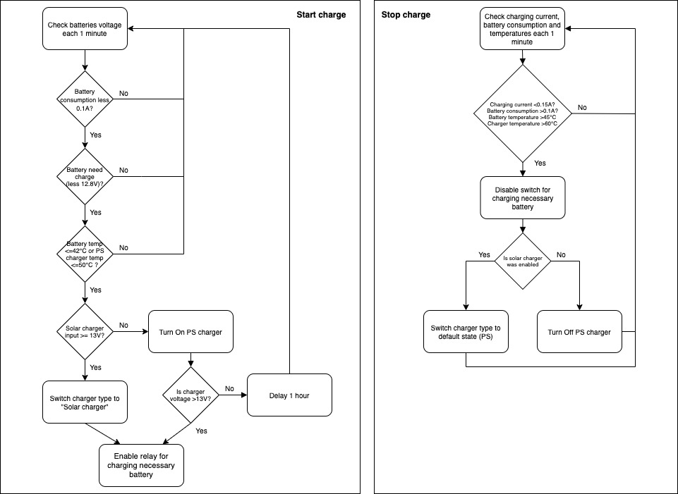](images/slvu_module1_charge_diagram.jpg)

## Device Photos

### Board version 2

[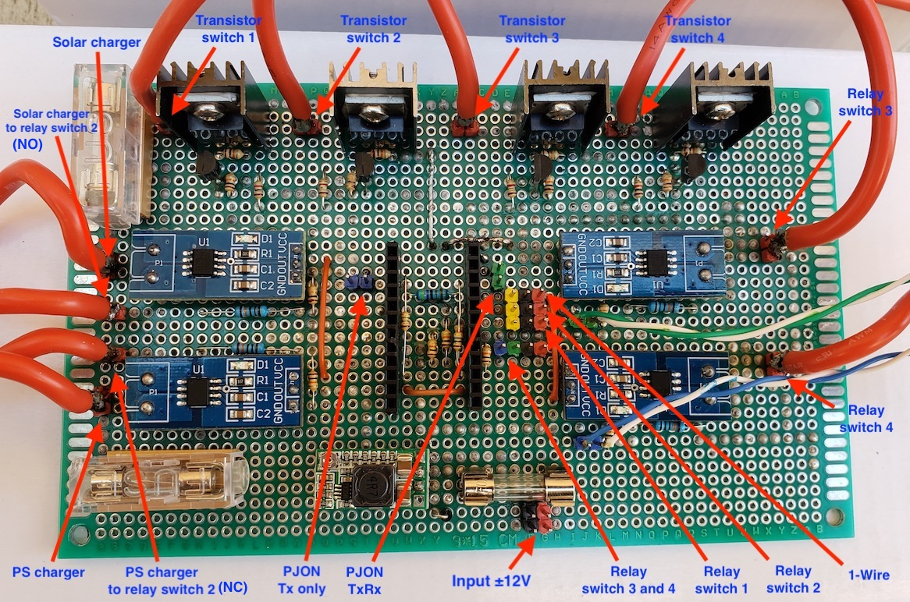](images/slvu_module1_1_v2.jpg)
[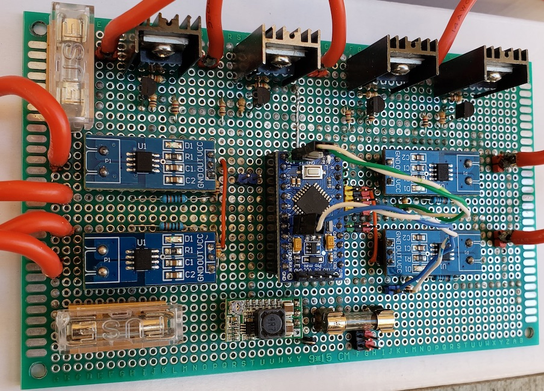](images/slvu_module1_2_v2.jpg)
[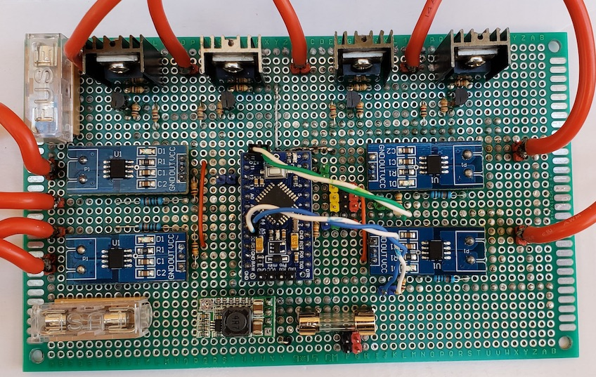](images/slvu_module1_3_v2.jpg)
[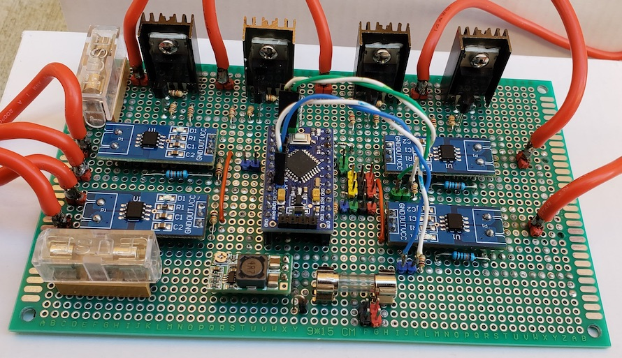](images/slvu_module1_4_v2.jpg)

### Board version 1

**Note:** this version with transistors switches for batteries which is not good as current can go in both dirrections, therefore, was changed to 30A relays, see version 2.

[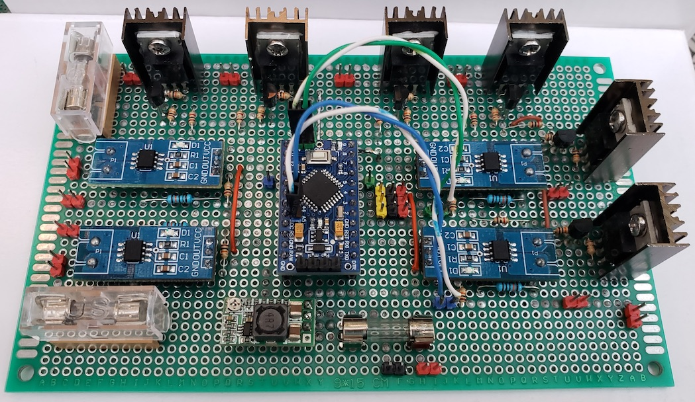](images/slvu_module1_1_v1.jpg)
[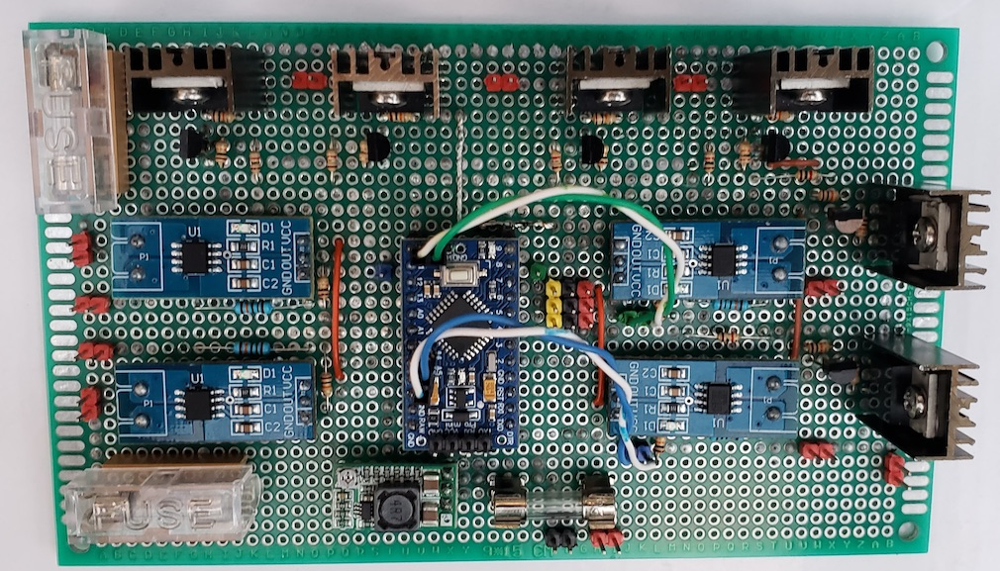](images/slvu_module1_2_v1.jpg)
[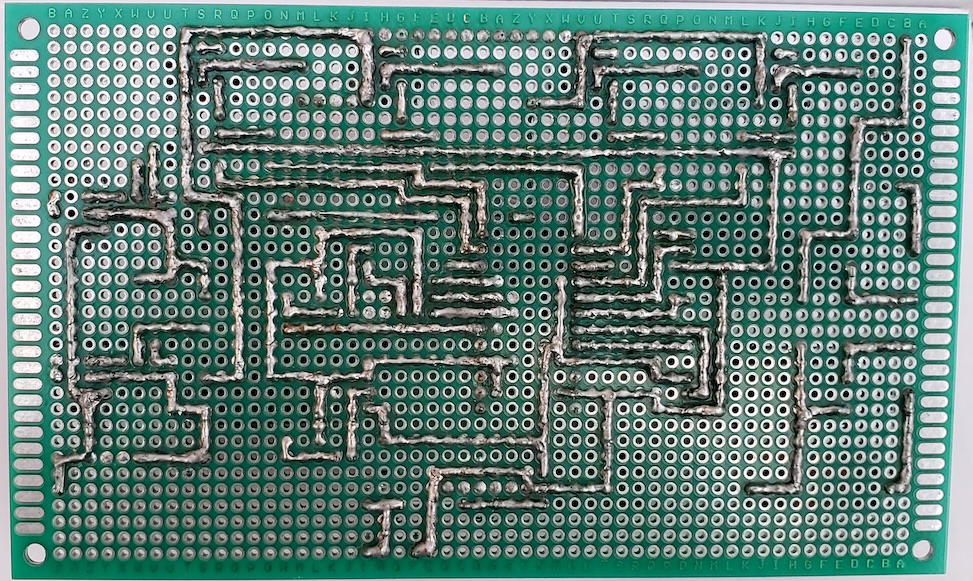](images/slvu_module1_3_v1.jpg)
