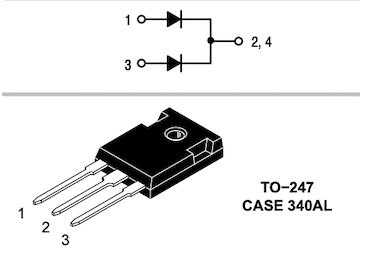
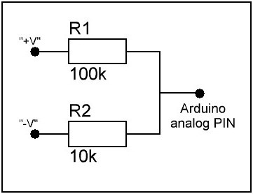
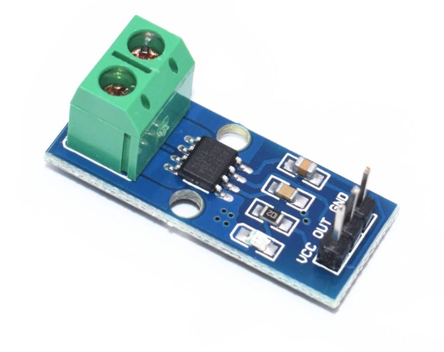
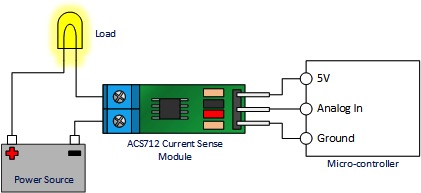
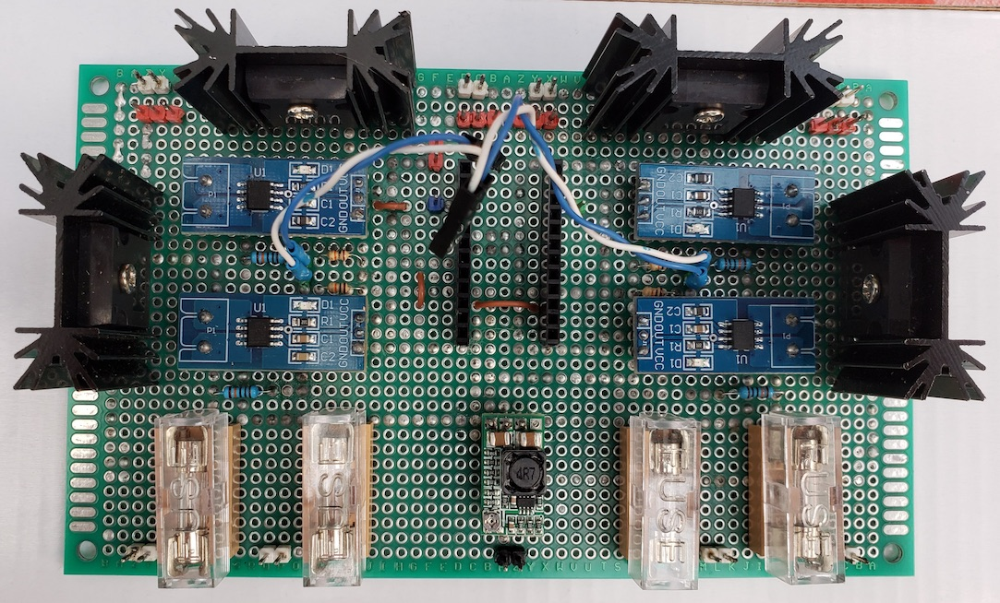
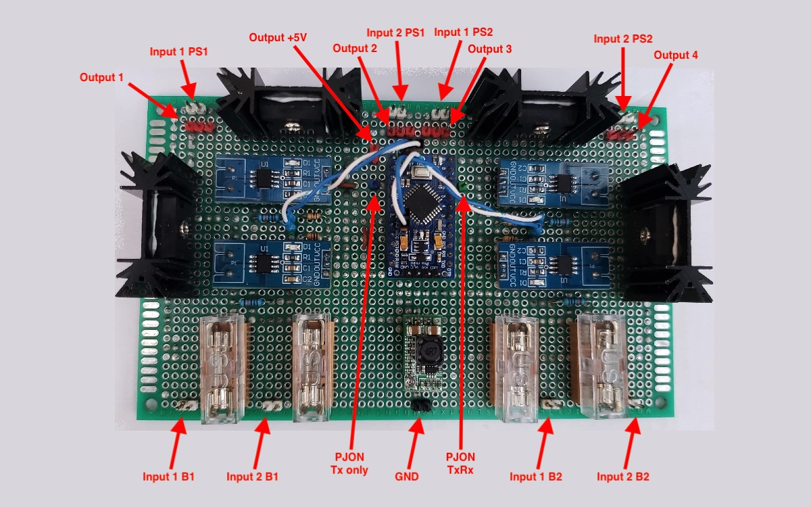
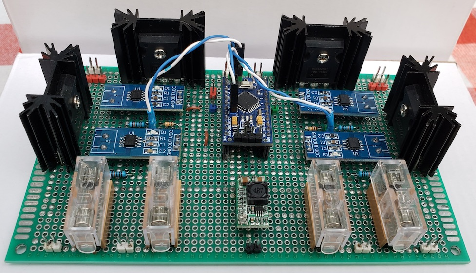
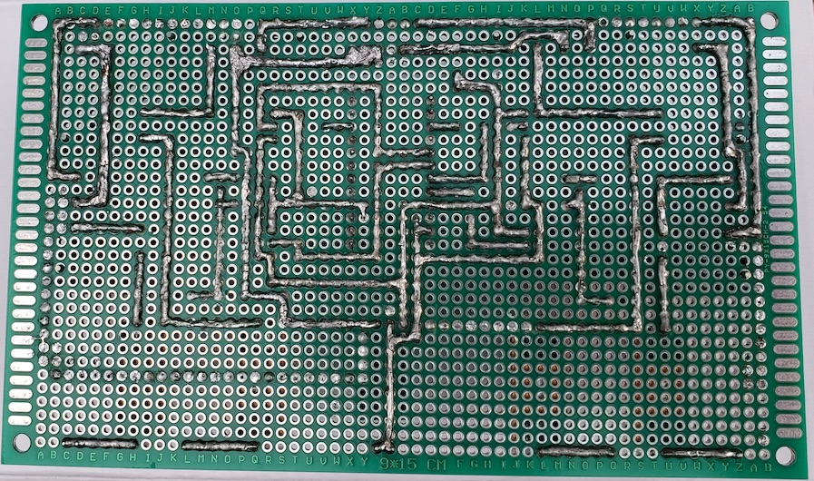

# Low voltage UPS for smart home - Module #2

## Main functions

- mixing voltage from batteries and power supplies;
- 2 x 100W and 2 x 150W UPS outputs which connected to two separate batteries and two separate power supplies (maximum continuous output for each one ~150W);
- "Output 2" and "Output 3" can be connected together and as result can be used for very critical components like home alarm, fire alarm, etc., where need "backup" uninterrupted power supply. In result, if one of the lines will die, devices which will be connected to these outputs will continue supply from another line;
- measuring voltage, current and power consumption from DC-DC step-UP boost converters with ability sending data to server via [PJON protocol](https://github.com/gioblu/PJON)

## PJON Specification

- PJON TxRx Bus Server ID: _1_
- PJON Tx Bus Server ID: _6_
- PJON Bus Device ID: _17_
- PJON Strategy: _SoftwareBitBang_

## Requirements and components

- 1 x Arduino Pro Mini 328 - 5V/16MHz
- 4 x [MBR4045WTG](https://www.onsemi.com/pub/Collateral/MBR4045WT-D.PDF) Schottky diodes
- 4 x ACS712-20A modules
- 4 x 10k resistors
- 4 x 100k resistors
- 2 x 8A fuses
- 2 x 12A fuses
- 1 x HW-613 Mini DC-DC 3A Step Down Power Supply Module (for ACS712 and Arduino devices on #1 and #2 modules, 5V output)

| Arduino PIN | Component | Notes |
| --- | --- | --- |
| D2 (Ext. Int.) | - ||
| D3 (PWM) | - ||
| D4 | - ||
| D5 (PWM) | - ||
| D6 (PWM) | - ||
| D7 | [PJON v13.0](https://github.com/gioblu/PJON/tree/13.0/src/strategies/SoftwareBitBang) | Communication with Server (TxRx) |
| D8 | - ||
| D9 (PWM) | - ||
| D10 (PWM) | - ||
| D11 (PWM) | - ||
| D12 | [PJON v13.0](https://github.com/gioblu/PJON/tree/13.0/src/strategies/SoftwareBitBang) | Communication with Server (TX only) |
| D13 | - ||
| A0 | ACS712-20A | UPS output #3 |
| A1 | ACS712-20A | UPS output #4 |
| A2 | ACS712-20A | UPS output #2 |
| A3 | ACS712-20A | UPS output #1 |
| A4 | Voltmeter: r1=100k, r2=10k | UPS output #2 |
| A5 | Voltmeter: r1=100k, r2=10k | UPS output #1 |
| A6 | Voltmeter: r1=100k, r2=10k | UPS output #4 |
| A7 | Voltmeter: r1=100k, r2=10k | UPS output #3 |

### Components photos and schematics

| Name | Schema / Photo |
| --- | --- |
| MBR4045WTG |  |
| Voltmeter |  |
| ACS712 |   |
| HW-613 |   |

## Commands

| Command | Description | EEPROM | Auto-push | Notes |
| --- | --- | --- | --- | --- |
| V-[1-4] | Read value of voltage for chargers and outputs | - | + (auto-push every 1 minute) | Volt |
| V-[1-4]-a | Read value of auto-push voltage for chargers and outputs | - | - | 0 - disabled 1 - enabled |
| V-[1-4]-a=[0,1] | Disable/enable auto-push for read values of voltage for chargers and outputs | + | - | 0 - disable 1 - enable default: 0 |
| I-[1-4] | Read value of current for chargers and outputs | - | + (auto-push every 1 minute) | Amper |
| I-[1-4]-a | Read value of auto-push current for chargers and outputs | - | - | 0 - disabled 1 - enabled |
| I-[1-4]-a=[0,1] | Disable/enable auto-push for read values of current for chargers and outputs | + | - | 0 - disable 1 - enable default: 0 |
| P-[1-4] | Read value of power consumption for chargers and outputs | - | + (auto-push every 1 minute) | Watt (Volt * Amper) |
| P-[1-4]-a | Read value of auto-push power consumption for chargers and outputs | - | - | 0 - disabled 1 - enabled |
| P-[1-4]-a=[0,1] | Disable/enable auto-push for read values of power consumption for chargers and outputs | + | - | 0 - disable 1 - enable default: 0 |

where, 
[V,I,P]-1 - DC-DC step-UP boost converter output #1 
[V,I,P]-2 - DC-DC step-UP boost converter output #2 
[V,I,P]-3 - DC-DC step-UP boost converter output #3 
[V,I,P]-4 - DC-DC step-UP boost converter output #4 
***EEPROM*** - memory values are kept when the board is turned off 
***Auto-push*** - periodically send data to server

## Device Photos

