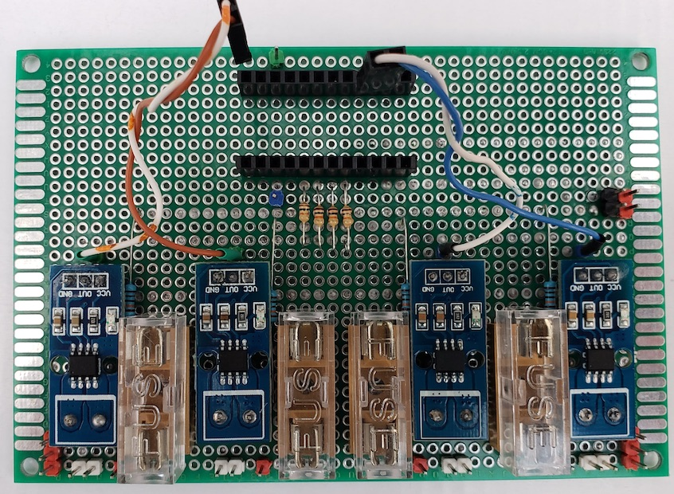
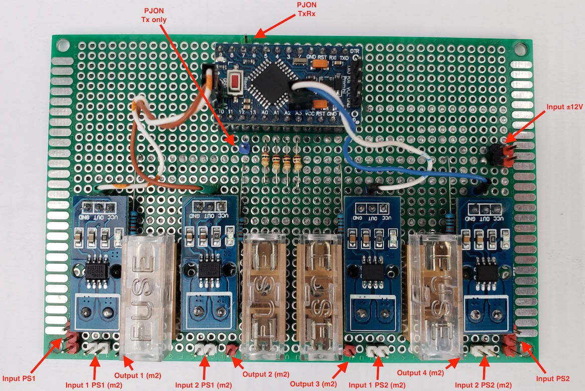
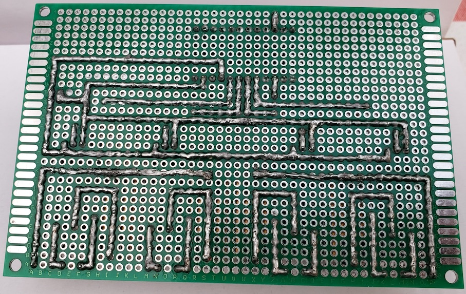

# Low voltage UPS for smart home - Module #3

## Main functions

- sensors for measuring voltage, curent and power consumption on inputs and outputs of module #2 with ability sending data to server via [PJON protocol](https://github.com/gioblu/PJON)

## PJON Specification

- PJON TxRx Bus Server ID: _1_
- PJON Tx Bus Server ID: _6_
- PJON Bus Device ID: _18_
- PJON Strategy: _SoftwareBitBang_

## Requirements and components

- 1 x Arduino Pro Mini 328 - 5V/16MHz
- 4 x ACS712-20A modules
- 4 x 10k resistors
- 4 x 100k resistors
- 2 x 8A fuses
- 2 x 12A fuses

| Arduino PIN | Component | Notes |
| --- | --- | --- |
| D2 (Ext. Int.) | - ||
| D3 (PWM) | - ||
| D4 | - ||
| D5 (PWM) | - ||
| D6 (PWM) | - ||
| D7 | [PJON v13.0](https://github.com/gioblu/PJON/tree/13.0/src/strategies/SoftwareBitBang) | Communication with Server (TxRx) |
| D8 | - ||
| D9 (PWM) | - ||
| D10 (PWM) | - ||
| D11 (PWM) | - ||
| D12 | [PJON v13.0](https://github.com/gioblu/PJON/tree/13.0/src/strategies/SoftwareBitBang) | Communication with Server (TX only) |
| D13 | - ||
| A0 | Voltmeter: r1=100k, r2=10k | UPS output #1 |
| A1 | Voltmeter: r1=100k, r2=10k | UPS output #2 |
| A2 | Voltmeter: r1=100k, r2=10k | UPS output #3 |
| A3 | Voltmeter: r1=100k, r2=10k | UPS output #4 |
| A4 | ACS712-20A | UPS output #3 |
| A5 | ACS712-20A | UPS output #4 |
| A6 | ACS712-20A | UPS output #1 |
| A7 | ACS712-20A | UPS output #2 |

### Components photos and schematics

| Name | Schema / Photo |
| --- | --- |
| Voltmeter |  |
| ACS712 |   |

## Commands

| Command | Description | EEPROM | Auto-push | Notes |
| --- | --- | --- | --- | --- |
| V-[1-4] | Read value of voltage for chargers and outputs | - | + (auto-push every 1 minute) | Volt |
| V-[1-4]-a | Read value of auto-push voltage for chargers and outputs | - | - | 0 - disabled 1 - enabled |
| V-[1-4]-a=[0,1] | Disable/enable auto-push for read values of voltage for chargers and outputs | + | - | 0 - disable 1 - enable default: 0 |
| I-[1-4] | Read value of current for chargers and outputs | - | + (auto-push every 1 minute) | Amper |
| I-[1-4]-a | Read value of auto-push current for chargers and outputs | - | - | 0 - disabled 1 - enabled |
| I-[1-4]-a=[0,1] | Disable/enable auto-push for read values of current for chargers and outputs | + | - | 0 - disable 1 - enable default: 0 |
| P-[1-4] | Read value of power consumption for chargers and outputs | - | + (auto-push every 1 minute) | Watt (Volt * Amper) |
| P-[1-4]-a | Read value of auto-push power consumption for chargers and outputs | - | - | 0 - disabled 1 - enabled |
| P-[1-4]-a=[0,1] | Disable/enable auto-push for read values of power consumption for chargers and outputs | + | - | 0 - disable 1 - enable default: 0 |

where, 
[V,I,P]-1 - UPS output #1 
[V,I,P]-2 - UPS output #2 
[V,I,P]-3 - UPS output #3 
[V,I,P]-4 - UPS output #4 
***EEPROM*** - memory values are kept when the board is turned off 
***Auto-push*** - periodically send data to server

## Device Photos

