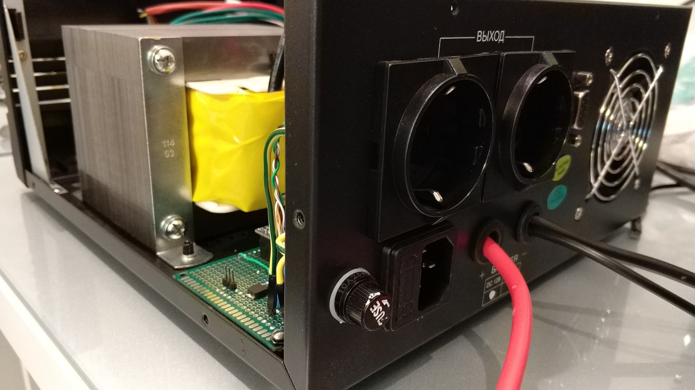

# Smart UPS LUXEON UPS-1000ZD

## Description

I bought "UPS LUXEON UPS-1000ZD" for uninterrupted operation within at least 6 hours after electricity loss of:

- heating boiler
- home network/server
- home security alarm + video monitoring

This is "miracle device" performs its basic functions without any issues, but has some cons which not good for me:

- after 2-3 hours works (even idle mode, without connected devices) the case of the device becomes very warm, the transformer gets very hot, it's very bad for the device which works continuously;
- it has "com-port", but it doesn't work. I tried many applications (and all of them only for Windows, application like NUT don't see this UPS), only one of them shown me small window with green status "OK" - this is was all information from this UPS. Discussions with vendor didn't make results;
- idling consumption: 32W

The last minus I can't solve, but 1st was solved by adding additional fan and 2nd I solved by developed device on Arduino.

### Main functions of device

- measuring temperature in 4 points: _transformer_, _in_, _out_ and on _accumulate battery_
- fan control: manually (fan speed can be defined remotely) or "auto mode" (fan speed controlled by temperature on "_transformer_" and changing gradually, where limits of this temperature can be changed remotely)
- read of speed fan in percent and RPM
- read values of: _voltage_, _current in-out_ and _power consuming_ on accumulate battery
- read output: _voltage_, _current_, _power_ and _energy_
- device can be configured and controlled remotely and send data to some device (like server) by [PJON protocol](https://github.com/gioblu/PJON). To avoid direct connect device with other devices was decided to use [HC-12](http://arduinolab.pw/wp-content/uploads/2016/06/2016-01-14_122335_HC-12_v2.3B.pdf) module for communication. This is very great and very stable module. I highly recommend use it for bi-directional communication. During tests and real work I didn't found any issues in communication by using this module.

### PJON Specification

- PJON Bus Server ID: _1_
- PJON Bus Device ID: _31_
- PJON Strategy: _ThroughSerial_

### Examples

- Enable "auto mode" for fan speed control by temperature on "transformer": _F-c-101_
- Define "temperature low limit" for temperature sensor 1 (transformer): _F-c-tl-30_
- Read output power: _O-p_

### Configure HC-12

Commands need copy-paste to serial-terminal

| minicom -b 9600 -o -D /dev/ttyUSB0 |
| --- |
| AT+C050 |

## Requirements and components

**Controller:** Arduino Pro Mini 328 - 5V/16MHz

| Arduino PIN | Component | Notes |
| --- | --- | --- |
| D2 (Ext. Int.) | Yellow wire \| 10k ↔ VCC (5V) | Cooler RPM (read speed) |
| D3 (PWM) |||
| D4 | DS18B20 DS18B20 DS18B20 DS18B20 | Temperature sensor (transformer) Temperature sensor (in) Temperature sensor (out) Temperature sensor (accumulate battery) |
| D5 (PWM) |||
| D6 (PWM) |||
| D7 | PZEM-004T (TX) | Monitor output: V, A, W and Wh |
| D8 | PZEM-004T (RX) | Monitor output: V, A, W and Wh |
| D9 (PWM) | IRLR2905 | Fan (control speed) |
| D10 (PWM) D11 (PWM) | HC-12 (TX) HC-12 (RX) | Communication with Server Configuration: AT+C050 PJON ([ThroughSerial](https://github.com/gioblu/PJON/tree/master/src/strategies/ThroughSerial)) |
| D12 |||
| D13 |||
| A0 | Voltmeter: r1=100k, r2=10k | Voltage of accumulate battery (100.3k, 10.03k) |
| A1 |||
| A2 |||
| A3 | ACS758LCB-050B | Current in/out of accumulate battery |||

### Fuses (Rear panel)

| # | Value | Description |
| --- | --- | --- |
| 1 | 0.5A | Power suply for fan and deivece |

### Components

| Name | Schema / Photo |
| --- | --- |
| Switch |   |
| Voltmeter |  |
| DS18B20 |  |
| ACS758LCB |   |
| PZEM-004T |  |
| HC-12 |   |

## Commands

| Command | Description | EEPROM | Autopush | Notes |
| --- | --- | --- | --- | --- |
| T-[1-4] | Read temperature of sensors 1-4 | - | + (auto push every 1 minute) | °C, [Transformer, In, Out, Accumulate battery] |
| T-[1-4]-a | Read value of "auto push" for 1-4 sensors | - | - | 0 - disabled; 1 - enabled |
| T-[1-4]-a-[0,1] | Disable/Enable "auto push" for 1-4 sensors | + | - | 0 - disable (default); 1 - enable |
| F-c | Read value of fan control mode | - | - | 0 - fan disabled; 1-100 - fan speed (%); 101 - enabled automatic fan control mode |
| F-c-[0-101] | Define fan speed/ Auto fan mode. "Auto fan mode" - fan speed will be gradually changed (by PWM), depends from temperature sensor 1 (check every 10 sec.) and defined low/high limits | + | - | 0 - disable fan (default); 1-100 - fan speed (%); 101 - enable automatic fan control mode |
| F-c-tl | Read value of "temperature low limit" of temperature sensor 1 (transformer) | - | - | °C, if temperature is less than defined value - fan disabled |
| F-c-tl-[20-40] | Define "temperature low limit" for temperature sensor 1 (transformer) | + | - | °C, value from 20 to 40 (default: 35) |
| F-c-th | Read value of "temperature high limit" of temperature sensor 1 (transformer) | - | - | °C, if temperature is greater than defined value - fan speed 100% |
| F-c-tl-[41-70] | Define "temperature high limit" for temperature sensor 1 (transformer) | + | - | °C, value from 41 to 70 (default: 55) |
| F-[p,r] | Read fan speed [percent, RPM] | - | + (auto push every 1 minute) | [%, RPM] |
| F-[p,r]-a | Read value of "auto push" for fan speed [percent, RPM] | - | - | 0 - disabled; 1 - enabled |
| F-[p,r]-a-[0,1] | Disable/Enable "auto push" for fan speed [percent, RPM] | + | - | 0 - disable (default); 1 - enable |
| A-[v,i,p] | Read [voltage, current in-out, power consuming] on accumulate battery | - | + (auto push every 1 minute) | [Volt, Amper, Watt (Volt * Amper)] |
| A-[v,i,p]-a | Read value of "auto push" for [v,i,p] | - | - | 0 - disabled; 1 - enabled |
| A-[v,i,p]-a-[0,1] | Disable/Enable "auto push" for [v,i,p] | + | - | 0 - disable (default); 1 - enable |
| O-[v,i,p,e] | Read output [voltage, current, power, energy] | - | + (auto push every 1 minute) | [Volt, Amper, Watt, Watt-hour] |
| O-[v,i,p,e]-a | Read value of "auto push" for [voltage, current, power, energy] | - | - | 0 - disabled; 1 - enabled |
| O-[v,i,p,e]-a-[0,1] | Disable/Enable "auto push" for [voltage, current, power, energy] | + | - | 0 - disable (default); 1 - enable |

***EEPROM*** - memory values are kept when the board is turned off 
***Autopush*** - send data to server

## Device Photos

## URLs

[Use a PC Fan as a Sensor](https://www.hackster.io/porrey/use-a-pc-fan-as-a-sensor-265798)
