# Home cluster for smart things control

## Cluster components

| Device | Communication protocol | Address | Notes |
|---|---|---|---|
| [Cluster case and hardware](cluster-case-and-hardware) | - | - ||
| [IP-KVM](ip-kvm) | Ethernet | Private IP ||
| [PJON routers](pjon-routers) | PJON | 1, 6 ||
| [Power Supply with Monitoring](ps-with-monitoring) | PJON | 15 ||
| [Low voltage UPS for smart home](smart-low-voltage-ups) | PJON | 16, 17, 18 ||
| [Fire Alarm System](fire-alarm)| PJON | 19 ||
| [Server Rack Cooling System](server-rack-cooling) | PJON | 20 ||
| [Power Supply boards and USB HUBs](power-supply-usb-hubs) | I2C | 0x03 ||
| [Cluster cooling](cluster-cooling) | PJON | 22 ||

## Cluster and power supply rack

For cluster rack I chose [TUFFIOM 9U Network Cabinet Enclosure](https://www.amazon.com/gp/product/B079ZZ8Y6X/ref=ppx_yo_dt_b_search_asin_title?ie=UTF8&psc=1) and added connectors to it to avoid pull wires from outside through holes, i.e. isolated it from outside.
Holes for mounting closed by [3M Fire Barrier](https://www.amazon.com/gp/product/B002FYAMPM/ref=ppx_yo_dt_b_search_asin_title?ie=UTF8&psc=1). 
This rack come with 2 x 110V fans which I replaced by 2 x 120mm 12V fans. Also was added 2 x 120mm 12V to each rack side. 
In the inside I put 2 x automatic fire suppressor [StoveTop FireStop Rangehood](https://stovetopfirestop.com/product/rangehood/). This is "class K" fire suppression which supposed to use on the kitchen but from reviews I found that is also works for electronics as it dry-chemical fire extinguisher. Once I will find good alterntive it will be changed to "class C".

[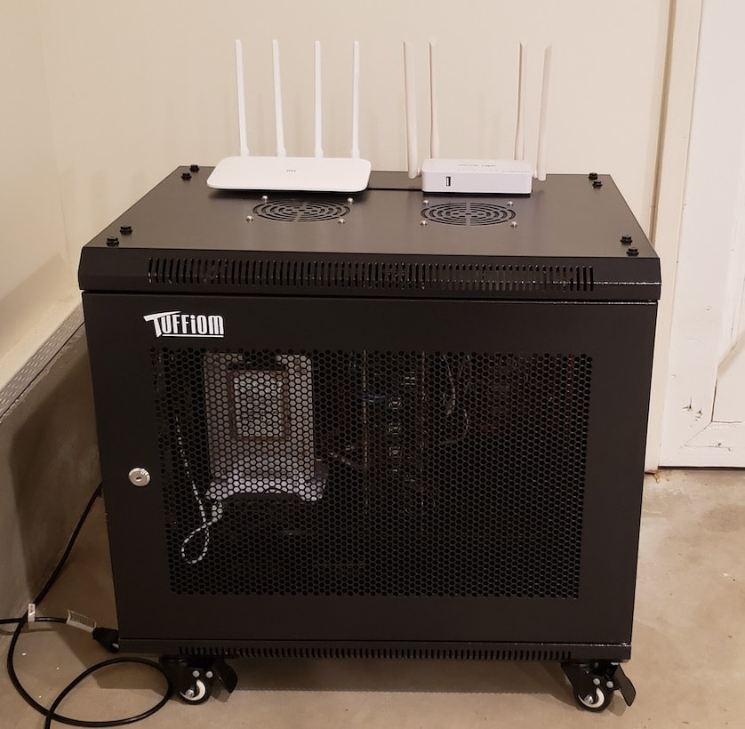](images/rack_1.jpg)
[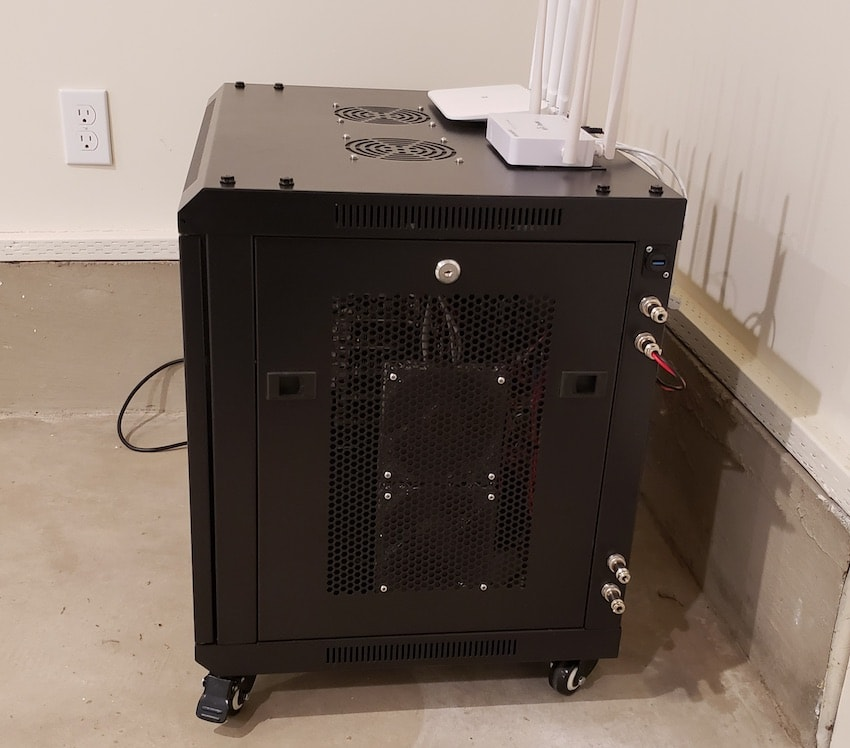](images/rack_2.jpg)
[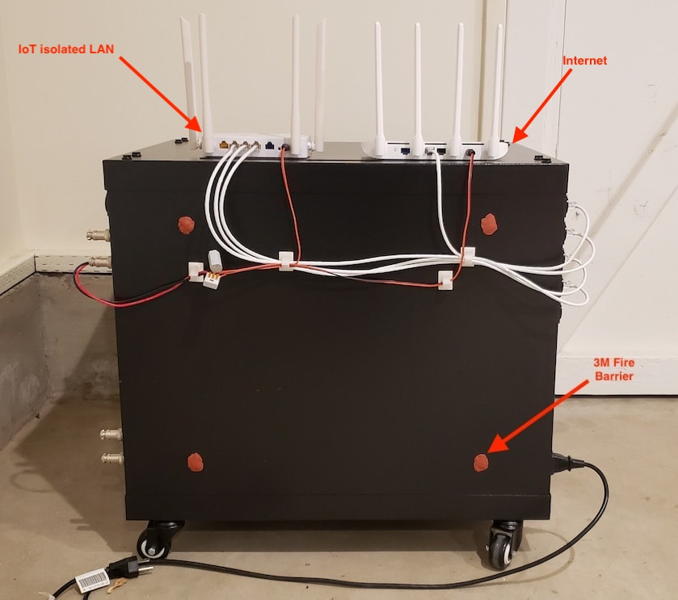](images/rack_3.jpg)
[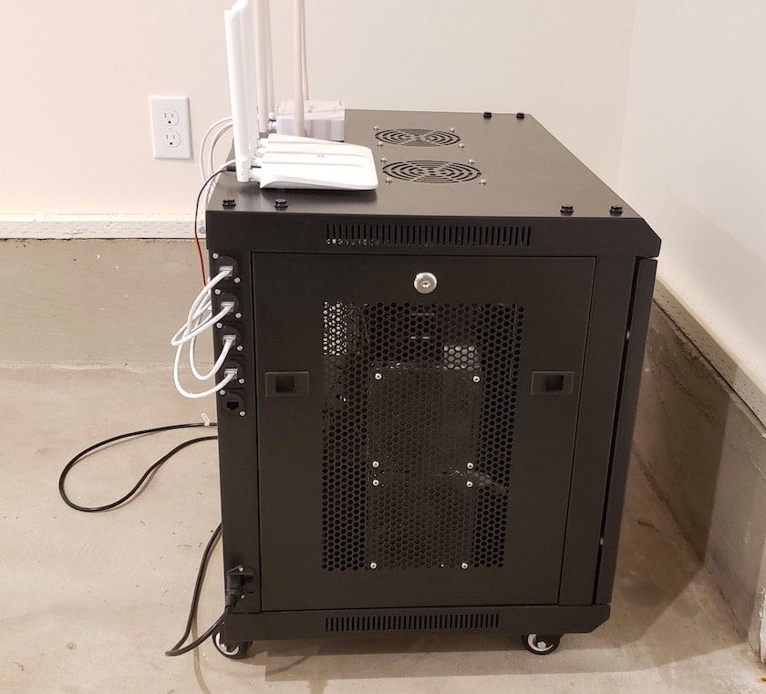](images/rack_4.jpg)
[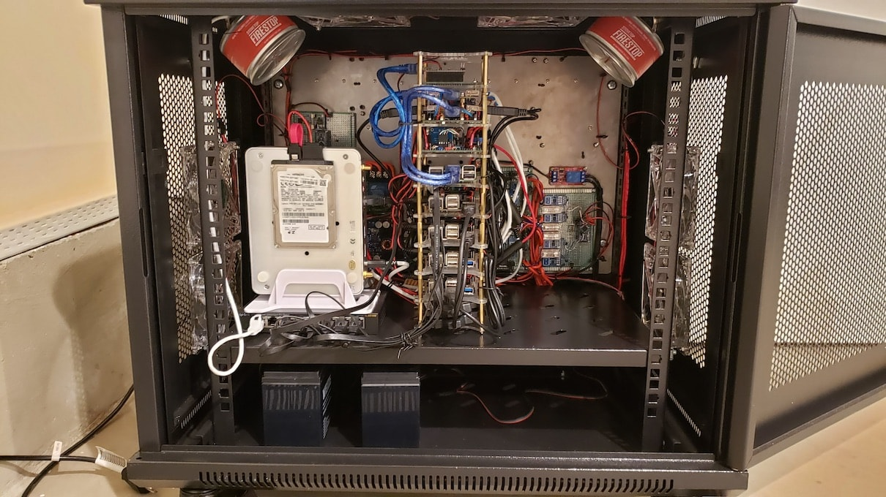](images/rack_5.jpg)
[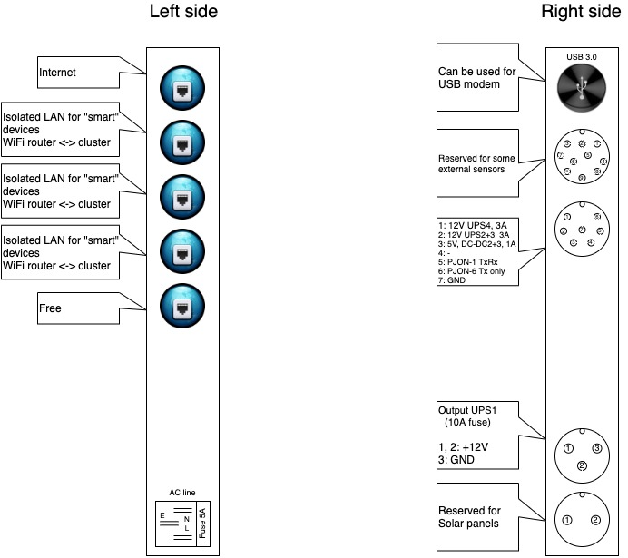](images/rack_6.jpg)

On front side plate was placed [UPS](smart-low-voltage-ups), [server-rack-cooling](server-rack-cooling) and reserved place for other electronics like [fire-alarm](fire-alarm), security alarm, etc.

[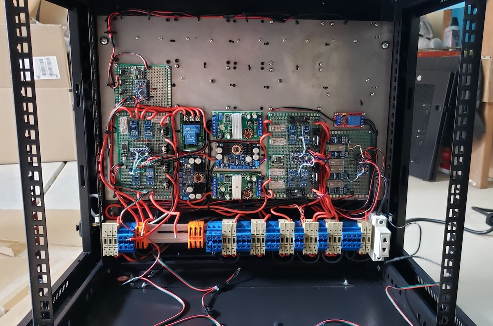](images/rack_inside_front_1.jpg)
[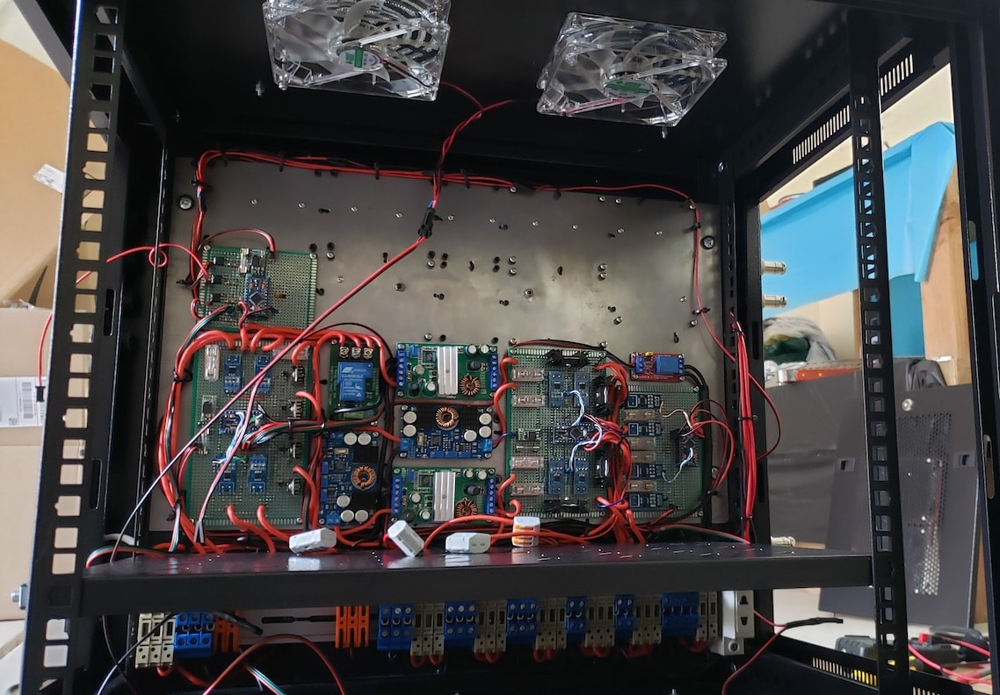](images/rack_inside_front_2.jpg)
[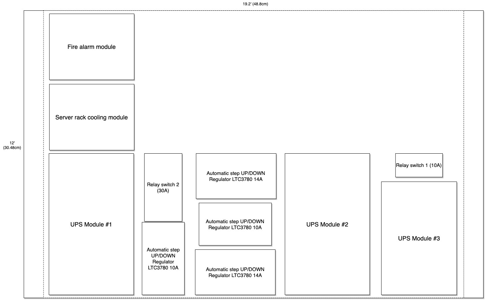](images/rack_inside_front_3.jpg)
[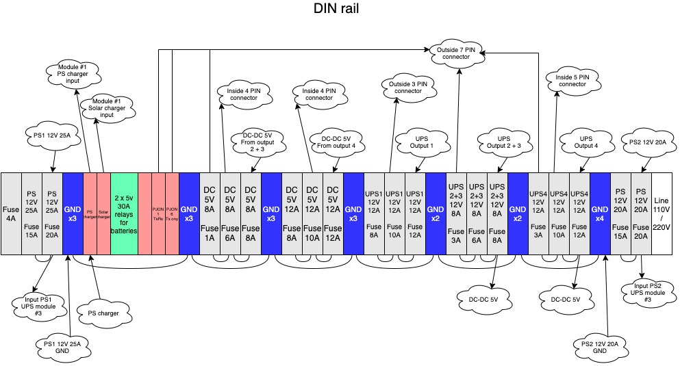](images/rack_inside_front_4.jpg)

On back side plate was placed Power supply modules with 5 x 50mm 12V fans and [power supplies with monitoring module](ps-with-monitoring) and other sensors.

[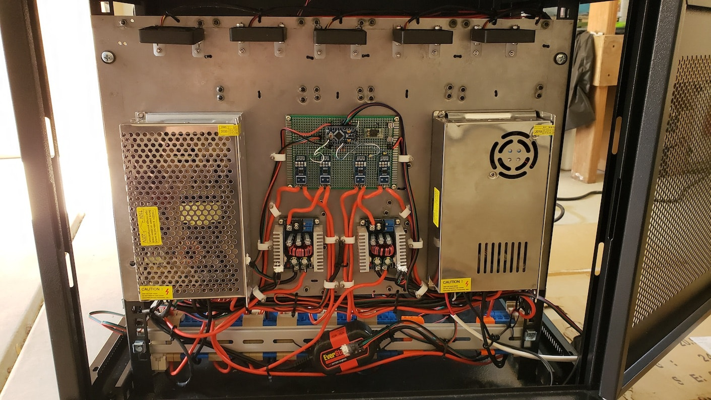](images/rack_inside_back_1.jpg)
[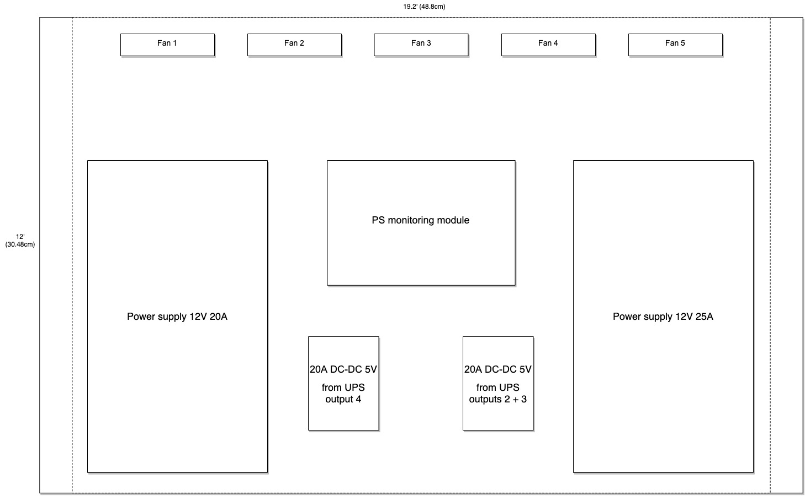](images/rack_inside_back_2.jpg)

## Device Photos

[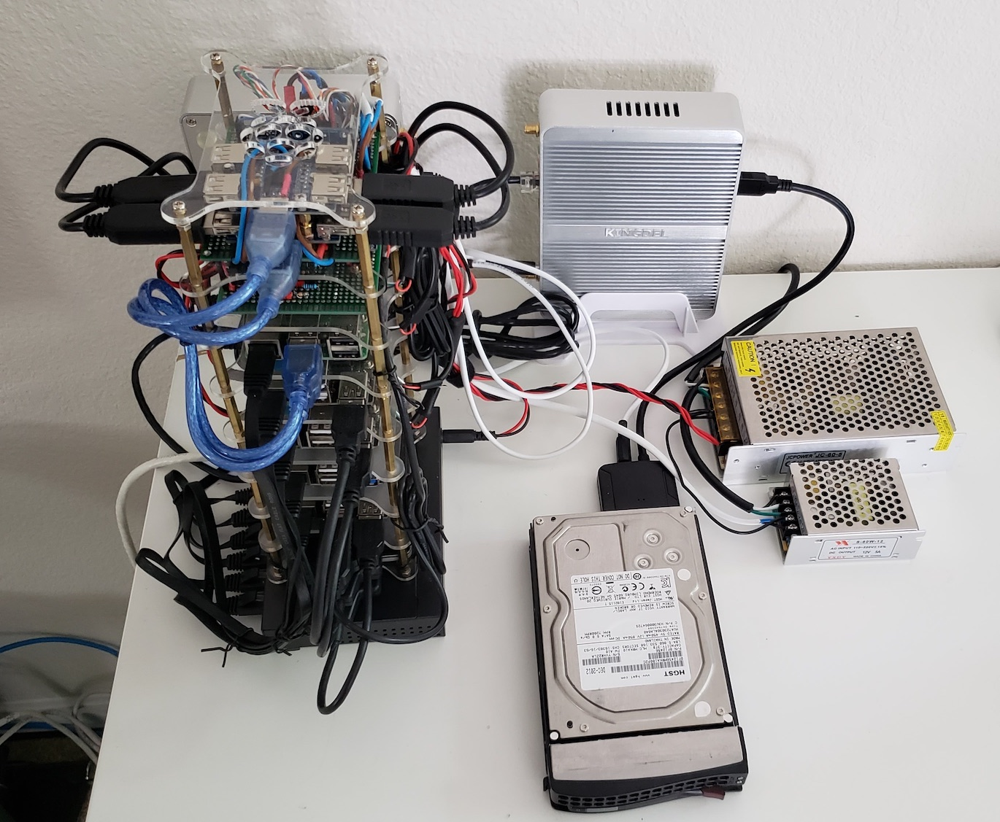](images/home-cluster_1.jpg)
[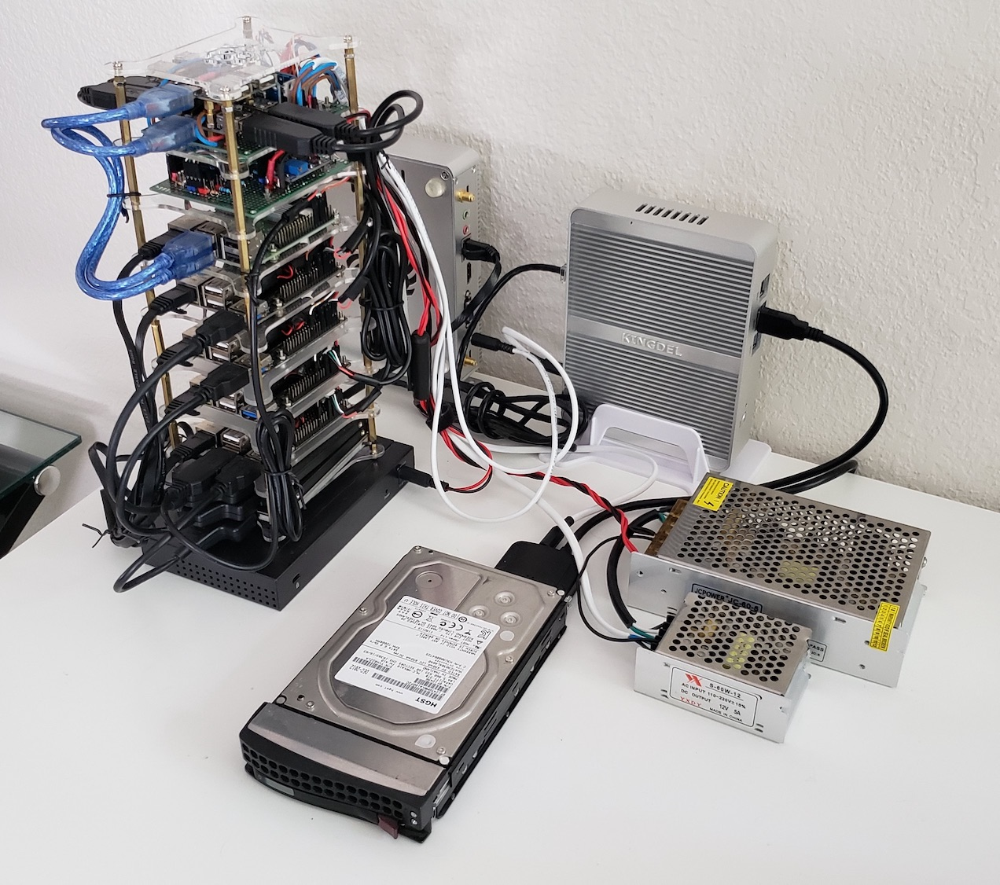](images/home-cluster_2.jpg)
[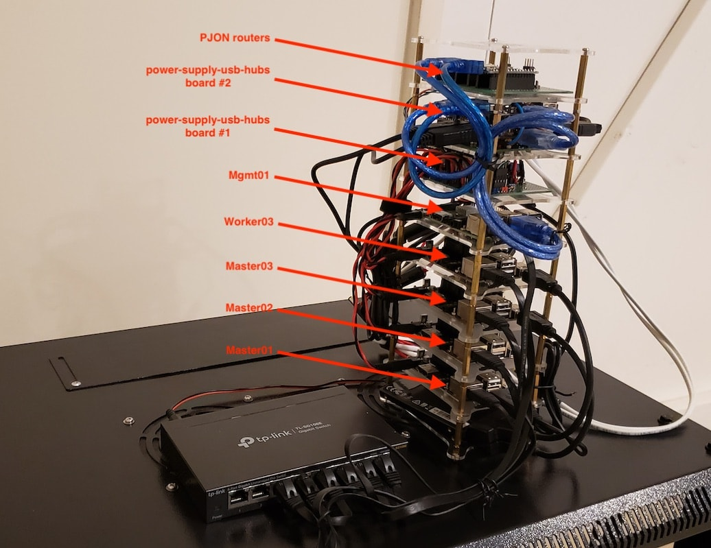](images/home-cluster_3.jpg)
