# Home Cluster

## Description

This is fully autonomous and automated high availability "micro data center" for home. All critical components has been reserved both on the hardware level and on the software level.

This is the 2nd version on 24V. A year ago I built [1st version](old-versions/version-1) on 12V which was unstable when all 6 computers were turned on. It's a long story, but in a few words from electronics "axioms" - if you want to eliminate issues with power - power your electronics with proper voltage and power.

Beside automation and reservation all devices (like computers, switches, external wifi routers, etc.) fully controlled remotely:

- turn on/off/reboot via [Power Supply boards and USB HUBs](components/power-supply-usb-hubs) module;
- access to all computers via [IP-KVM](components/ip-kvm).

### Hardware level reservation

- reservation by power (see details: [Low voltage UPS for smart home](components/smart-low-voltage-ups)):
  - `two separate power supplies` which can be connected to different lines;
  - `two separate batteries lines` for backup power when no power from lines;
  - `separate input` for connect to solar panels or other renewable energy with 24V on output;
- cluster hardware has `3 x arm SBCs` and `3 x x64 mini PCs` which totally enough for building HA Kubernetes cluster (see details: [Cluster case and hardware](components/cluster-case-and-hardware));
- 2 x [USB 3.0 KVM Switcher 2 Port PCs Sharing 4 Devices](https://www.aliexpress.com/item/4001215985508.html?spm=a2g0s.9042311.0.0.27424c4dnp0HBe) used for reservation connection of USB devices;
- IoT devices which controlled via [PJON protocol](https://www.pjon.org) also has reservation by additional Arduinos (see [PJON routers](components/pjon-routers));
- availability to use multiple internet providers include mobile and satellite internet providers (rack has all necessary outside connectors which can be easily connected to internal cluster components) for full reservation of internet connection.

### Software level reservation

- HA Kubernetes cluster: 3 x arm SBCs for Master nodes and 3 x x64 mini PCs for Workers;
- Each Worker node has additional 1TB disk which used for HA data storage based on [OpenEBS](https://openebs.io) and [MinIO](https://min.io);
- Full remote access to Masters and Workers via [IP-KVM](components/ip-kvm) for example to easily access in BIOS or remote manual OS installation.

### Automation and monitoring

As electronics are just my hobby and my primary job/position is SRE I clearly understand that repeatable things should be automated and critical components should be monitored.  

#### Automation

At first sight, what can be repeatable for a home cluster where hardware for the years can be unchangeable? Yes, with one server - it's can be ok, but when you have 6 servers and time to time they should be upgraded both on the hardware and on the software levels - manual deployment and configuration become to pain, therefore, I trying to keep everything automated.

- OS deployment on all nodes (includes arm SBCs) I making via PXE and process fully automated. [IP-KVM](components/ip-kvm) is used only when need make some correction in configuration files for the new OS version of automated deployment;
- for automate configuration of hardware nodes, some LXD containers and applications like [HashiCorp Vault](https://www.vaultproject.io) I use [terraform](https://www.terraform.io/) and [ansible](https://www.ansible.com/);
- Kubernetes deployment, include building docker containers via [bazel](https://bazel.build).

Some other software which I use:

- [MetalLB](https://metallb.universe.tf) - network load balancer for bare-metal clusters;
- [Traefik](https://doc.traefik.io/traefik) - as Kubernetes ingress controller;
- [Docker-registry](https://docs.docker.com/registry) - for storing my containers;
- [OpenVPN](https://openvpn.net) - access into private network from anywhere (I have everything closed for public internet);
- [Gitea](https://gitea.io) - for storing my projects code and docs in git, also, for CI-CD, tickets system (sometimes it useful create tickets for my self :) );
- [Home Assistant](https://www.home-assistant.io) - main component for IoT things;
- [Frigate](https://github.com/blakeblackshear/frigate) - NVR With Realtime Object Detection for IP Cameras.

#### Monitoring

For hardware level, almost each line has a monitoring of voltage, current and power consumption. Also, it has 12 temperature sensors, 8 flame sensors and 2 smoke detection sensors. From all these components data sending to cluster via [PJON protocol](hhttps://github.com/gioblu/PJON) and storing it in the DB for visualization via [Prometheus](https://prometheus.io) / [Grafana](https://grafana.com) with alerting about abhormal situations via [Prometheus Alertmanager](https://prometheus.io/docs/alerting/latest/alertmanager) / [Telegram](https://telegram.org) / [Slack](https://slack.com).

For software level monitoring and alerting used the same software stack: [Prometheus](https://prometheus.io) / [Grafana](https://grafana.com) / [Prometheus Alertmanager](https://prometheus.io/docs/alerting/latest/alertmanager) / [Telegram](https://telegram.org) / [Slack](https://slack.com).

How overview cluster dashboard looks:

[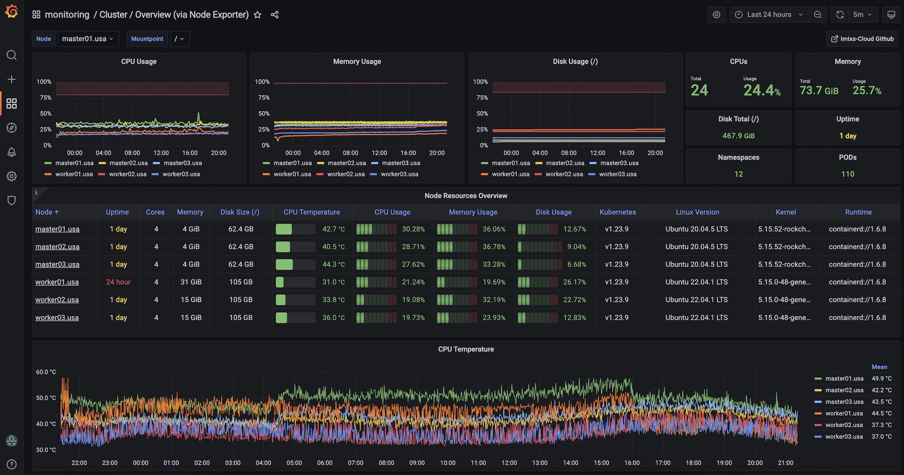](images/overview_dashboard.jpeg)

## Cluster rack design

For cluster rack I chose [TUFFIOM 9U Network Cabinet Enclosure](https://www.amazon.com/gp/product/B079ZZ8Y6X/ref=ppx_yo_dt_b_search_asin_title?ie=UTF8&psc=1) and added connectors to it to avoid pulling wires from outside through holes, i.e. isolated it from outside.
Holes for mounting closed by [3M Fire Barrier](https://www.amazon.com/gp/product/B002FYAMPM/ref=ppx_yo_dt_b_search_asin_title?ie=UTF8&psc=1).  
This rack comes with 2 x 110V fans which I replaced by 2 x 120mm 12V fans. Also was added 2 x 120mm 12V to each rack side.

I tried to make it a safe as possible:

- fully isolate everything from outside (via nonflammable connectors)
- I think that I used more 70% nonflammable components and wires inside
- I used here so many fuses as I have never seen on any device before (each line at least has one fuse, in some cases two)

But for "better sleep" I decided to put **3** automatic fire suppressors: 2 x [StoveTop FireStop Rangehood](https://stovetopfirestop.com/product/rangehood/) on the inside (near the largest congestion of wires) and 1 x [JOSEOZSTA](https://www.amazon.com/dp/B09YS6DJWN?ref=ppx_yo2ov_dt_b_product_details&th=1) on the top (between fans).

[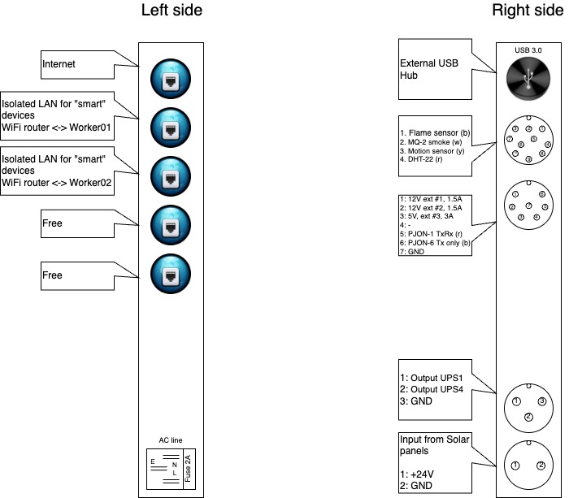](images/cluster_rack_10.jpeg)

On the front side plate was placed [UPS](components/smart-low-voltage-ups), [rack cooling](components/rack-cooling), [rack alarm](components/rack-alarm) and reserved place for other electronics.

[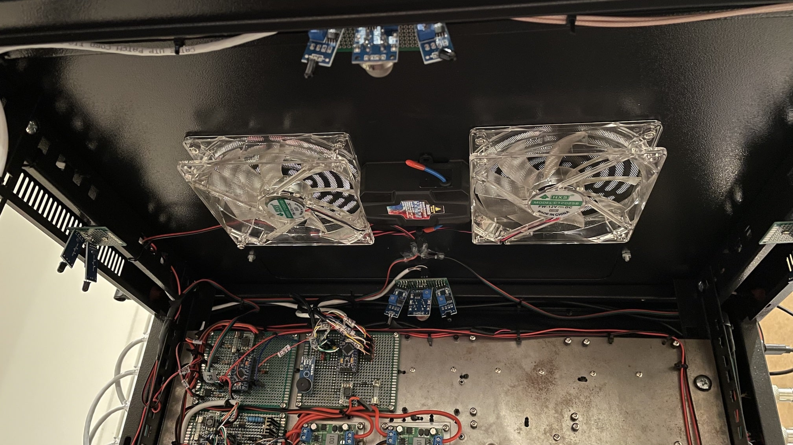](images/cluster_rack_inside_front_2.jpeg)

[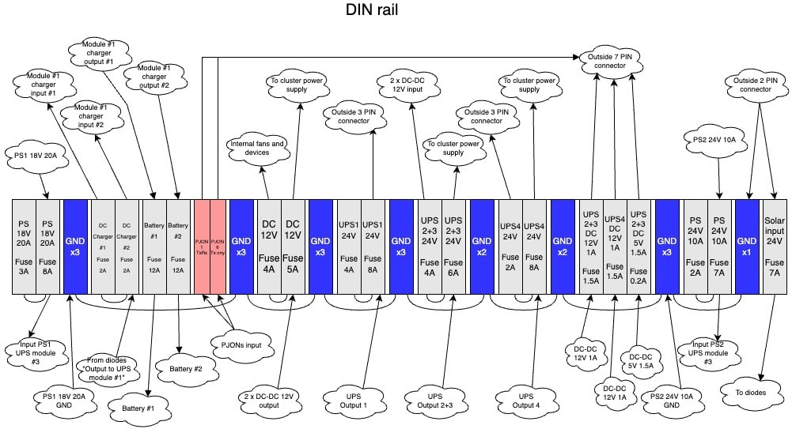](images/cluster_rack_inside_front_6.jpeg)

On the back side plate was placed Power Supply modules with 5 x 50mm 12V fans and [power supplies with monitoring module](components/ps-with-monitoring) and other sensors.

[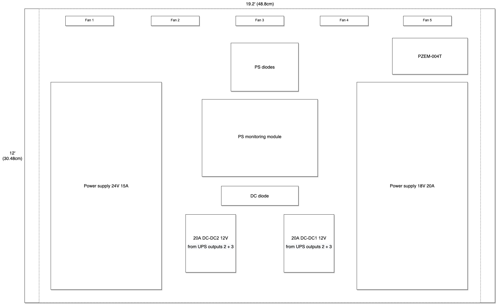](images/cluster_rack_inside_back_2.jpeg)

## Heatmap

As it too much electronics inside 9U rack it should be very good cooled, therefore, inside this rack I placed 20 fans (11 for rack cooling and 9 for cluster cooling). Fans turn on only when temperatures higher than normal and controlled by module [rack cooling](components/rack-cooling) and [cluster cooling](components/cluster-cooling).

## Upgrade

Added [12U rack](https://www.amazon.com/dp/B07JB9YCJF?psc=1&ref=ppx_yo2ov_dt_b_product_details). For now it using for UPS ([APC BE600M1](https://www.amazon.com/dp/B01FWAZEIU?psc=1&ref=ppx_yo2ov_dt_b_product_details)) and PoE Switch ([NETGEAR GS305EP](https://www.amazon.com/dp/B08LR18SC4?psc=1&ref=ppx_yo2ov_dt_b_product_details)) which I need for my cameras, but in the future can be added more devices (as this rack have plenty free space). To be sure that top 9U rack won't overweight native 12U legs I added [4 x adjustable legs](https://www.amazon.com/dp/B0B9J482TM?psc=1&ref=ppx_yo2ov_dt_b_product_details).

Also was added 2 smoke detectors: 1 x [X-Sense SC06-W Smoke and Carbon Monoxide Detector](https://www.amazon.com/dp/B09FXXXG95?psc=1&ref=ppx_yo2ov_dt_b_product_details) which paired with other smoke detectors (if one will be triggered - all will be activated) and 1 x [First Alert Z-Wave Smoke Detector & Carbon Monoxide Alarm](https://www.amazon.com/dp/B08FFB233Y?psc=1&ref=ppx_yo2ov_dt_b_product_details) which I use for notifications on mobile. Inside 12U rack I put 1 x [Automatic Fire Extinguisher](https://www.amazon.com/dp/B095S3L4GT?psc=1&ref=ppx_yo2ov_dt_b_product_details). All external wires was placed in [fiberglass tube](https://www.aliexpress.us/item/2255800366654895.html?spm=a2g0o.order_list.0.0.21ef1802x8n4oh&gatewayAdapt=glo2usa&_randl_shipto=US) which is totally non flammable.

[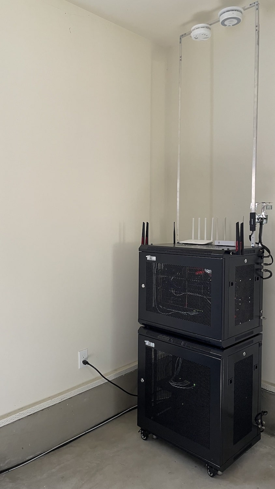](images/cluster_rack_upgrade1_1.jpeg)
[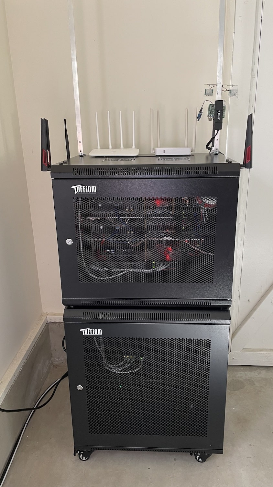](images/cluster_rack_upgrade1_2.jpeg)
[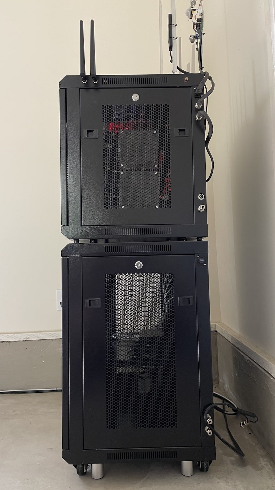](images/cluster_rack_upgrade1_3.jpeg)
[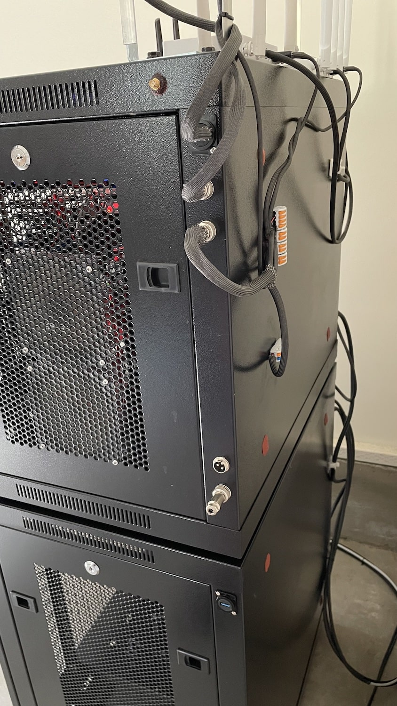](images/cluster_rack_upgrade1_4.jpeg)
[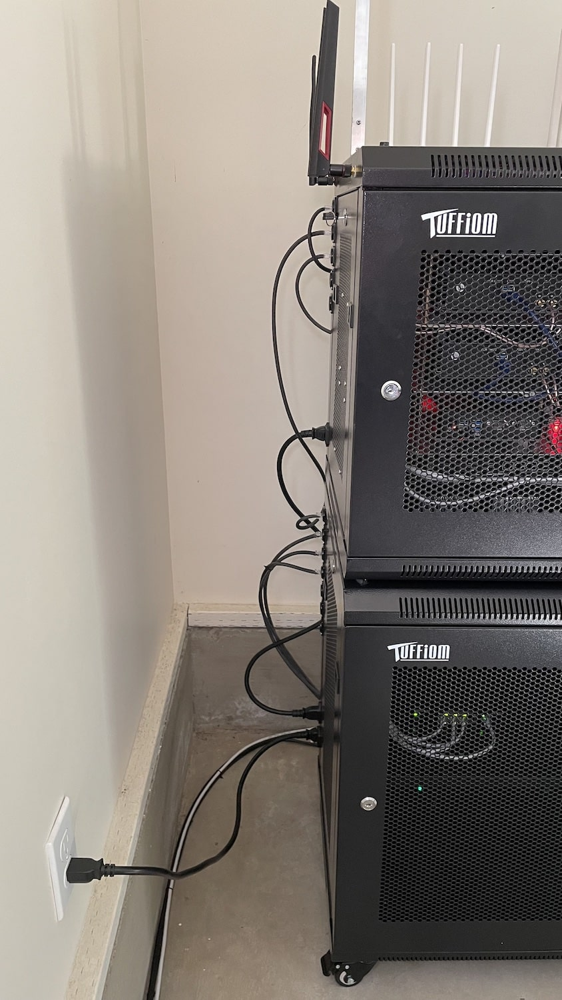](images/cluster_rack_upgrade1_5.jpeg)
[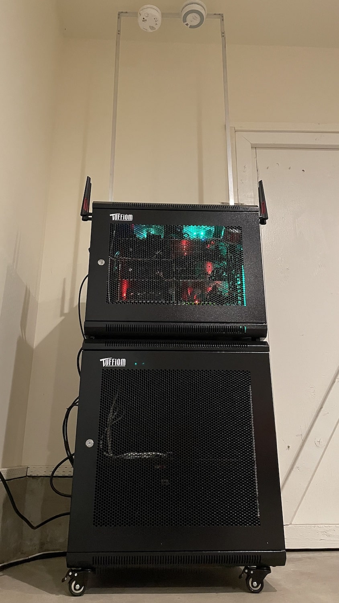](images/cluster_rack_upgrade1_6.jpeg)

