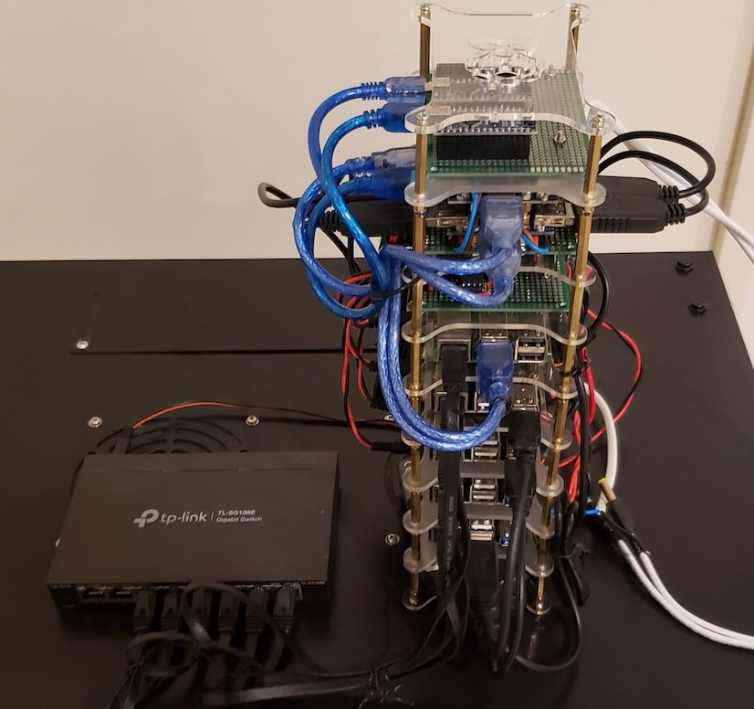
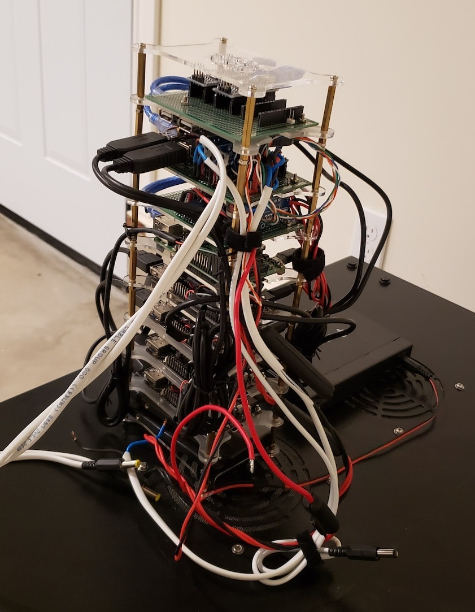

# Home cluster for smart things control

## Cluster and power supply rack

I bought [TUFFIOM 9U Network Cabinet Enclosure](https://www.amazon.com/gp/product/B079ZZ8Y6X/ref=ppx_yo_dt_b_search_asin_title?ie=UTF8&psc=1) and added connectors to it to avoid pull wires from outside through holes, i.e. isolated it from outside.
Holes for mounting closed by [3M Fire Barrier](https://www.amazon.com/gp/product/B002FYAMPM/ref=ppx_yo_dt_b_search_asin_title?ie=UTF8&psc=1). 
This rack come with 2 x 110V fans which I replaced by 2 x 120mm 12V fans. Also was added 2 x 120mm 12V to each rack side. 
In inside I put 2 x automatic fire suppressor [StoveTop FireStop Rangehood](https://stovetopfirestop.com/product/rangehood/). This is "class K" fire suppression which supposed to use on the kitchen but from reviews I found that is also works for electronics as it dry-chemical fire extinguisher. Once I will find good alterntive it will be changed to "class C".

On front side plate was placed [UPS](../automation-devices/smart-low-voltage-ups), [server-rack-cooling](../automation-devices/server-rack-cooling) and reserved place for other electronics like [fire-alarm](../automation-devices/fire-alarm), security alarm, etc.

On back side plate was placed Power supply modules with 5 x 50mm 12V fans and [ps-monitoring](../automation-devices/ps-monitoring) module.

## Cluster hardware

**Mgmt01 (arm64)** 
[Raspberry Pi 3 Model B+ Motherboard](https://www.raspberrypi.org/products/raspberry-pi-3-model-b/) - 1 x $38.15 
[Samsung 32GB 95MB/s (U1) MicroSD EVO Select Memory Card with Adapter (MB-ME32GA/AM)](https://www.amazon.com/dp/B06XWN9Q99/ref=twister_B071R715MZ?_encoding=UTF8&psc=1) - 1 x $7 
**Master01, Master02, Master03, Worker02 and Worker03 (arm64)** 
[Rock64 single board computer (4G RAM)](https://www.pine64.org/devices/single-board-computers/rock64/) - 4 x $52 
[Samsung 64GB 100MB/s (U3) MicroSDXC Evo Select Memory Card with Adapter (MB-ME64GA/AM)](https://www.amazon.com/gp/product/B06XX29S9Q/ref=oh_aui_detailpage_o00_s00?ie=UTF8&th=1) - 4 x $11 
**Worker01 (x64)** 
[Mini PC HTPC Celeron N3150 Quad Core 1.6~2.08GHz WiFi Dual HDMI Dual LAN TV Box (6W)](https://www.aliexpress.com/item/32824210413.html?spm=a2g0s.9042311.0.0.ecfe4c4d3PjvMY) - 1 x $122 
[WEIJINTO mSATA SSD 128GB Mini SATA Internal Solid StateHard Drive](https://www.aliexpress.com/item/1000005925897.html?spm=a2g0s.12269583.0.0.24d4621bBo4hUw) - 1 x $ 18.44 
**Other** 
[Samsung ram memory 16GB kit (2 x 8GB) DDR3 PC3L-12800,1600MHz, 204 PIN SODIMM for laptops](https://www.amazon.com/gp/product/B00KEAEX54/ref=ppx_yo_dt_b_search_asin_title?ie=UTF8&psc=1) - 1 x $54.70 
[Silicon Power 128GB SSD 3D NAND A55 SLC Cache](https://www.amazon.com/gp/product/B07D7VTDNB/ref=od_aui_detailpages00?ie=UTF8&psc=1) - 3 x $24 
[22 Pin SATA To USB 3.0 2.5 Inch Hard Drive Adapter Cable Converter](https://www.aliexpress.com/item/32979975057.html?gps-id=detail404&scm=1007.16891.96945.0&scm_id=1007.16891.96945.0&scm-url=1007.16891.96945.0&pvid=e359805e-0030-4529-a268-ba953892b73f) - 3 x $2.6 
[TP-Link 8-Port Gigabit Ethernet Easy Smart Switch (TL-SG108E)](https://www.amazon.com/gp/product/B00K4DS5KU/ref=oh_aui_detailpage_o03_s00?ie=UTF8&psc=1) - 1 x $33 
[Transparent Acrylic Cluster Case 5 Layer](https://www.aliexpress.com/item/32642777289.html?spm=a2g0s.9042311.0.0.27424c4dIndH2Z) - 2 x $12.22

## Description

- [Power Supply modules](power-supply-usb-hubs) - for remote cluster control, controled from `mgmt01` node
- HA Kubernetes (runs on all nodes)
- LXD virtualization on `worker01`)

## Device Photos

