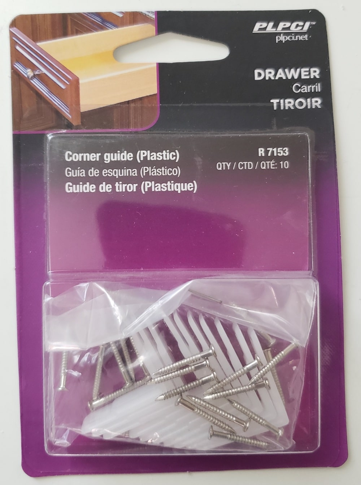
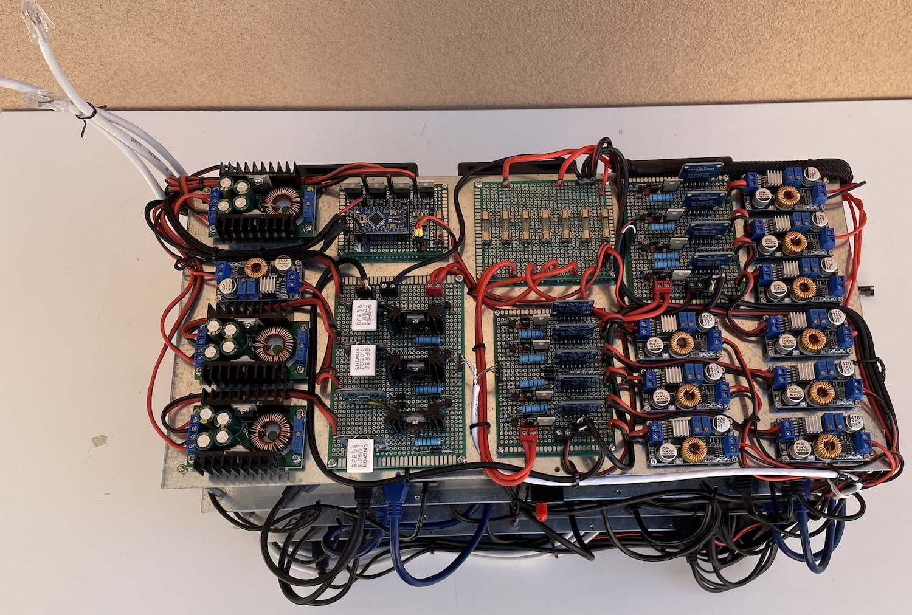

# Cluster case and hardware

- [Cluster case and hardware](#cluster-case-and-hardware)
  - [Components](#components)
  - [Device Photos](#device-photos)

## Components

- 1 x [0.093" x 30" x 36" acrylic sheet](https://www.homedepot.com/p/OPTIX-36-in-x-30-in-x-093-in-Acrylic-Sheet-MC-06/202038044) (almost 100% was used) that has been cut to:
  - 4 x 120mm x 120mm
  - 3 x 120mm x 140mm
  - 3 x 140mm x 180mm
  - 5 x 200mm x 420mm
- Nylon standoff
  - 44 x [M2x5mm M-F nylon standoff](https://www.aliexpress.com/item/33020434460.html?spm=a2g0o.cart.0.0.60e03c00agJLKw&mp=1)
  - 20 x [M2.5x5mm M-F nylon standoff](https://www.aliexpress.com/item/33020434460.html?spm=a2g0o.cart.0.0.60e03c00agJLKw&mp=1)
  - 20 x [M2.5x25mm M-F nylon standoff](https://www.aliexpress.com/item/33020434460.html?spm=a2g0o.cart.0.0.60e03c00agJLKw&mp=1)
  - 28 x [M3x5mm M-F nylon standoff](https://www.aliexpress.com/item/33020434460.html?spm=a2g0o.cart.0.0.60e03c00agJLKw&mp=1)
  - 12 x [M3x12mm M-F nylon standoff](https://www.aliexpress.com/item/33020434460.html?spm=a2g0o.cart.0.0.60e03c00agJLKw&mp=1)
  - 3 x [M3x18mm M-F nylon standoff](https://www.aliexpress.com/item/33020434460.html?spm=a2g0o.cart.0.0.60e03c00agJLKw&mp=1)
- Brass standoff
  - 16 x [M3x25mm M-F brass standoff](https://www.aliexpress.com/item/32968818335.html?spm=a2g0o.cart.0.0.60e03c00agJLKw&mp=1)
  - 6 x [M3x30mm M-F brass standoff](https://www.aliexpress.com/item/32968818335.html?spm=a2g0o.cart.0.0.60e03c00agJLKw&mp=1)
  - 40 x [M3x40mm M-F brass standoff](https://www.aliexpress.com/item/32968818335.html?spm=a2g0o.cart.0.0.60e03c00agJLKw&mp=1)
- Screws
  - 44 x [M2x5mm](https://www.aliexpress.com/item/4001280418592.html?spm=a2g0o.cart.0.0.299c3c00CW7ceW&mp=1)
  - 24 x [M2.5x5mm](https://www.aliexpress.com/item/4001280418592.html?spm=a2g0o.cart.0.0.299c3c00CW7ceW&mp=1)
  - 60 x [M3x5mm](https://www.aliexpress.com/item/4001280418592.html?spm=a2g0o.cart.0.0.299c3c00CW7ceW&mp=1)
  - 18 x [M4x10mm](https://www.aliexpress.com/item/32834398756.html?spm=a2g0o.cart.0.0.299c3c00CW7ceW&mp=1)
  - 18 x [M4x18mm](https://www.aliexpress.com/item/32834398756.html?spm=a2g0o.cart.0.0.299c3c00CW7ceW&mp=1)
- Nuts
  - 44 x [M2 nuts](https://www.aliexpress.com/item/32796990429.html?spm=a2g0o.cart.0.0.299c3c00CW7ceW&mp=1)
  - 24 x [M2.5 nuts](https://www.aliexpress.com/item/32796990429.html?spm=a2g0o.cart.0.0.299c3c00CW7ceW&mp=1)
  - 60 x [M3 nuts](https://www.aliexpress.com/item/32796990429.html?spm=a2g0o.cart.0.0.299c3c00CW7ceW&mp=1)
  - 36 x [M4 nuts](https://www.aliexpress.com/item/32796990429.html?spm=a2g0o.cart.0.0.299c3c00CW7ceW&mp=1)
- USB cables
  - 4 x 25cm mini M-USB to M-USB (for Arduinos) - can be replaced by self-soldered
  - 4 x 50cm M-USB3.0 to M-USB3.0 (for Switch Selectors)
  - 1 x 10cm M-USB to F-USB (Master01 -> USB switch) - can be replaced by self-soldered
  - 1 x 30cm M-USB to F-USB (Master02 -> USB switch) - can be replaced by self-soldered
  - 2 x 50cm USB-C to USB (IPKVM) - can be replaced by self-soldered
  - 1 x 100cm USB-C to USB (IPKVM) - can be replaced by self-soldered
  - 2 x 50cm HDMI to HDMI (IPKVM)
  - 2 x 90cm HDMI to HDMI (IPKVM)
  - 1 x 50cm micro USB to M-USB (IPKVM keyboard/mouse) - can be replaced by self-soldered
  - 2 x 40cm SATA cables - not sure if needed

- 18 x [Nylon L--Angle Drawer Guides](https://www.homedepot.com/p/Prime-Line-Nylon-L-Angle-Drawer-Guides-10-pack-R-7153/100110945) (for mount Fans)

| Name | Schema / Photo |
| --- | --- |
| Nylon L--Angle Drawer Guides | |

## Device Photos

