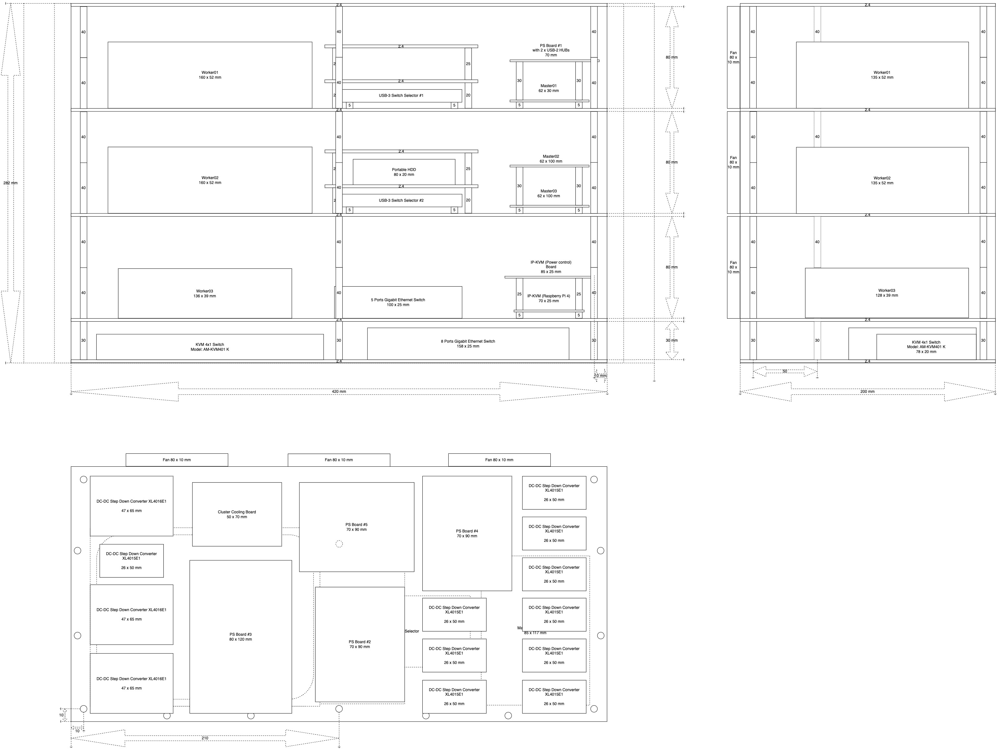
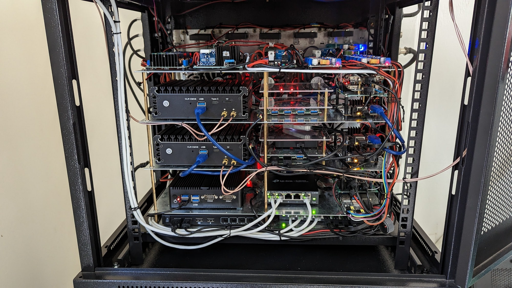

# Cluster case and hardware

- [Cluster case and hardware](#cluster-case-and-hardware)
  - [Prehistory](#prehistory)
  - [How don't need to do](#how-dont-need-to-do)
  - [Components](#components)
  - [Cluster hardware](#cluster-hardware)
    - [IP-KVM (arm64)](#ip-kvm-arm64)
    - [Master0\[1-3\] (arm64)](#master01-3-arm64)
    - [Worker01 (x64)](#worker01-x64)
    - [Worker02 (x64)](#worker02-x64)
    - [Worker03 (x64)](#worker03-x64)
    - [Other](#other)
  - [Simple circuit of connections hardware](#simple-circuit-of-connections-hardware)
  - [Case drawing](#case-drawing)
  - [Case Photos](#case-photos)
    - [Worker01](#worker01)
    - [Worker02](#worker02)
    - [Worker03](#worker03)
    - [Assembled case (Version 2)](#assembled-case-version-2)
    - [Assembled case (version 1)](#assembled-case-version-1)

## Prehistory

What pushed me to make the cluster case? Simple answer - this picture:

This is was total mess...

## How don't need to do

Before starting this project I chose [0.093" x 30" x 36" acrylic sheet](https://www.homedepot.com/p/OPTIX-36-in-x-30-in-x-093-in-Acrylic-Sheet-MC-06/202038044) as main material for my cluster case. When I completed it I understood that this is was my fault to use acrylic sheets as main material, because, hardware with wires were too heavy. They didn't break acrylic sheets, but it could happens at any time. Also it was big chance to break it during the move. The weight of fully assembled case was about 7kg!!! The 2nd negative moment - acrylic sheets is combustible (I noticed that after I finished the case). I trying avoid using combustible materials (at least 50% wires I use which has good flame resistance), therefore, it is also the reason to replace it as much as possible with other non-combustible material.

After that I decided remake it with using 0.06" steel sheets which was a great choose even it added weight (assembled case became 12.2kg), but it became very stable, strong and non-combustible.

## Components

- 5 x 16.54" x 7.87" (200mm x 420mm) [0.06" Carbon Steel Sheet A653 Galvanized Hot Dip](https://www.onlinemetals.com/en/buy/carbon-steel/0-06-carbon-steel-sheet-a653-galvanized-hot-dip/pid/13265)
- 1 x [0.093" x 30" x 36" acrylic sheet](https://www.homedepot.com/p/OPTIX-36-in-x-30-in-x-093-in-Acrylic-Sheet-MC-06/202038044) (can be used smaller sheet) that has been cut to:
  - 4 x 120mm x 120mm
  - 3 x 120mm x 140mm
  - 3 x 140mm x 180mm
- Nylon standoff
  - 44 x [M2x5mm M-F nylon standoff](https://www.aliexpress.com/item/33020434460.html?spm=a2g0o.cart.0.0.60e03c00agJLKw&mp=1)
  - 20 x [M2.5x5mm M-F nylon standoff](https://www.aliexpress.com/item/33020434460.html?spm=a2g0o.cart.0.0.60e03c00agJLKw&mp=1)
  - 20 x [M2.5x25mm M-F nylon standoff](https://www.aliexpress.com/item/33020434460.html?spm=a2g0o.cart.0.0.60e03c00agJLKw&mp=1)
  - 28 x [M3x5mm M-F nylon standoff](https://www.aliexpress.com/item/33020434460.html?spm=a2g0o.cart.0.0.60e03c00agJLKw&mp=1)
  - 12 x [M3x12mm M-F nylon standoff](https://www.aliexpress.com/item/33020434460.html?spm=a2g0o.cart.0.0.60e03c00agJLKw&mp=1)
  - 3 x [M3x18mm M-F nylon standoff](https://www.aliexpress.com/item/33020434460.html?spm=a2g0o.cart.0.0.60e03c00agJLKw&mp=1)
- Brass standoff
  - 16 x [M3x25mm M-F brass standoff](https://www.aliexpress.com/item/32968818335.html?spm=a2g0o.cart.0.0.60e03c00agJLKw&mp=1)
  - 6 x [M3x30mm M-F brass standoff](https://www.aliexpress.com/item/32968818335.html?spm=a2g0o.cart.0.0.60e03c00agJLKw&mp=1)
  - 40 x [M3x40mm M-F brass standoff](https://www.aliexpress.com/item/32968818335.html?spm=a2g0o.cart.0.0.60e03c00agJLKw&mp=1)
- Screws
  - 44 x [M2x5mm](https://www.aliexpress.com/item/4001280418592.html?spm=a2g0o.cart.0.0.299c3c00CW7ceW&mp=1)
  - 24 x [M2.5x5mm](https://www.aliexpress.com/item/4001280418592.html?spm=a2g0o.cart.0.0.299c3c00CW7ceW&mp=1)
  - 60 x [M3x5mm](https://www.aliexpress.com/item/4001280418592.html?spm=a2g0o.cart.0.0.299c3c00CW7ceW&mp=1)
  - 18 x [M4x10mm](https://www.aliexpress.com/item/32834398756.html?spm=a2g0o.cart.0.0.299c3c00CW7ceW&mp=1)
  - 18 x [M4x18mm](https://www.aliexpress.com/item/32834398756.html?spm=a2g0o.cart.0.0.299c3c00CW7ceW&mp=1)
- Nuts
  - 44 x [M2 nuts](https://www.aliexpress.com/item/32796990429.html?spm=a2g0o.cart.0.0.299c3c00CW7ceW&mp=1)
  - 24 x [M2.5 nuts](https://www.aliexpress.com/item/32796990429.html?spm=a2g0o.cart.0.0.299c3c00CW7ceW&mp=1)
  - 60 x [M3 nuts](https://www.aliexpress.com/item/32796990429.html?spm=a2g0o.cart.0.0.299c3c00CW7ceW&mp=1)
  - 36 x [M4 nuts](https://www.aliexpress.com/item/32796990429.html?spm=a2g0o.cart.0.0.299c3c00CW7ceW&mp=1)
- USB cables
  - 4 x 5-10cm self-made mini M-USB to M-USB (for Arduinos, PJON routers)
  - 4 x [50cm M-USB3.0 to M-USB3.0](https://www.aliexpress.com/item/33027161053.html?spm=a2g0s.9042311.0.0.27424c4dETkEIu) (for Switch Selectors)
  - 1 x 5cm self-made M-USB to F-USB (Master01 -> USB switch), without +5V
  - 1 x 20cm self-made M-USB to F-USB (Master02 -> USB switch), without +5V
- 18 x [Nylon L--Angle Drawer Guides](https://www.homedepot.com/p/Prime-Line-Nylon-L-Angle-Drawer-Guides-10-pack-R-7153/100110945) (for mount Fans)

| Name | Schema / Photo |
| --- | --- |
| Nylon L--Angle Drawer Guides |  |

## Cluster hardware

### IP-KVM (arm64)

1 x [Raspberry Pi 4, 2GB RAM](https://www.raspberrypi.org/products/raspberry-pi-4-model-b/)  
1 x 32 GB MicroSD card  
Other components listed here: [ip-kvm](../ip-kvm/README.md)

### Master0[1-3] (arm64)

3 x [Orange Pi 5 (16G RAM)](http://www.orangepi.org/html/hardWare/computerAndMicrocontrollers/details/Orange-Pi-5.html)  
3 x [128GB Samsung PRO Plus microSDXC Up to 160MB/s UHS-I, U3, A2, V30, (MB-MD128KA/AM)](https://www.amazon.com/gp/product/B06XX29S9Q/ref=oh_aui_detailpage_o00_s00?ie=UTF8&th=1)

### Worker01 (x64)

1 x [Pentium N6005 4 Intel i226-V 2500M Network Card (10W)](https://www.aliexpress.com/item/3256804440929471.html?spm=a2g0o.order_list.0.0.21ef1802ZA71Me)  
1 x [Crucial RAM 32GB Kit (2x16GB) DDR4 3200MHz CL22 (or 2933MHz or 2666MHz) Laptop Memory CT2K16G4SFRA32A](https://www.amazon.com/dp/B08C4X9VR5?psc=1&ref=ppx_yo2ov_dt_b_product_details)  
1 x [Crucial MX500 1TB 3D NAND SATA 2.5 Inch Internal SSD, up to 560MB/s - CT1000MX500SSD1](https://www.amazon.com/dp/B078211KBB?psc=1&ref=ppx_yo2ov_dt_b_product_details)

### Worker02 (x64)

1 x [Pentium N6005 4 Intel i226-V 2500M Network Card (10W)](https://www.aliexpress.com/item/3256804440929471.html?spm=a2g0o.order_list.0.0.21ef1802ZA71Me)  
1 x [Crucial RAM 16GB DDR4 3200MHz CL22 (or 2933MHz or 2666MHz) Laptop Memory CT16G4SFRA32A](https://www.amazon.com/dp/B08C511GQH?psc=1&ref=ppx_yo2ov_dt_b_product_details)  
1 x [Crucial MX500 1TB 3D NAND SATA 2.5 Inch Internal SSD, up to 560MB/s - CT1000MX500SSD1](https://www.amazon.com/dp/B078211KBB?psc=1&ref=ppx_yo2ov_dt_b_product_details)

### Worker03 (x64)

1 x [Mini PC Intel Celeron N4100 Dual Gigabit Ethernet, 8GB DDR4 128GB SSD (6W)](https://www.aliexpress.com/item/32832914936.html?spm=a2g0s.9042311.0.0.27424c4dorKW6d)  
1 x [A-Tech 16GB DDR4 2400 MHz SODIMM PC4-19200 (PC4-2400T) CL17 2Rx8 Non-ECC Laptop RAM Memory Module](https://www.amazon.com/gp/product/B07KGM4W57/ref=ppx_yo_dt_b_search_asin_title?ie=UTF8&psc=1)  
1 x [Crucial MX500 1TB 3D NAND SATA 2.5 Inch Internal SSD, up to 560MB/s - CT1000MX500SSD1](https://www.amazon.com/dp/B078211KBB?psc=1&ref=ppx_yo2ov_dt_b_product_details)

### Other

1 x [Seagate Portable 5TB External Hard Drive HDD – USB 3.0 (STGX5000400)](https://www.amazon.com/gp/product/B07VS8QCXC/ref=ppx_yo_dt_b_search_asin_title?ie=UTF8&psc=1) - for backups  
2 x [USB 3.0 KVM Switcher 2 Port PCs Sharing 4 Devices](https://www.aliexpress.com/item/4001215985508.html?spm=a2g0s.9042311.0.0.27424c4dnp0HBe) - for two masters and two workers  
1 x [Coral USB Accelerator](https://coral.ai/products/accelerator/) - for NVR and other machine learning things  
1 x [ZigBee Sniffer CC2531](https://www.aliexpress.com/item/1005001973376896.html?spm=a2g0s.9042311.0.0.27424c4d2JSjAN) - for connecting smart devices via ZigBee protocol, check [Zigbee2MQTT](https://www.zigbee2mqtt.io/)  
1 x [GoControl CECOMINOD016164 HUSBZB-1 USB Hub](https://www.amazon.com/dp/B01GJ826F8?psc=1&ref=ppx_yo2ov_dt_b_product_details) - Z-Wave + ZigBee  
1 x [TP-Link 5-Port Gigabit Ethernet Easy Smart Switch (TL-SG105E)](https://www.amazon.com/dp/B00N0OHEMA?ref=ppx_yo2ov_dt_b_product_details&th=1)  
1 x [TP-Link 8-Port Gigabit Ethernet Easy Smart Switch (TL-SG108E)](https://www.amazon.com/gp/product/B00K4DS5KU/ref=oh_aui_detailpage_o03_s00?ie=UTF8&psc=1)  
1 x [NETGEAR 5 Port PoE Gigabit Ethernet Plus Switch (GS305EP) - with 4 x PoE+ @ 63W](https://www.amazon.com/dp/B08LR18SC4?psc=1&ref=ppx_yo2ov_dt_b_product_details)

## Simple circuit of connections hardware

## Case drawing

Version 2 (current)

Version 1

Original in draw.io format here: [Cluster-case.drawio.xml](draw.io/Cluster-case.drawio.xml)

## Case Photos

### Worker01

### Worker02

### Worker03

### Assembled case (Version 2)

### Assembled case (version 1)

