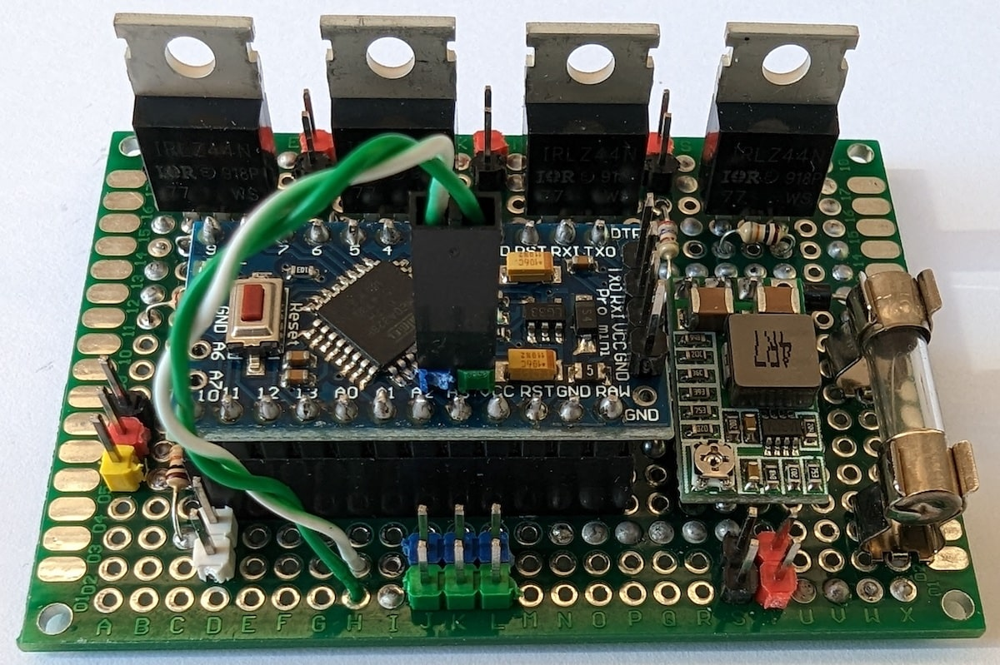

# Cooling

## Description

This is the *2nd version* of Cluster and Rack Cooling. It was developed for fans control depends from temperature with ability control and send data from/to server via **i2c protocol**. The [1st version](old-versions/version-1) used [PJON protocol](https://github.com/gioblu/PJON).

## Main functions

- 4 PWM outputs for fans;
- fans control by commands from server;
- fans control automatically in depends from temperature. Can be chosen 1 of 2 modes: fan on/off without speed control and with speed control (fan speed will be gradually changed by PWM and depends from temperature sensors (check every 60 sec.) and defined low/high limits);
- measure temperature in 2x4 (8 for cluster) zones;
- turn off all fans by external 3.3V HIGH signal (for example from fire alarm) or by command (A) and sending message to server. Normal functionality (include automode configuration) after that can be resumed only by command via i2c;
- control and send data from/to server via i2c protocol.

## Specification

- cluster i2c address: 0x12
- rack i2c address: 0x13

## Requirements and components

- 1 x Arduino Pro Mini 328 - **3.3V/8MHz**
- 1 x 1N4001 diode
- 4 x IRLZ44N
- 4 x 270 Om resistors
- 5 x 10 kOm resistors
- 1 x 4.7k resistor
- 4 (8 for cluster) x DS18B20
- 1 x HW-613 Mini DC-DC 3A Step Down Power Supply Module (**3.3V output**)
- 1 x 1.5A fuse

| Arduino PIN | Component | Notes |
| --- | --- | --- |
| D2 (Ext. Int.) | - | - |
| D3 (PWM) | IRLZ44N fan switch | Fan 1: (3x80mm for cluster and 2x120mm for rack) |
| D4 | - | - |
| D5 (PWM) | IRLZ44N fan switch | Fan 2: (3x80mm for cluster and 2x120mm for rack) |
| D6 (PWM) | IRLZ44N fan switch | Fan 3: (3x80mm for cluster and 2x120mm for rack) |
| D7 | - | - |
| D8 | - | - |
| D9 (PWM) | IRLZ44N fan switch | Fan 4: (2x120mm for rack) |
| D10 (PWM) | Alarm input | For external 3.3V HIGH signal |
| D11 (PWM) | 1-Wire | Temperature sensors |
| D12 | - | - |
| D13 | - | - |
| A0 | - | - |
| A1 | - | - |
| A2 | - | - |
| A3 | - | - |
| A4 | i2c SDA | Communication with i2c master |
| A5 | i2c SCL | Communication with i2c master |

### Components photos and schematics

| Name | Schema / Photo |
| --- | --- |
| Fan switch |   |
| DS18B20 |  |
| HW-613 |   |

## Commands

| Command | Description | EEPROM | Notes |
| --- | --- | --- | --- |
| f | Read value of speed from all fans | - | 0 - fan disabled 1-100 - fan speed (%) |
| f[1-4] | Read value of fan speed | - | 0 - fan disabled 1-100 - fan speed (%) |
| f[1-4]=[0-100] | Define fan speed | + | 0 - disable fan (default) 1-100 - fan speed (%) |
| f-ac | Read value of automatic control mode from all fans | - | 0 - disabled 1 - enabled without speed control 2 - enabled with speed control |
| f[1-4]-ac | Read value of automatic fan control mode | - | 0 - disabled 1 - enabled without speed control 2 - enabled with speed control |
| f[1-4]-ac=[0-2] | Disable/Enable automatic fan control mode | + | 0 - disable (default) 1 - enable without speed control 2 - enable with speed control |
| f-tl | Read value for "temperature low limit" of temperature sensors from all fans | - | °C, if temperature is less than defined value - fan is stopped |
| f[1-4]-tl | Read value for "temperature low limit" of temperature sensors | - | °C, if temperature is less than defined value - fan is stopped |
| f[1-4]-tl=[20-25] | Define "temperature low limit" for temperature sensors | + | °C, value from 20 to 25 (default: 22) |
| f-th | Read value for "temperature high limit" of temperature sensors from all fans | - | °C, if temperature is greater than defined value - fan speed is 100% |
| f[1-4]-th | Read value for "temperature high limit" of temperature sensors | - | °C, if temperature is greater than defined value - fan speed is 100% |
| f[1-4]-th=[26-39] | Define "temperature high limit" for temperature sensors | + | °C, value from 26 to 39 (default: 30) |
| t | Read temperature of all sensors | - | °C, see notes below |
| t[1-4,8] | Read temperature of sensors 1-4,8 | - | °C, see notes below |
| ta | Read value of auto-mode for get temperatures | - | 0 - disabled 10-120 - seconds |
| ta=[10-120] | Set value of auto-mode for get temperatures | + | 0 - disabled 10-120 - seconds |
| a | External alarm status | - | 0 - no alarm 1 - alarm |
| a=[0,1] | Disable/enable external alarm | + | 0 - disable 1 - enable |

***EEPROM*** - memory values are kept when the board is turned off

**Notes 1:** if 8 sensors (for cluster), then `1-2` temperature sensors for "Fan #1", `3-4` - "Fan #2", etc. In automatic fan control mode 2 fan speed calculation by temperature from sensor in group with highest temperature.

**Notes 2:** if automatic control mode is enabled during disabled auto-mode for getting temperature, then automatically will be set auto-mode for get temperature to 60 seconds.

**Notes 3:** Rack: f1/t1 - back wall, f2/t2 - left, f3/t3 - top, f4/t4 - right

## Device Photos

