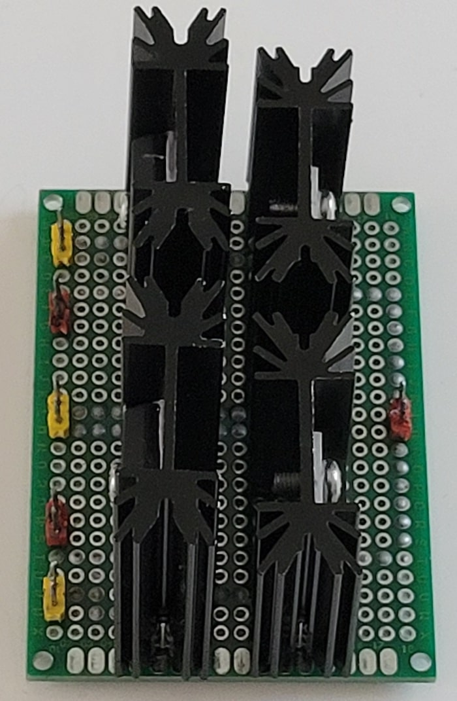
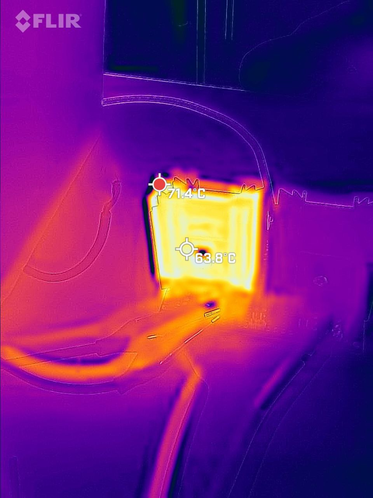
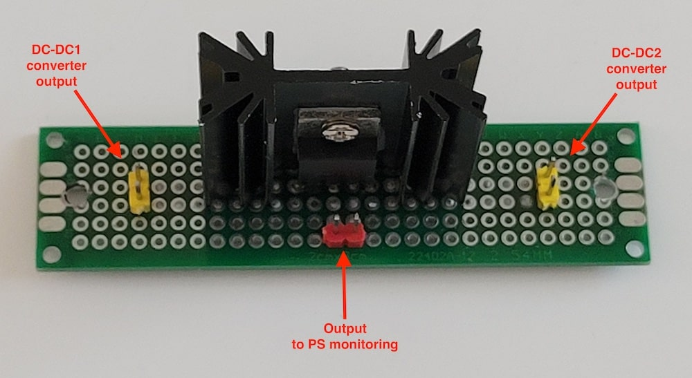
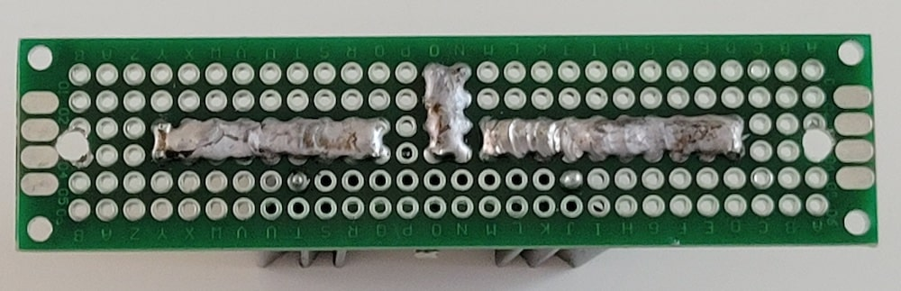

# Power Supply with Monitoring

This is version 3 with power supplies on 18V and 24V and included input for connecting Solar Batteries on 24V.

## Description

Power Supply Monitoring module was developed for measure voltage, current and power consumption on AC line, PS outputs and Solar Batteries input with ability send data to server via **i2c protocol**.

## Main functions

- measure voltage, curent and power consumption on PS outputs, Solar Batteries input and dc-dc converters;
- measure AC line parameters: Voltage, Current, Power, Energy, Frequency and Power factor;
- measuring temperature on PS outputs and dc-dc converters;
- send data to server via i2c protocol.

## Specification

- i2c address: 0x14

## Requirements and components for Power Supply

- 1 x Power supply 18V 20A (model: JC-360-18)
- 1 x Power supply 24V 15A (model: Alito, ALT-1220T)
- 2 x 300W 20A DC-DC Buck Converter Step Down Modules
- 2 x MBR6045PT diodes (for mixing lines from 3 inputs)
- 2 x MBR60100CT diodes (for backup)
- 1 x MBR4045CT diode (for DC convertors)
- 4 x 34x12x38mm heatsink for MBR6045PT diodes (19.3V -> 18.8V, 8A (~150W) - 70℃; 22V -> 21.47V, 7A (~150W) - 60℃)
- 1 x 34x12x30mm heatsink for MBR4045CT diode (12.6V -> 12.05V, 5A (~60W) - 60℃)

## Requirements and components for monitoring module

- 1 x Arduino Pro Mini 328 - **5V/16MHz**
- 1 x HW-613 Mini DC-DC 3A Step Down Power Supply Module (**5V output**)
- 4 x ACS712-20A modules
- 4 x 10k resistors
- 4 x 100k resistors
- 4 x DS18B20
- 1 x PZEM004T v3.0
- 2 x 1 MOm resistors
- 1 x 1N4001 diode
- 1 x Bidirectional Logic Level Converter

| Arduino PIN | Component | Notes |
| --- | --- | --- |
| D2 (Ext. Int.) | Rx (Connects to the Tx pin on the PZEM) | [PZEM004T v3.0](https://innovatorsguru.com/pzem-004t-v3) |
| D3 (PWM) | Tx (Connects to the Rx pin on the PZEM) | [PZEM004T v3.0](https://innovatorsguru.com/pzem-004t-v3) |
| D4 | - ||
| D5 (PWM) | - ||
| D6 (PWM) | - ||
| D7 | - ||
| D8 | - ||
| D9 (PWM) | - ||
| D10 (PWM) | 1-Wire | Temperature sensors |
| D11 (PWM) | - ||
| D12 | - ||
| D13 | - ||
| A0 | Voltmeter: r1=100k, r2=10k | 24V 15A PS output (v1) |
| A1 | ACS712-20A | 24V 15A PS output (i1) |
| A2 | ACS712-20A | 18V 20A PS output (i2) |
| A3 | Voltmeter: r1=100k, r2=10k | 18V 20A PS output (v2) |
| A4 | i2c SDA (through Bidirectional LLC) | Communication with i2c master |
| A5 | i2c SCL (through Bidirectional LLC) | Communication with i2c master |
| A6 | Voltmeter: r1=100k, r2=10k | 24V Solar Battaries output (v3) or 12V DC-DC output (v4) |
| A7 | ACS712-20A | 24V Solar Battaries output (i3) or 12V DC-DC output (i4) |

### Components photos and schematics

| Name | Schema / Photo |
| --- | --- |
| Voltmeter |  |
| ACS712 |   |
| HW-613 |   |
| DS18B20 |  |
| PZEM-004T v3 |  |
| 300W 20A DC-DC Buck Converter Step Down Module |   |

### Commands

| Command | Description | EEPROM | Notes |
| --- | --- | --- | --- |
| sd | Read value of source: Solar Battaries or DC-DC converter | - | 0 - Solar Battaries 1 - DC-DC converter |
| sd=[0-1] | Set value of source: Solar Battaries or DC-DC converter | + | 0 - Solar Battaries 1 - DC-DC converter |
| v | Read value of voltage for 1-4 outputs | - | Volt |
| v[1-4] | Read value of voltage for 1-4 outputs | - | Volt |
| i | Read value of current for 1-4 outputs | - | Amper |
| i[1-4] | Read value of current for 1-4 outputs | - | Amper |
| p | Read value of power consumption for 1-4 outputs | - | Watt (Volt * Amper) |
| p[1-4] | Read value of power consumption for 1-4 outputs | - | Watt (Volt * Amper) |
| t | Read value of all temperature sensors | - | °C |
| t[1-4] | Read value of temperature on PS outputs, dc-dc converter and near diodes | - | °C |
| ta | Read value of auto-mode for get temperatures | - | 0 - disabled 10-120 - seconds |
| ta=[10-120] | Set value of auto-mode for get temperatures | + | 0 - disabled 10-120 - seconds |
| l | Read value of all AC line parameters | - | Voltage (V) Current (A) Power (W) Energy (kWh) Frequency (Hz) Power factor |
| l[v,c,p,e,f,pf] | Read value of AC line parameters | - | Voltage (V) Current (A) Power (W) Energy (kWh) Frequency (Hz) Power factor |
| la | Read value of auto-mode for get AC line parameters | + | 0 - disabled 10-120 - seconds |
| la=[10-120] | Set value of auto-mode for get AC line parameters | + | 0 - disabled 10-120 - seconds |

where, 
[v,i,p]-1 - 24V 15A PS output 
[v,i,p]-2 - 18V 20A PS output 
[v,i,p]-3 - 24V Solar Battaries output 
[v,i,p]-4 - 12V DC-DC output 
t1 - 24V 15A PS 
t2 - 18V 20A PS 
t3 - 12V DC-DC2, from 24V 15A PS 
t4 - 12V DC-DC1, from 18V 20A PS 
***EEPROM*** - memory values are kept when the board is turned off

**Note:** read values of AC line parameters are available only when the auto-mode is enabled (la=[10-60]).

## Device Photos

### UPS schema and common photo

Version 3:

Upgraded 24V 15A PS version (2):

Old 24V 10A PS version (1):

### PS diodes

### DC diode

### Monitoring board version 2

**Note:** added [PZEM004T v3.0](https://innovatorsguru.com/pzem-004t-v3) and [PJON filters](https://github.com/gioblu/PJON/wiki/Mitigate-interference) (1MOm resistors and diode)

### Monitoring board version 1

