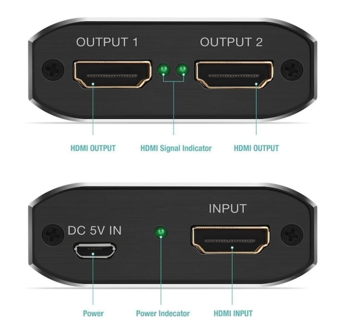

# IP-KVM

- [IP-KVM](#ip-kvm)
  - [Description](#description)
    - [Main functions](#main-functions)
    - [Screenshots of UI](#screenshots-of-ui)
  - [Requirements and components](#requirements-and-components)
    - [Raspberry Pi](#raspberry-pi)
    - [Board](#board)
    - [Other components](#other-components)
    - [Pinout](#pinout)
  - [4 Ports HDMI KVM Switcher](#4-ports-hdmi-kvm-switcher)
    - [Switching channels](#switching-channels)
    - [Power supply](#power-supply)
  - [Hardware Arduino HID instead of the OTG](#hardware-arduino-hid-instead-of-the-otg)
    - [Switch IP-KVM to Hardware Arduino HID](#switch-ip-kvm-to-hardware-arduino-hid)
    - [Flash the Arduino HID (TTL Firmware)](#flash-the-arduino-hid-ttl-firmware)
  - [PiKVM configuration](#pikvm-configuration)
  - [Example of making aliases for USB ports](#example-of-making-aliases-for-usb-ports)
  - [Circuit](#circuit)
  - [Photos](#photos)
    - [Complete device photos](#complete-device-photos)
    - [Board photos](#board-photos)
    - [4 Ports KVM Switcher](#4-ports-kvm-switcher)

## Description

IP-KVM based on Raspberry Pi, for x64 architecture uses PiKVM: [https://github.com/pikvm/pikvm](https://github.com/pikvm/pikvm) - [hardware for v2](https://github.com/pikvm/pikvm#hardware-for-v2), for arm architecture (single board computers) uses serial console via PL2303 UART TTL Cables.

### Main functions

- Access to 3 single board computers via serial console (power status/control via [Power supply boards and USB HUBs](../power-supply-usb-hubs) module);
- Access to 3 mini PCs via IP KVM based on [PiKVM](https://github.com/pikvm/pikvm) with other features:
  - FullHD video using advanced HDMI-to-CSI bridge;
  - Bootable Virtual CD-ROM and Flash Drive;
  - USB Keyboard and mouse;
  - Access via Web UI or VNC;
  - Control power (on mini PCs) by power buttons via Web UI;
  - Check power status (on mini PCs) by reading power LED state via Web UI.
- Using Raspberry Pi as DHCP and tFTP server for install OS on nodes via PXE.

### Screenshots of UI

[](images/ui_screenshot_1.jpeg)
[](images/ui_screenshot_2.jpeg)

## Requirements and components

### Raspberry Pi

- 1 x Raspberry Pi 4 (2 GB RAM)
- 1 x 32 GB MicroSD card

### Board

- 1 x [HDMI to CSI-2 bridge based on TC358743](https://www.aliexpress.com/item/4000102166176.html)
- 1 x ATMEGA32U4 Pro Micro 5V/16MHZ
- 12 x [MOSFET relays OMRON G3VM-61A1](https://www.aliexpress.com/item/1005001989679623.html?spm=a2g0s.9042311.0.0.27424c4dnmIQ2j)
- 13 x 390 Ohm resistors
- 6 x 4.7k Ohm resistors
- 1 x 2N2222A
- 1 x Bidirectional Logic Level Converter

### Other components

- 1 x 15cm self-made 4 pin to USB-C cable (male) for connect board to the Raspberry Pi
- 1 x 50cm self-made 2 pin to USB-C and micro USB-B cable (male) for connect board to the KVM and "HDMI Splitter" (5V power)
- 1 x 50cm self-made 3 pin (without +5v) to USB-A cable (male) for connect board to the KVM (HUB port) - mass storage drive
- 1 x 50cm USB-A to micro USB-B cable (male-male) for connect TMEGA32U4 Pro Micro to the KVM (HUB port) - keyboard/mouse
- 3 x self-made USB-A to USB-C cables (male-male) for connect 3 x Worker nodes to KVM switch (for keyboard/mouse), without +5V
- 2 x 50cm HDMI to HDMI cables for connect Worker02-03 nodes to the KVM switch
- 2 x 90cm HDMI to HDMI cables for connect Worker01 node and input of the "CSI-2 bridge" to the output of "HDMI Splitter"
- 1 x 30cm HDMI to HDMI cable for connect KVM switch output with "HDMI Splitter" input
- 6 x self-made 4 pin cables for connection 3 x Worker nodes and KVM switch(3 channels) to the board (leds/buttons)
- 3 x USB to PL2303 UART TTL Cables for connect board with Master SBCs
- 1 x [4 Ports KVM Switcher 4K HDMI-compatible Video Display 4 IN 1 Out Type USB-C with EDID/HDCP decryption](https://www.aliexpress.com/item/1005001873550202.html?spm=a2g0s.9042311.0.0.49584c4dNbLu7M)
- 1 x HDMI Splitter 1 in 2 Out - Techole 4K Aluminum Ver1.4 HDCP, Powered HDMI Splitter Supports 3D 4K@30Hz Full Hd1080p

### Pinout

[](images/RPi4-Pinout.jpeg)

| RPi-4 PIN | Component on Board | Notes |
| --- | --- | --- |
| 3.3V (1) | Power for OMRONs G3VM-61A1 ||
| GND (6) | Bidirectional LLC GND -> Arduino GND ||
| GPIO 14 (UART TX) | Bidirectional LLC -> Arduino RX ||
| GPIO 15 (UART RX) | Bidirectional LLC -> Arduino TX ||
| GPIO 4 (GPCLK0) | 2N2222A | For reset the HID |
| GPIO 17 | OMRON 1 (input) | KVM Switch, channel #1: LED |
| GPIO 27 | OMRON 2 (output) | KVM Switch, channel #1: Button |
| GPIO 22 | OMRON 3 (input) | KVM Switch, channel #2: LED |
| GPIO 23 | OMRON 4 (output) | KVM Switch, channel #2: Button |
| GPIO 24 | OMRON 5 (input) | KVM Switch, channel #3: LED |
| GPIO 25 | OMRON 6 (output) | KVM Switch, channel #3: Button |
| GPIO 5 | OMRON 7 (output) | Worker01: Power button |
| GPIO 6 | OMRON 8 (input) | Worker01: LED |
| GPIO 13 | OMRON 9 (output) | Worker02: Power button |
| GPIO 26 | OMRON 10 (input) | Worker02: LED |
| GPIO 12 | OMRON 11 (output) | Worker03: Power button |
| GPIO 16 | OMRON 12 (input) | Worker03: LED |

## 4 Ports HDMI KVM Switcher

### Switching channels

[4 Ports HDMI KVM Switcher](https://www.aliexpress.com/item/1005001873550202.html?spm=a2g0s.9042311.0.0.49584c4dNbLu7M) is supporting use real keyboard for selecting ports, but nor Raspberry Pi4 emulated HID netheir Arduino emulated HID doesn't support it, therefore I used "Omron G3VM-61A1" for switching ports and read their status (via Web UI).

### Power supply

This KVM switch doesn't have separate input for power supply, therefore, it powering via usb-c ports from PCs. Also, it has "back powering issue" as power also coming to HDMI output port and USB HID ports (from Raspberry Pi) - see details on [Multiport KVM over IP](https://github.com/pikvm/pikvm/blob/master/pages/multiport.md), as result, after shutdown Raspberry Pi it wont't be started and will be needed push power button on KVM switch.
To solve this issue I desided make own USB cables without power (+5V) wire (except "micro USB" to "USB" cable for Arduino HID, as it required +5V). As I need only 3 KVM ports I use 4rd port for powering KVM switch from board. By this modification KVM switch powering only when Raspberry Pi started.  
For solving issue with "back powering" via HDMI ports I use "Techole 4K HDMI Splitter" which powered via the same line as KVM:

[](images/techole_hdmi_splitter_1.jpeg)
[](images/techole_hdmi_splitter_2.jpeg)

## Hardware Arduino HID instead of the OTG

As some motherboards contain a buggy BIOS that does not understand the keyboard of the v2 platform I implemented "Arduino HID".

Hightlights from [official doc](https://github.com/pikvm/pikvm/blob/master/pages/arduino_hid.md):

### Switch IP-KVM to Hardware Arduino HID

- Switch to RW-mode using command `rw`.
- Add these lines to `/etc/kvmd/override.yaml` (remove `{}` in the file before):

  ```bash
  kvmd:
    hid:
        type: serial
        reset_pin: 4
        device: /dev/kvmd-hid
  ```

- Create file `/etc/udev/rules.d/99-kvmd-extra.rules`:
  
  ```bash
  KERNEL=="ttyAMA0", SYMLINK+="kvmd-hid"
  ```

- Run `systemctl disable getty@ttyAMA0.service`.
- Remove `console=ttyAMA0,115200` or `console=serial0,115200` and `kgdboc=ttyAMA0,115200` or `kgdboc=serial0,115200` from `/boot/cmdline.txt`.

### Flash the Arduino HID (TTL Firmware)

- Disconnect the RESET wire from the Arduino board.
- Connect the Arduino and RPi with a suitable USB cable.
- Execute `rw`, add line `dtoverlay=spi0-1cs` to `/boot/config.txt` and perform `reboot`.
- Upload the firmware (USB keyboard & mouse is used by default)
  
  ```bash
  [root@pikvm ~]# rw
  [root@pikvm ~]# systemctl stop kvmd
  [root@pikvm ~]# cp -r /usr/share/kvmd/hid ~
  [root@pikvm ~]# cd ~/hid
  [root@pikvm hid]# make
  [root@pikvm hid]# make install
  ```

- Connect the RESET wire, disconnect the USB cable, and `reboot` the RPi.

## PiKVM configuration

PiKVM config file: [conf/override.yaml](conf/override.yaml).

## Example of making aliases for USB ports

Example of making aliases for USB ports used for access to 3 single board computers via serial console

```bash
# Example to find device: udevadm info --name=/dev/ttyUSB0 --attribute-walk | egrep "KERNELS|idVendor|idProduct"
# Apply rules: udevadm trigger

SUBSYSTEM=="tty", KERNELS=="1-1.3:1.0", SYMLINK+="master01"
SUBSYSTEM=="tty", KERNELS=="1-1.4:1.0", SYMLINK+="master02"
SUBSYSTEM=="tty", KERNELS=="1-1.2:1.0", SYMLINK+="master03"
```

## Circuit

I took circuit from official [PiKVM project](https://raw.githubusercontent.com/pikvm/pikvm/master/img/v0.png) as example, but used different PINs and devices (see pinout table above).

[](images/circuit.png)

## Photos

### Complete device photos

[](images/complete_device_1.jpeg)
[](images/complete_device_2.jpeg)
[](images/complete_device_3.jpeg)

### Board photos

[](images/board_1.jpeg)
[](images/board_2.jpeg)
[](images/board_3.jpeg)
[](images/board_4.jpeg)

### 4 Ports KVM Switcher

[](images/kvm_switch_1.jpeg)
[](images/kvm_switch_2.jpeg)
[](images/kvm_switch_3.jpeg)
[](images/kvm_switch_4.jpeg)
[](images/kvm_switch_5.jpeg)
[](images/kvm_switch_6.jpeg)
