# Power supply boards and USB HUBs

## Description

### Main functions

- Control of:
  - 5 single board computers (5V)
  - 2 mini PCs (12V)
  - 2 USB HUBs (with external power supply)
  - 2 IP KVM devices (can be extended up to 5)

- Remote devices control: *On*, *Off* (state save in EEPROM) and *Reboot* (5 seconds)
- Button devices control: Turn On devices by buttons (on case if remote control for some reasons not available)
- Remote reading voltage, current and power for single board computers and mini PCs
- 2 x 5V power lines (see board #1 photos of version 2): one line from backup power source for Raspberry Pi, USB HUBs and these modules, another one - for rest single board computers

### Specification

- **i2c address**: *0x03*
- **Button #1**: Turn ON devices connected to D2-D10 Arduino Pins
- **Button #2**: Turn ON devices connected to D11-A1 Arduino Pins

***Note:*** Devices can't be turned off by buttons

### Tools

[python-client](python-client) - command-line tool for devices remote control

## Requirements and components

### Board #1

- 5 x IRF4905 transistors
- 5 x BC547 transistors
- 5 x 1k resistors
- 5 x INA219 current/voltage sensors
- 10 x 10k resistors
- 1 x HW-613 Mini DC-DC 3A Step Down Power Supply Module (for INA219/Arduino devices, 3.3V output)
- 1 x MT3608 DC-DC Step Up Converter Booster Power Supply Module (for switch, 9V output)

### Board #2

- 1 x Arduino Pro Mini 328 - **3.3V/8MHz**
- 4 x IRF4905 transistors
- 4 x BC547 transistors
- 4 x 1k resistors
- 2 x INA219 current/voltage sensors
- 10 x 10k resistors
- 2 x buttons
- 2 x USB HUB modules (added external power supply)

| Cmd | Arduino PIN | Component | Notes |
| --- | --- | --- | --- |
| c\|2 | D2 (Ext. Int.) | IRF4905 + BC547 (Switch) | USB module #1 |
| c\|3 | D3 (PWM) | IRF4905 + BC547 (Switch) | USB module #2, for serial console's (IP KVM) |
| c\|4 | D4 | IRF4905 + BC547 (Switch) | Master01 (mini PC) |
| c\|7 | D5 (PWM) | IRF4905 + BC547 (Switch) | Worker01 (mini PC) |
| c\|1 | D6 (PWM) | IRF4905 + BC547 (Switch) | Raspberry Pi |
| c\|9 | D7 | IRF4905 + BC547 (Switch) | Worker03 (Rock64) |
| c\|8 | D8 | IRF4905 + BC547 (Switch) | Worker02 (Rock64) |
| c\|6 | D9 (PWM) | IRF4905 + BC547 (Switch) | Master03 (Rock64) |
| c\|5 | D10 (PWM) | IRF4905 + BC547 (Switch) | Master02 (Rock64) |
| i\|1 | D11 (PWM) | Output 1 | IP KVM #1 |
| i\|2 | D12 | Output 2 | IP KVM #2 |
| i\|3 | D13 | Output 3 | - |
| i\|4 | A0 | Output 4 | - |
| i\|5 | A1 | Output 5 | - |
| - | A2 | Button #1 | Cluster control (D2 - D10) |
| - | A3 | Button #2 | IP KVM control (D11 - A1) |
| - | A4 | i2c SDA | Communication with i2c master |
| - | A5 | i2c SCL | Communication with i2c master |

### Components

| Name | Schema / Photo |
| --- | --- |
| Switch |    |
| INA219 | [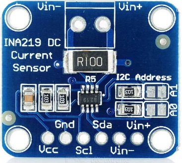](images/INA219_1.jpg)   |
| HW-613 |   |
| USB HUB | [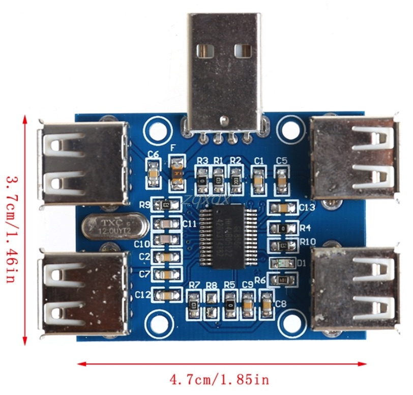](images/USB_HUB1.jpg)  |

## Commands

| Command | Description | EEPROM | Notes |
| --- | --- | --- | --- |
| cv0 | get status of all cluster devices | - ||
| c[e\|d\|r\|v][1-9] | enable/disable/reboot/status for cluster device | + (for e\|d) | see mapping in "Cmd" column |
| iv0 | get status of all IP KVM devices | - ||
| i[e\|d\|v][1-5] | enable/disable/status for IP KVM device | + (for e\|d) | see mapping in "Cmd" column |
| s0 | read voltage/current/power for cluster devices | - ||
| s1 | read voltage/current/power | - | Raspberry Pi |
| s2 | read voltage/current/power | - | Master01 (mini PC) |
| s3 | read voltage/current/power | - | Master02 (Rock64) |
| s4 | read voltage/current/power | - | Master03 (Rock64) |
| s5 | read voltage/current/power | - | Worker01 (mini PC) |
| s6 | read voltage/current/power | - | Worker02 (Rock64) |
| s7 | read voltage/current/power | - | Worker03 (Rock64) |

***EEPROM*** - memory values are kept when the board is turned off

## Device Photos

### Board #1 (version 2)

### Board #1 (version 1)

[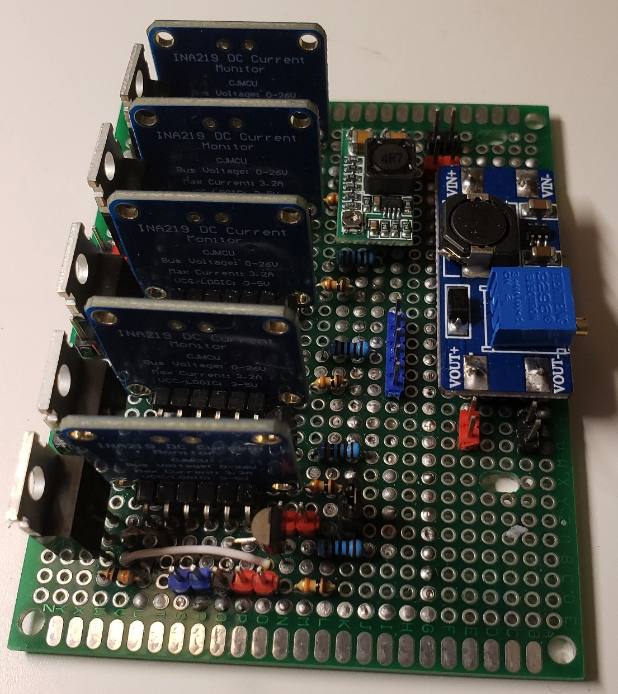](images/ps-board1_4.jpg)

[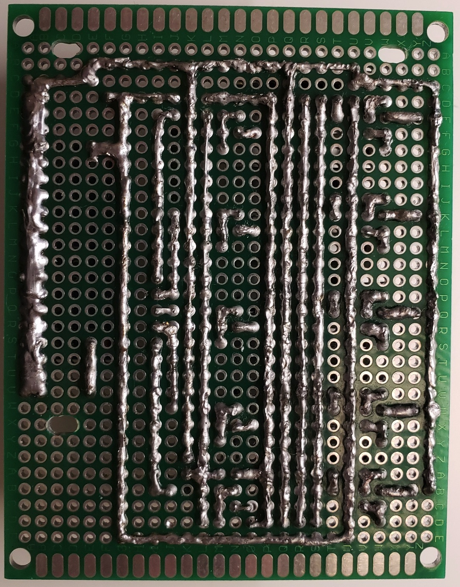](images/ps-board1_6.jpg)

### Board #2

[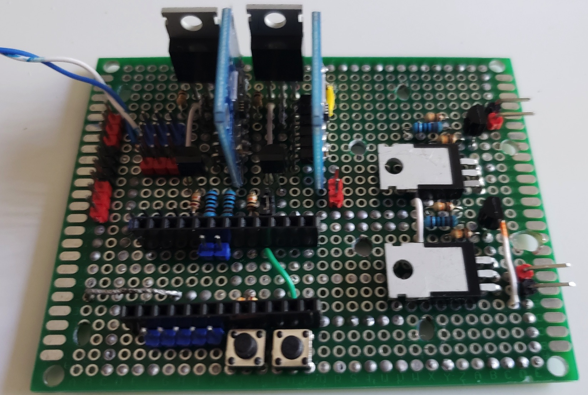](images/ps-board2_2.jpg)
[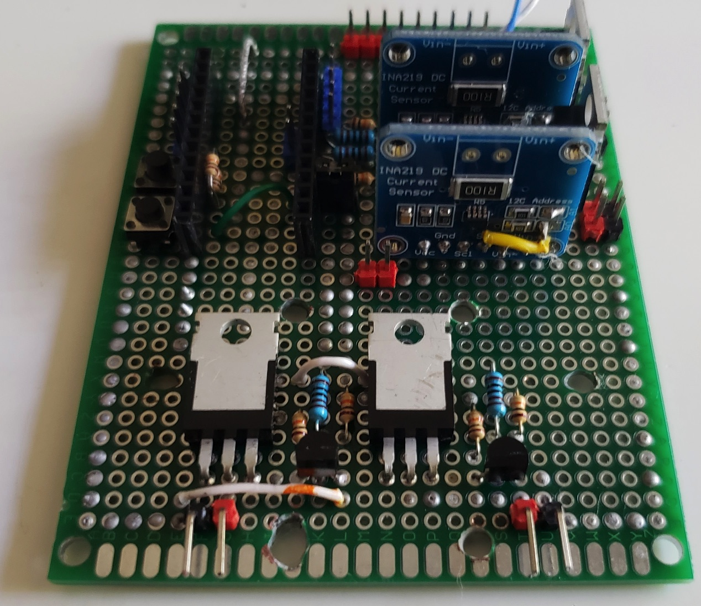](images/ps-board2_3.jpg)
[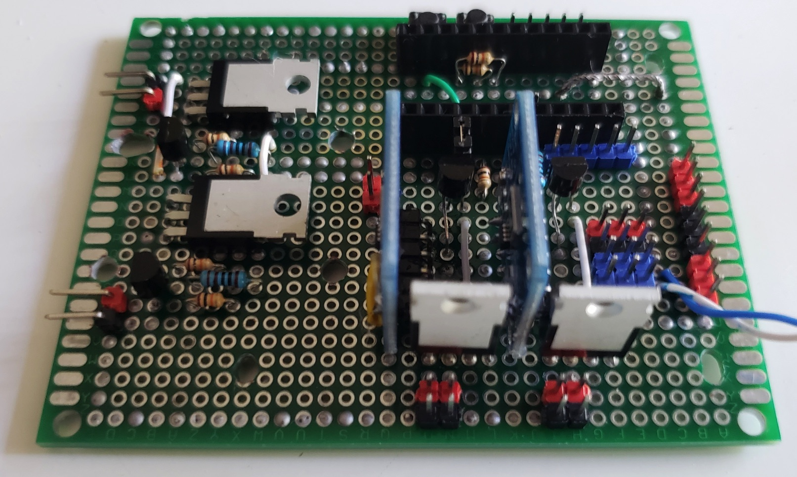](images/ps-board2_4.jpg)
[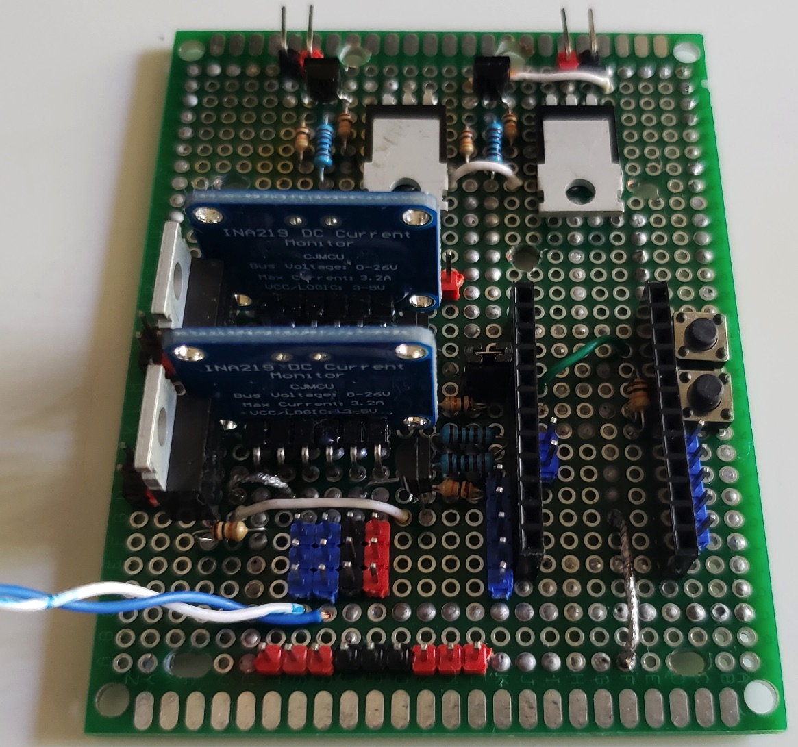](images/ps-board2_5.jpg)

[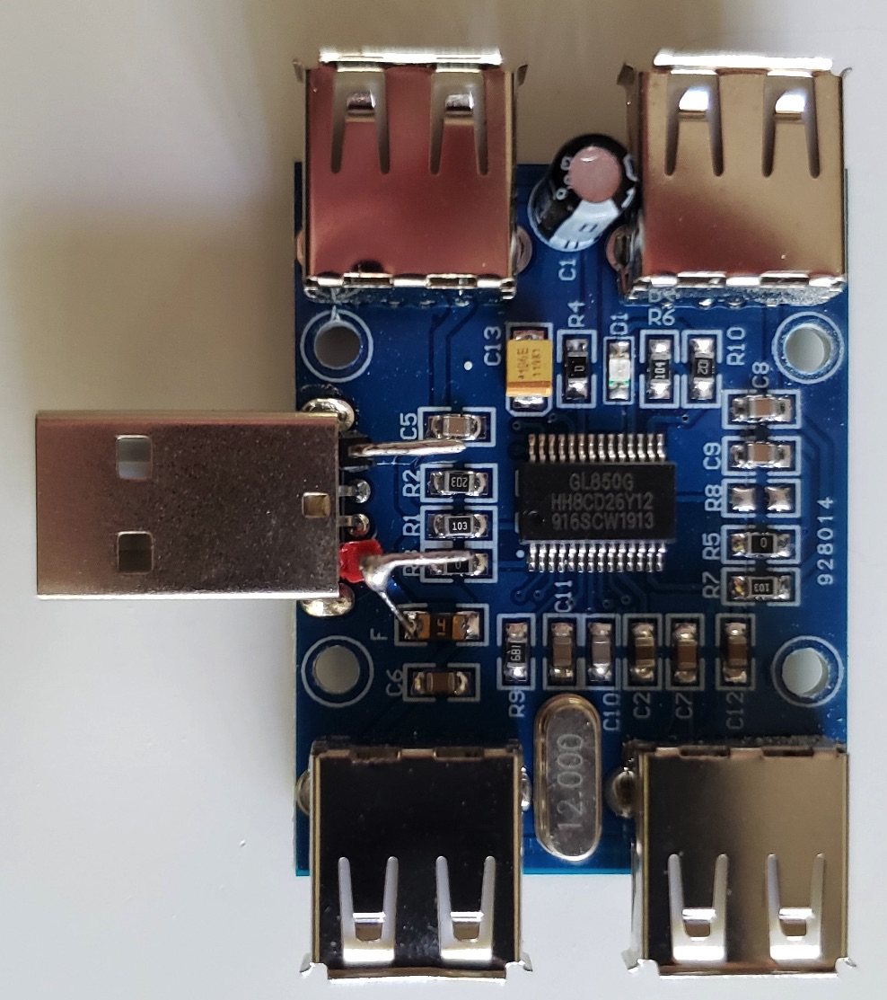](images/ps-board2_7.jpg)
[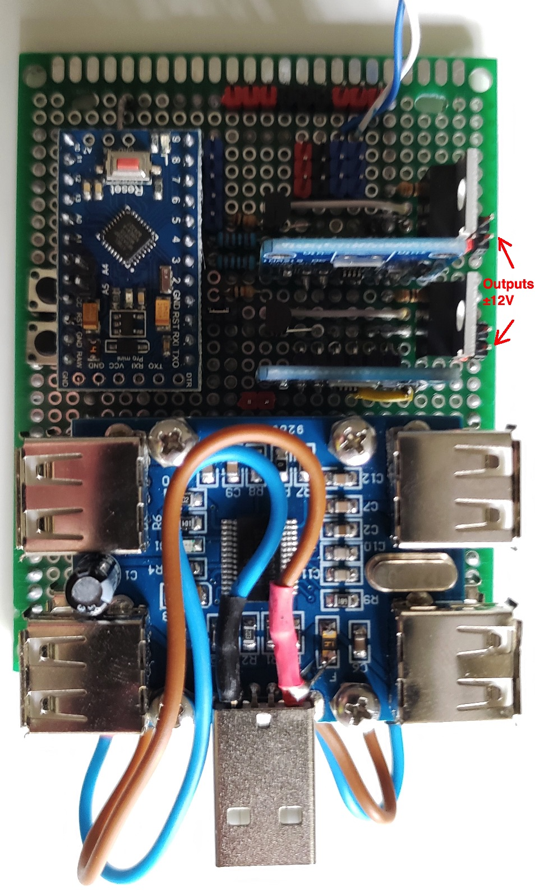](images/ps-board2_8.jpg)

[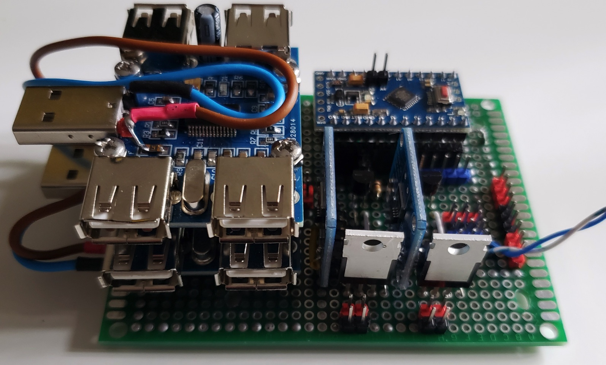](images/ps-board2_11.jpg)
[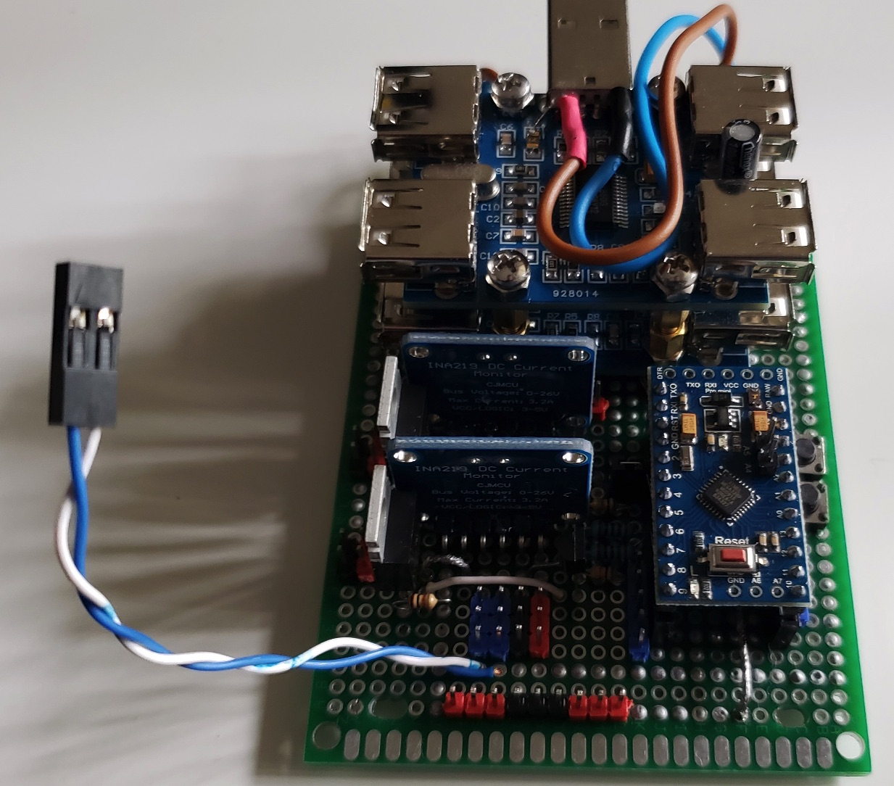](images/ps-board2_12.jpg)
[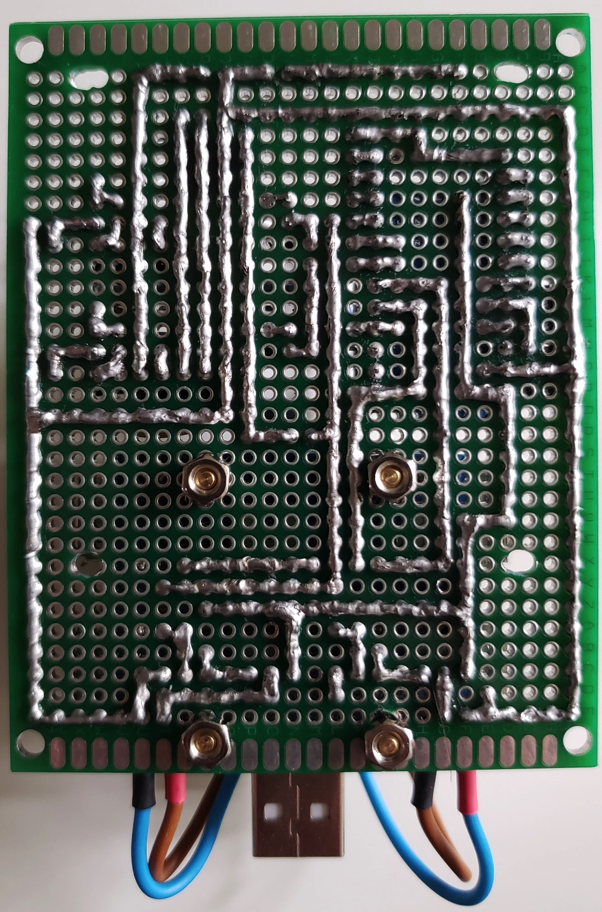](images/ps-board2_13.jpg)

### Boards

### MOSFET key (if need replace mini PC by single board computer or vise versa)

## URLs

[Raspberry Pi INA219 Tutorial](https://www.rototron.info/raspberry-pi-ina219-tutorial)
