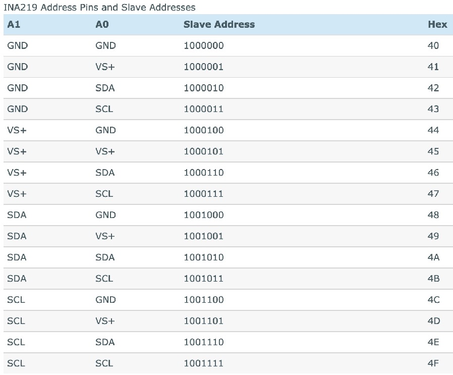
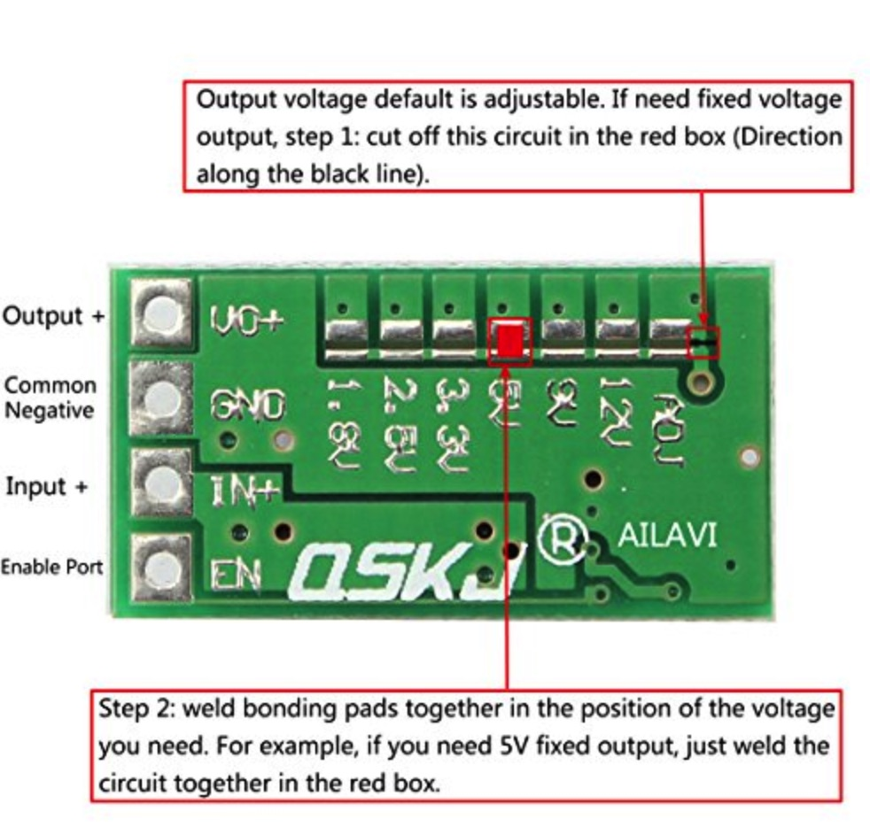

# Power supply boards and USB HUBs

- [Power supply boards and USB HUBs](#power-supply-boards-and-usb-hubs)
  - [Description](#description)
    - [Main functions](#main-functions)
    - [Specification](#specification)
    - [Tools](#tools)
  - [Requirements and components](#requirements-and-components)
    - [Board #1](#board-1)
    - [Board #2](#board-2)
    - [Board #3](#board-3)
    - [Board #4](#board-4)
    - [Components](#components)
  - [Commands](#commands)
  - [Schematic](#schematic)
  - [Device Photos](#device-photos)
    - [Board #1](#board-1-1)
  - [URLs](#urls)

## Description

### Main functions

- Control of:
  - 4 single board computers (5V);
  - 3 mini PCs (12V);
  - Ethernet/USB switches, external devices like modem, wi-fi routers, etc.

- Remote devices control: *On*, *Off* (state save in EEPROM) and *Reboot* (5 seconds);
- Button outputs control: Turn On devices by buttons (on case if remote control for some reasons not available);
- Remote reading voltage, current and power for all outputs;
- Choosing input power source from 2 x 14-24V lines for any output: one line from "power line" and "solar" sources, another one - from backup power source

### Specification

- **i2c address**: *0x03*
- **Button**: Turn ON devices connected to D2-D12 Arduino Pins

***Note:*** Devices can't be turned off by buttons

### Tools

[python-client](python-client) - command-line tool for devices remote control

## Requirements and components

### Board #1

This is "brain" module of smart power supply, 2 USB HUBs and control of USB switch selectors

- 1 x Arduino Pro Mini 328 - **3.3V/8MHz**
- 2 x USB HUB modules (with external power supply from SBC PSs)
- 4 x 390 Ohm resistors
- 3 x 10k resistors
- 4 x OMRON G3VM-61A1
- 1 x button
- 1 x HW-613 Mini DC-DC 3A Step Down Power Supply Module (for Arduino and INA219 devices, 3.3V)
- 1 x 1N4001 diode
- 1 x 0.2A fuse

### Board #2

Module for control power for IP-KVM, Master (SBC) nodes and USB switch selector #1

- 4 x IRF4905 transistors (input: 15V, output: 5.2V, 3A (~15.5W) - 35℃)
- 4 x BC547 transistors
- 4 x 1k resistors
- 4 x 2k (2W) resistors
- 8 x 10k resistors
- 4 x 12V Zener diodes
- 4 x SR240 diodes
- 2 x SR340 diodes
- 5 x INA219 current/voltage sensors
- 4 x DC-DC Step Down Converter XL4015E1 -> 5.2V, 1.5A (up to 3A)
- 1 x DC-DC Step Down Converter LM2596 -> 5.2V, 1A (up to 2A)

### Board #3

Module for control power for Worker (Mini PC) nodes and USB switch selector #2

- 3 x IRF4905 transistors
- 3 x BC547 transistors
- 3 x 1k resistors
- 3 x 2k (2W) resistors
- 6 x 10k resistors
- 3 x 12V Zener diodes
- 3 x SR240 diodes
- 2 x SR340 diodes
- 4 x INA219 current/voltage sensors
- 3 x DC-DC Step Down Converter XL4016E1 -> 12.5V, 3A (up to 5A)
- 1 x DC-DC Step Down Converter LM2596 -> 5.2V, 1A (up to 2A)
- 3 x 34x12x30mm heatsink for IRF4905 (input: 15V, output: 12.3V, 5A (~60W) - 77℃)

### Board #4

Module for control power for Ethernet switch (internal) and 3 external devices (like wifi routers, modems, etc)

- 4 x IRF4905 transistors
- 4 x BC547 transistors
- 4 x 1k resistors
- 4 x 2k (2W) resistors
- 8 x 10k resistors
- 4 x 12V Zener diodes
- 4 x SR240 diodes
- 4 x INA219 current/voltage sensors
- 1 x DC-DC Step Down Converter LM2596 -> 9V, 1A (up to 2A)
- 2 x DC-DC Step Down Converter LM2596 -> 5..12V, 1A (up to 2A)
- 1 x DC-DC Step Down Converter XL4015E1 -> 5..12V, 1.5A (up to 3A)
- 2 x 1.5A fuses
- 1 x 2A fuse

| Cmd | Arduino PIN | Component | Notes |
| --- | --- | --- | --- |
| c*\|1 | D2 (Ext. Int.) | IRF4905 + BC547 (Switch) | IP-KVM (Raspberry Pi) |
| c*\|2 | D3 (PWM) | IRF4905 + BC547 (Switch) | Master01 (SBC) + USB module |
| c*\|3 | D4 | IRF4905 + BC547 (Switch) | Master02 (SBC) + USB module |
| c*\|4 | D5 (PWM) | IRF4905 + BC547 (Switch) | Master03 (SBC) |
| c*\|5 | D6 (PWM) | IRF4905 + BC547 (Switch) | Worker01 (mini PC) |
| c*\|6 | D7 | IRF4905 + BC547 (Switch) | Worker02 (mini PC) |
| c*\|7 | D8 | IRF4905 + BC547 (Switch) | Worker03 (mini PC) |
| c*\|8 | D9 (PWM) | IRF4905 + BC547 (Switch) | Ethernet switch |
| c*\|9 | D10 (PWM) | IRF4905 + BC547 (Switch) | External device #3 |
| c*\|10 | D11 (PWM) | IRF4905 + BC547 (Switch) | External device #2 |
| c*\|11 | D12 | IRF4905 + BC547 (Switch) | External device #1 |
| ue\|1 | D13 | OMRON G3VM-61A1 | USB switch selector #1 Button |
| ue\|2 | A0 | OMRON G3VM-61A1 | USB switch selector #2 Button |
| us\|1 | A1 | OMRON G3VM-61A1 | USB switch selector #1 Led #1 |
| us\|2 | A2 | OMRON G3VM-61A1 | USB switch selector #2 Led #1 |
| - | A3 | Button | Manual control (D2 - D12) |
| - | A4 | i2c SDA | Communication with i2c master |
| - | A5 | i2c SCL | Communication with i2c master |

### Components

| Name | Schema / Photo |
| --- | --- |
| Switch |     **Note:** DC-DC inverters - this is inductive load, therefore flyback diode (SR240) is necessary for protect Mosfet transistor!|
| INA219 |    |
| HW-613 |   |
| USB HUB |   |

## Commands

| Command | Description | EEPROM | Notes |
| --- | --- | --- | --- |
| cs0 | get status of all controlled outputs | - ||
| c[e\|d\|r\|s][1-11] | enable/disable/reboot/status for controlled outputs | + (for e\|d) | see mapping in "Cmd" column |
| us0 | get status of all USB switch selectors for output #1 | - ||
| us[1-2] | get status for specific USB switch selector for output #1 | - | see mapping in "Cmd" column |
| ue[1-2][1-2] | enable selected output on specific USB switch selector | + | see mapping in "Cmd" column |
| s0 | read voltage/current/power for controlled outputs | - ||
| s1 | read voltage/current/power | - | IP-KVM (Raspberry Pi) |
| s2 | read voltage/current/power | - | Master01 (SBC) + USB module |
| s3 | read voltage/current/power | - | USB switch selector #1 |
| s4 | read voltage/current/power | - | Master02 (SBC) + USB module |
| s5 | read voltage/current/power | - | Master03 (SBC) |
| s6 | read voltage/current/power | - | Worker01 (mini PC) |
| s7 | read voltage/current/power | - | USB switch selector #2 |
| s8 | read voltage/current/power | - | Worker02 (mini PC) |
| s9 | read voltage/current/power | - | Worker03 (mini PC) |
| s10 | read voltage/current/power | - | Ethernet switch |
| s11 | read voltage/current/power | - | External device #1 |
| s12 | read voltage/current/power | - | External device #2 |
| s13 | read voltage/current/power | - | External device #3 |

***EEPROM*** - memory values are kept when the board is turned off  

**cr[1-11]:**

- status `0`: output disabled;
- status `1`: output in reboot process;
- status `2`: some output still in reboot process (turn OFF -> delay 5 seconds -> turn ON)

**ue[1-2][1-2]:**

- status `0`: output was already in `enabled` state;
- status `1`: command accepted for change state to `enabled`, need make 2nd call `us[1-2]` within 3 seconds to verify if state changed (works only for verifying output #1);
- status `2`: (only if was 2nd call `us[1-2]` within 3 seconds) means that output wasn't swithched (works only for verifying output #1)

## Schematic

## Device Photos

### Board #1

## URLs

[Raspberry Pi INA219 Tutorial](https://www.rototron.info/raspberry-pi-ina219-tutorial)
