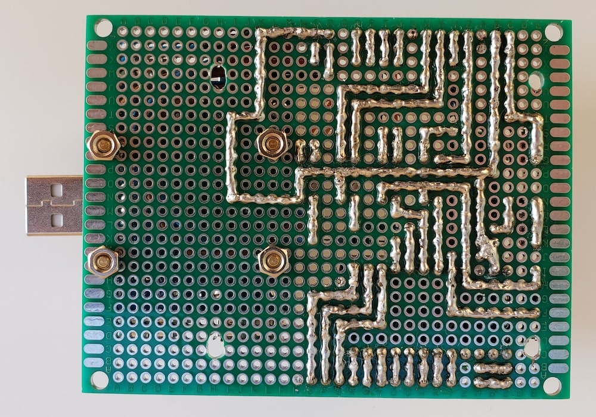

# Power supply boards and USB HUBs

- [Power supply boards and USB HUBs](#power-supply-boards-and-usb-hubs)
  - [Description](#description)
    - [Main functions](#main-functions)
    - [Specification](#specification)
    - [Tools](#tools)
  - [Requirements and components](#requirements-and-components)
    - [Board #1](#board-1)
    - [Board #2](#board-2)
    - [Board #3](#board-3)
    - [Board #4](#board-4)
    - [Board #5](#board-5)
    - [Arduino connections](#arduino-connections)
    - [Components](#components)
  - [Commands](#commands)
  - [Connect SPI with two Master SBCs](#connect-spi-with-two-master-sbcs)
  - [Tests](#tests)
    - [DC-DC 5A Step-down Converter XL4015E1](#dc-dc-5a-step-down-converter-xl4015e1)
      - [Load tests](#load-tests)
      - [Voltage tests](#voltage-tests)
      - [Device photo](#device-photo)
      - [Heatmap photos (2A output current)](#heatmap-photos-2a-output-current)
    - [DC-DC 300W 12A Step-down Converter XL4016E1](#dc-dc-300w-12a-step-down-converter-xl4016e1)
      - [Load tests](#load-tests-1)
      - [Voltage tests](#voltage-tests-1)
      - [Device photo](#device-photo-1)
      - [Heatmap photos (5A output current)](#heatmap-photos-5a-output-current)
  - [Schematic](#schematic)
  - [Device Photos](#device-photos)
    - [Assembled](#assembled)
    - [Board #1](#board-1-1)
    - [Board #2](#board-2-1)
    - [Board #3](#board-3-1)
    - [Board #4](#board-4-1)
    - [Board #5](#board-5-1)
  - [URLs](#urls)

## Description

### Main functions

- Remote devices control: *On*, *Off* (state save in EEPROM) and *Reboot* (5 seconds) of:
  - 4 single board computers (5V);
  - 3 mini PCs (12V);
  - Ethernet/USB switches, external devices like modem, wi-fi routers, etc.
- High Availability: control board connected with two SBC Masters;
- Button outputs control: turn On devices by buttons (on case if remote control for some reasons not available). Devices can't be turned off by button;
- Remote reading voltage, current and power for all outputs;
- Choosing input power source from 2 x 14-24V lines for any output: one line from "power line" and "solar" sources (UPS output #4), another one with additional backup (UPS output #2 + #3)

### Specification

- **i2c address**: *0x03*

### Tools

[python-client](python-client) - command-line tool for devices remote control

## Requirements and components

### Board #1

This is "brain" module of smart power supply, 2 USB HUBs and control of USB switch selectors

- 1 x Arduino Pro Mini 328 - **3.3V/8MHz**
- 2 x USB HUB modules (with external power supply from SBC PSs)
- 4 x 390 Ohm resistors
- 3 x 10k resistors
- 4 x OMRON G3VM-61A1
- 1 x button
- 1 x HW-613 Mini DC-DC 3A Step Down Power Supply Module (for Arduino and INA219 devices, 3.3V)
- 1 x 1N4001 diode
- 1 x 0.2A fuse

### Board #2

Module for control power for IP-KVM, Master (SBC) nodes and USB switch selector #1

- 4 x IRF4905 transistors (input: 15V, output: 5.2V, 3A (~15.5W) - 35℃)
- 4 x BC547 transistors
- 4 x 1k resistors
- 4 x 2k (2W) resistors
- 8 x 10k resistors
- 4 x 12V Zener diodes
- 6 x SR240 diodes
- 5 x INA219 current/voltage sensors (address: 0x40 - 0x44)
- 5 x DC-DC Step Down Converter XL4015E1 -> 5.2V, 1.5A (up to 3A)
- 5 x 9x9x5mm aluminum heatsinks

### Board #3

Module for control power for Worker (Mini PC) nodes and USB switch selector #2

- 3 x IRF4905 transistors
- 3 x BC547 transistors
- 3 x 1k resistors
- 3 x 2k (2W) resistors
- 6 x 10k resistors
- 3 x 12V Zener diodes
- 5 x SR240 diodes
- 4 x INA219 current/voltage sensors (3 of them with 0.05 Ohm 5W (BPR56) shunt resistor for measure max current up to 0.32/0.05=6.4A, address: 0x45 - 0x48)
- 3 x DC-DC Step Down Converter XL4016E1 -> 12.5V, 3A (up to 5A)
- 1 x DC-DC Step Down Converter XL4015E1 -> 5.2V, 1.5A (up to 3A)
- 1 x 9x9x5mm aluminum heat sinks
- 3 x 34x12x30mm heatsink for IRF4905 (input: 15V, output: 12.3V, 5A (~60W) - 77℃)

### Board #4

Module for control power for Ethernet switch (internal) and 3 external devices (like wifi routers, modems, etc)

- 4 x IRF4905 transistors
- 4 x BC547 transistors
- 4 x 1k resistors
- 4 x 2k (2W) resistors
- 8 x 10k resistors
- 4 x 12V Zener diodes
- 4 x SR240 diodes
- 4 x INA219 current/voltage sensors (address: 0x49 - 0x4C)
- 1 x DC-DC Step Down Converter XL4015E1 -> 9V, 1.5A (up to 3A)
- 3 x DC-DC Step Down Converter XL4015E1 -> 5..12V, 1.5A (up to 3A)
- 4 x 9x9x5mm aluminum heatsinks

### Board #5

Module of distribution input lines and fuses for 1-4 modules

- input (line #1) from "UPS output #4"
- input (line #2) from "UPS output #2 + #3" (additional backup)
- input (line #3) from '"UPS output #2 + #3" -> "DC-DC convertor to 12V"'
- 1 x 2A fuse for output to board #1 and "Cluster Cooling Board"
- 2 x 5A fuse for output to board #2
- 2 x 8A fuse for output to board #3
- 2 x 5A fuse for output to board #4

### Arduino connections

| Cmd | Arduino PIN | Component | Notes |
| --- | --- | --- | --- |
| c*\|1 | D2 (Ext. Int.) | IRF4905 + BC547 (Switch) | IP-KVM (Raspberry Pi) |
| c*\|2 | D3 (PWM) | IRF4905 + BC547 (Switch) | Master01 (SBC) + USB module |
| c*\|3 | D4 | IRF4905 + BC547 (Switch) | Master02 (SBC) + USB module |
| c*\|4 | D5 (PWM) | IRF4905 + BC547 (Switch) | Master03 (SBC) |
| c*\|5 | D6 (PWM) | IRF4905 + BC547 (Switch) | Worker01 (mini PC) |
| c*\|6 | D7 | IRF4905 + BC547 (Switch) | Worker02 (mini PC) |
| c*\|7 | D8 | IRF4905 + BC547 (Switch) | Worker03 (mini PC) |
| c*\|8 | D9 (PWM) | IRF4905 + BC547 (Switch) | Ethernet switch |
| c*\|9 | D10 (PWM) | IRF4905 + BC547 (Switch) | External device #1 |
| c*\|10 | D11 (PWM) | IRF4905 + BC547 (Switch) | External device #2 |
| c*\|11 | D12 | IRF4905 + BC547 (Switch) | External device #3 |
| ue\|1 | D13 | OMRON G3VM-61A1 | USB switch selector #1 Button |
| ue\|2 | A0 | OMRON G3VM-61A1 | USB switch selector #2 Button |
| us\|1 | A1 | OMRON G3VM-61A1 | USB switch selector #1 Led #1 |
| us\|2 | A2 | OMRON G3VM-61A1 | USB switch selector #2 Led #1 |
| - | A3 | Button | Manual control (D2 - D12) |
| - | A4 | i2c SDA | Communication with i2c master |
| - | A5 | i2c SCL | Communication with i2c master |

### Components

| Name | Schema / Photo |
| --- | --- |
| Switch | [](images/Transistor_Switch.png) [](images/IRF4905.jpg) [](images/BC547.jpg)<br> **Note:** DC-DC inverters - this is inductive load, therefore flyback diode (SR240) is necessary for protect Mosfet transistor!|
| INA219 | [](images/INA219_1.jpg) [](images/INA219_2.jpg) [](images/INA219_addrs.jpg) |
| HW-613 | [](images/HW-613_1.jpg) [](images/HW-613_2.jpg) |
| USB HUB | [](images/USB_HUB1.jpg) [](images/USB_HUB2.jpg) |
| DC-DC XL4015E1 | [](images/XL4015E1_1.png) [](images/XL4015E1_2.png) |
| DC-DC XL4016E1 | [](images/XL4016E1_1.png) [](images/XL4016E1_2.png) |

## Commands

| Command | Description | EEPROM | Notes |
| --- | --- | --- | --- |
| cs0 | get status of all controlled outputs | - ||
| c[e\|d\|r\|s][1-11] | enable/disable/reboot/status for controlled outputs | + (for e\|d) | see mapping in "Cmd" column |
| us0 | get status of all USB switch selectors for output #1 | - ||
| us[1-2] | get status for specific USB switch selector for output #1 | - | see mapping in "Cmd" column |
| ue[1-2][1-2] | enable selected output on specific USB switch selector | + | see mapping in "Cmd" column |
| s0 | read voltage/current/power for controlled outputs | - ||
| s1 | read voltage/current/power | - | IP-KVM (Raspberry Pi) |
| s2 | read voltage/current/power | - | Master01 (SBC) + USB module |
| s3 | read voltage/current/power | - | USB switch selector #1 |
| s4 | read voltage/current/power | - | Master02 (SBC) + USB module |
| s5 | read voltage/current/power | - | Master03 (SBC) |
| s6 | read voltage/current/power | - | Worker01 (mini PC) |
| s7 | read voltage/current/power | - | USB switch selector #2 |
| s8 | read voltage/current/power | - | Worker02 (mini PC) |
| s9 | read voltage/current/power | - | Worker03 (mini PC) |
| s10 | read voltage/current/power | - | Ethernet switch |
| s11 | read voltage/current/power | - | External device #1 |
| s12 | read voltage/current/power | - | External device #2 |
| s13 | read voltage/current/power | - | External device #3 |

***EEPROM*** - memory values are kept when the board is turned off  

**cr[1-11]:**

- status `0`: output disabled;
- status `1`: output in reboot process;
- status `2`: some output still in reboot process (turn OFF -> delay 5 seconds -> turn ON)

**ue[1-2][1-2]:**

- status `0`: output was already in `enabled` state;
- status `1`: command accepted for change state to `enabled`, need make 2nd call `us[1-2]` within 3 seconds to verify if state changed (works only for verifying output #1);
- status `2`: (only if was 2nd call `us[1-2]` within 3 seconds) means that output wasn't swithched (works only for verifying output #1)

## Connect SPI with two Master SBCs

For High Availability (to be able control outputs even if one of the control SBC is unavailable) I need connect the control board #1 with two SBC Masters. The simple connection both Masters on the same SPI is not working, therefore, I used relay and by signal from Master02 I can switch SPI from Master01 to Master02 (when Master01 has issues).

DR21A01 Mini DC 5V relay:

[](images/dr21a01_mini_5v_relay_1.jpeg)
[](images/dr21a01_mini_5v_relay_2.jpeg)
[](images/dr21a01_mini_5v_relay_3.jpeg)

Connections:

**GND:** Master02, P20 Gnd  
**VCC:** Master02, P2 5.0V  
**IN:** Master02, P16 101 GPIO3_A5  
**COM1:** board #1, A4, i2c SDA  
**COM2:** board #1, A5, i2c SCL  
**NC1:** Master01, P27 68 GPIO2_A4 I2C1_SDA_PMIC  
**NC2:** Master01, P28 69 GPIO2_A5 I2C1_SLC_PMIC  
**NO1:** Master02, P27 68 GPIO2_A4 I2C1_SDA_PMIC  
**NO2:** Master02, P28 69 GPIO2_A5 I2C1_SLC_PMIC

Rock64 pinouts:


Example script of GPIO configuration on Master02:

```bash
# Relay control (PIN16 - GPIO3_A5)
# Check if gpio is already exported
if [ ! -d /sys/class/gpio/gpio101 ]
then
  echo 101 > /sys/class/gpio/export
  sleep 1 # Short delay while GPIO permissions are set up
fi
echo "out" > /sys/class/gpio/gpio101/direction
echo 0 > /sys/class/gpio/gpio101/value
```

Relay can be enabled/disabled by writing `1 or 0` to `/sys/class/gpio/gpio101/value`

## Tests

### DC-DC 5A Step-down Converter XL4015E1

#### Load tests

Each test during 15 minutes.  
Without load: input voltage **24V**, output voltage **5.25V**.

| Input current | Output current | Output voltage | temperature |
| - | - | - | - |
| 0.26A (6.3W) | 1A (5.1W) | 5.17V | 60 °C |
| 0.51A (12.2W) | 2A (10.2W) | 5.14V | 80 °C |

#### Voltage tests

| Output current | 12.63V -> 5.23V | 15V -> 5.23V |
| - | - | - |
| 1A | 5.16V | 5.17V |
| 2A | 5.12V | 5.12V |

Configured cut off on 3.1A output (will be disabled output)

#### Device photo


#### Heatmap photos (2A output current)


Where to buy: https://www.aliexpress.com/item/1084552308.html?spm=a2g0s.9042311.0.0.27424c4dMDav6W

### DC-DC 300W 12A Step-down Converter XL4016E1

#### Load tests

Each test during 15 minutes.  
Without load: input voltage **24V**, output voltage **12.3V**.

| Input current | Output current | Output voltage | temperature |
| - | - | - | - |
| 1.62A (39W) | 3A (36W) | 12.22V | 51 °C |
| 2.76A (66.2W) | 5A (61W) | 12.21V | 71 °C |

#### Voltage tests

| Output current | 14V -> 12.27V | 15V -> 12.28V | 14V -> 12.5V |
| - | - | - | - |
| 3A | 12.20V | 12.20V | 12.42V |
| 4A | 12.17V | 12.20V | 12.40V |
| 5A | 12.16V | 12.20V | 12.39V |

Configured cut off on 5.3A output (will be disabled output)

#### Device photo


#### Heatmap photos (5A output current)


Where to buy: https://www.aliexpress.com/item/32967000523.html?spm=a2g0s.9042311.0.0.27424c4dMDav6W

## Schematic


## Device Photos

### Assembled

[](images/assembled_1.jpeg)
[](images/assembled_2.jpeg)
[](images/assembled_3.jpeg)

### Board #1

[](images/board1_1.jpeg)
[](images/board1_2.jpeg)
[](images/board1_3.jpeg)
[](images/board1_4.jpeg)
[](images/board1_5.jpeg)
[](images/board1_6.jpeg)
[](images/board1_7.jpeg)

### Board #2

[](images/board2_1.jpeg)
[](images/board2_2.jpeg)
[](images/board2_3.jpeg)
[](images/board2_4.jpeg)
[](images/board2_5.jpeg)
[](images/board2_6.jpeg)

### Board #3

[](images/board3_1.jpeg)
[](images/board3_2.jpeg)
[](images/board3_3.jpeg)
[](images/board3_4.jpeg)
[](images/board3_5.jpeg)
[](images/board3_6.jpeg)

### Board #4

[](images/board4_1.jpeg)
[](images/board4_2.jpeg)
[](images/board4_3.jpeg)
[](images/board4_4.jpeg)
[](images/board4_5.jpeg)
[](images/board4_6.jpeg)

### Board #5

[](images/board5_1.jpeg)
[](images/board5_2.jpeg)
[](images/board5_3.jpeg)
[](images/board5_4.jpeg)
[](images/board5_5.jpeg)
[](images/board5_6.jpeg)
[](images/board5_7.jpeg)

## URLs

[Raspberry Pi INA219 Tutorial](https://www.rototron.info/raspberry-pi-ina219-tutorial)
