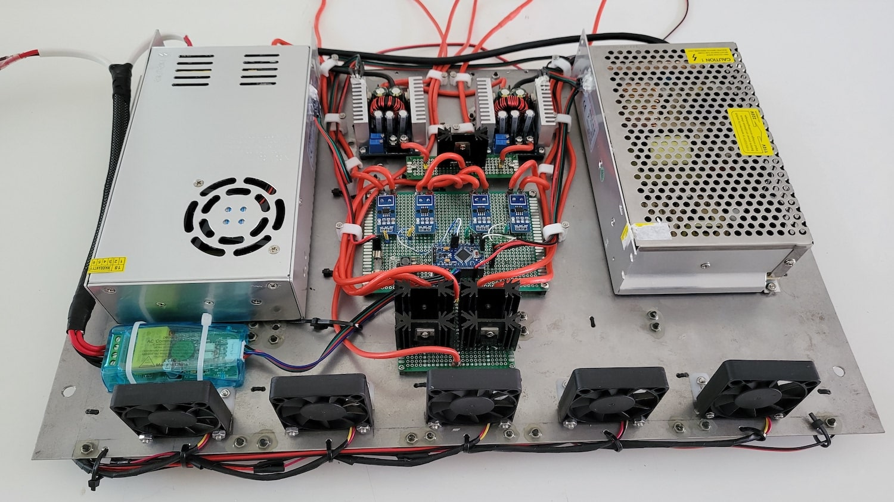
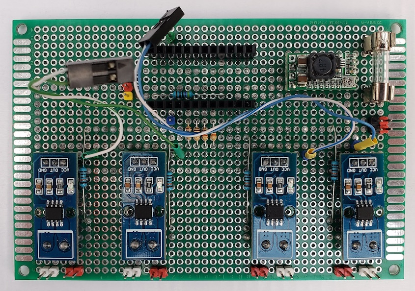
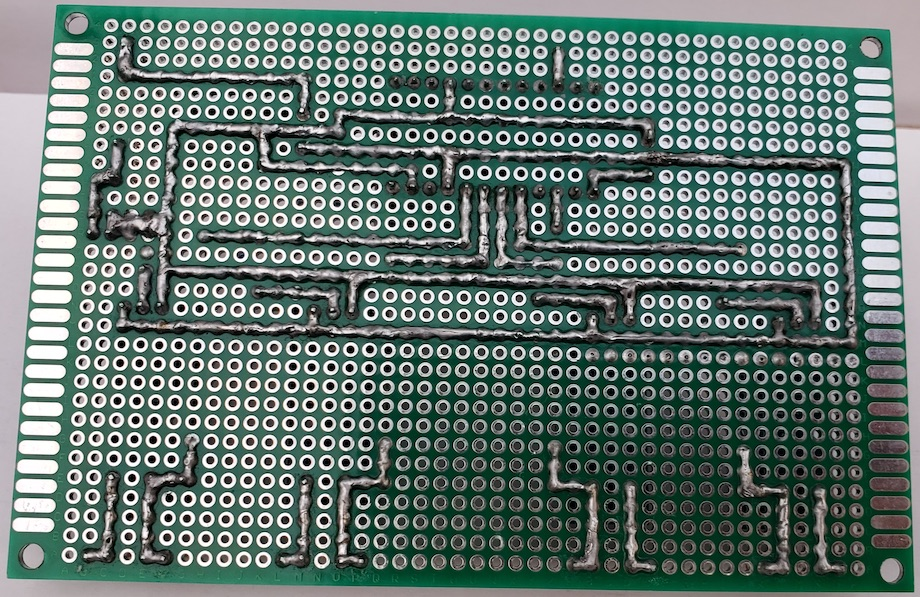

# Power Supply with Monitoring

This is version 2 with power supplies on 18V and 24V and included input for connecting Solar Batteries on 24V.

## Description

Power Supply Monitoring module was developed for measure voltage, current and power consumption on AC line, PS outputs and Solar Batteries input with ability send data to server via [PJON protocol](https://github.com/gioblu/PJON).

## Main functions

- measure voltage, curent and power consumption on PS outputs, Solar Batteries input and dc-dc converter;
- measure AC line parameters: Voltage, Current, Power, Energy, Frequency and Power factor;
- measuring temperature on PS outputs and dc-dc converters;
- send data to server via [PJON protocol](https://github.com/gioblu/PJON)

## PJON Specification

- PJON TxRx Bus Server ID: _1_
- PJON Tx Bus Server ID: _6_
- PJON Bus Device ID: _15_
- PJON Strategy: _SoftwareBitBang_

## Requirements and components for Power Supply

- 1 x Power supply 18V 20A (model: JC-360-18)
- 1 x Power supply 24V 10A (model: S-240-24)
- 2 x 300W 20A DC-DC Buck Converter Step Down Modules
- 2 x MBR6045PT diodes (for mixing lines from 3 inputs)
- 2 x MBR60100CT diodes (for chargers)
- 1 x MBR4045CT diode (for DC convertors)
- 2 x 34x12x38mm heatsink for MBR6045PT diodes (19.3V -> 18.8V, 8A (~150W) - 70℃; 22V -> 21.47V, 7A (~150W) - 60℃)
- 2 x 34x12x30mm heatsink for MBR60100CT diodes (19.1V -> 18.4V, 3A (~55W) - 48℃; 22.6V -> 21.8V, 3A (~65W) - 50℃)
- 1 x 34x12x30mm heatsink for MBR4045CT diode (12.6V -> 12.05V, 5A (~60W) - 60℃)

### Modification power supply 24V 10A (model: S-240-24)

This power supply came with ability adjusting output voltage within 22.7 - 28.77V limits. For building my UPS the lowwer limit is little bit high, therefore, was decided to descrease it to 22.0V. This is was done by simple changing RSS1 resistor (located near ajustable resistor) from 820 Om to 1.5 kOm. As I didn't have one 1.5 kOm resistor I took 2 resistors on 1 kOm and 510 Om and connected them in series. Check the photo below:

After this modification adjusting output voltage limits became: 21.3V - 28.77V which totally acceptable for this UPS.

## Requirements and components for monitoring module

- 1 x Arduino Pro Mini 328 - 5V/16MHz
- 1 x HW-613 Mini DC-DC 3A Step Down Power Supply Module
- 4 x ACS712-20A modules
- 4 x 10k resistors
- 4 x 100k resistors
- 4 x DS18B20
- 1 x PZEM004T v3.0
- 2 x 1 MOm resistors
- 1 x 1N4001 diode

| Arduino PIN | Component | Notes |
| --- | --- | --- |
| D2 (Ext. Int.) | Rx (Connects to the Tx pin on the PZEM) | [PZEM004T v3.0](https://innovatorsguru.com/pzem-004t-v3) |
| D3 (PWM) | Tx (Connects to the Rx pin on the PZEM) | [PZEM004T v3.0](https://innovatorsguru.com/pzem-004t-v3) |
| D4 | - ||
| D5 (PWM) | - ||
| D6 (PWM) | - ||
| D7 | [PJON v13.0](https://github.com/gioblu/PJON/tree/13.0/src/strategies/SoftwareBitBang) | Communication with Server (TxRx) |
| D8 | - ||
| D9 (PWM) | - ||
| D10 (PWM) | 1-Wire | Temperature sensors |
| D11 (PWM) | - ||
| D12 | [PJON v13.0](https://github.com/gioblu/PJON/tree/13.0/src/strategies/SoftwareBitBang) | Communication with Server (Tx only) |
| D13 | - ||
| A0 | Voltmeter: r1=100k, r2=10k | 24V 10A PS output (V-1) |
| A1 | Voltmeter: r1=100k, r2=10k | 24V Solar Battaries output (V-2) |
| A2 | Voltmeter: r1=100k, r2=10k | 12V DC-DC (from UPS 2+3) output (V-3) |
| A3 | Voltmeter: r1=100k, r2=10k | 18V 20A PS output (V-4) |
| A4 | ACS712-20A | 24V 10A PS output (I-1) |
| A5 | ACS712-20A | 24V Solar Battaries output (I-2) |
| A6 | ACS712-20A | 12V DC-DC (from UPS 2+3) output (I-3) |
| A7 | ACS712-20A | 18V 20A PS output (I-4) |

### Components photos and schematics

| Name | Schema / Photo |
| --- | --- |
| Voltmeter |  |
| ACS712 |   |
| HW-613 |   |
| DS18B20 |  |
| PZEM-004T v3 |  |
| 300W 20A DC-DC Buck Converter Step Down Module |   |

### Commands

| Command | Description | EEPROM | Auto-push | Notes |
| --- | --- | --- | --- | --- |
| V-[1-4] | Read value of voltage for 1-4 outputs | - | + (auto-push every 1 minute) | Volt |
| V-[1-4]-a | Read value of auto-push voltage for 1-4 outputs | - | - | 0 - disabled 1 - enabled |
| V-[1-4]-a=[0,1] | Disable/enable auto-push for read values of voltage for 1-4 outputs | + | - | 0 - disable 1 - enable default: 0 |
| I-[1-4] | Read value of current for 1-4 outputs | - | + (auto-push every 1 minute) | Amper |
| I-[1-4]-a | Read value of auto-push current for 1-4 outputs | - | - | 0 - disabled 1 - enabled |
| I-[1-4]-a=[0,1] | Disable/enable auto-push for read values of current for 1-4 outputs | + | - | 0 - disable 1 - enable default: 0 |
| P-[1-4] | Read value of power consumption for 1-4 outputs | - | + (auto-push every 1 minute) | Watt (Volt * Amper) |
| P-[1-4]-a | Read value of auto-push power consumption for 1-4 outputs | - | - | 0 - disabled 1 - enabled |
| P-[1-4]-a=[0,1] | Disable/enable auto-push for read values of power consumption for 1-4 outputs | + | - | 0 - disable 1 - enable default: 0 |
| T-[1-4] | Read value of temperature on PS outputs, dc-dc converter and near diodes | - | + (auto-push every 1 minute) | °C |
| T-[1-4]-a | Read value of auto-push for temperature on PS outputs, dc-dc converter and near diodes | - | - | 0 - disabled 1 - enabled |
| T-[1-4]-a=[0,1] | Disable/Enable auto-push for read values of temperature on PS outputs, dc-dc converter and near diodes | + | - | 0 - disable 1 - enable default: 0 |
| L-[v,c,p,e,f,pf] | Read value of AC line parameters | - | + (auto-push every 1 minute) | Voltage (V) Current (A) Power (W) Energy (kWh) Frequency (Hz) Power factor |
| L-[v,c,p,e,f,pf]-a | Read value of auto-push AC line parameters | - | - | 0 - disabled 1 - enabled |
| L-[v,c,p,e,f,pf]-a=[0,1] | Disable/enable auto-push for read values of AC line parameters | + | - | 0 - disable 1 - enable default: 0 |

where, 
[V,I,P]-1 - 24V 10A PS output 
[V,I,P]-2 - 24V Solar Battaries output 
[V,I,P]-3 - 12V DC-DC (from UPS 2+3) output 
[V,I,P]-4 - 18V 20A PS output 
T-1 - 24V 10A PS 
T-2 - 12V DC-DC2 (from UPS 2+3), near 24V 10A PS 
T-3 - 12V DC-DC1 (from UPS 2+3), near 18V 20A PS 
T-4 - 18V 20A PS 
***EEPROM*** - memory values are kept when the board is turned off 
***Auto-push*** - periodically send data to server

## Device Photos

### UPS schema and common photo

### PS diodes

### DC diode

### Monitoring board version 2

**Note:** added [PZEM004T v3.0](https://innovatorsguru.com/pzem-004t-v3) and [PJON filters](https://github.com/gioblu/PJON/wiki/Mitigate-interference) (1MOm resistors and diode)

### Monitoring board version 1

