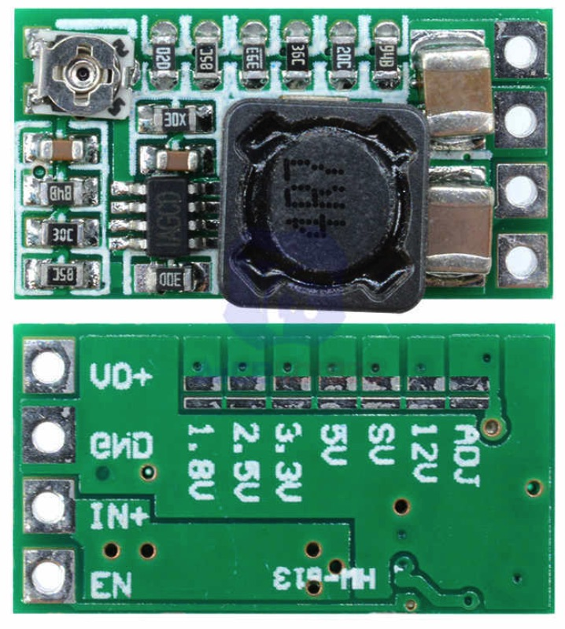

# Rack Alarm System

## Description

### Main functions

- send messages to server (via [PJON protocol](https://github.com/gioblu/PJON)) when detect smoke, flame or external motion;
- send "status" message to server each 1 minute;
- send message to server and HIGH signal within 1 minute after last any sensor triggered (except A5 external motion sensor). Can be used, for example, for turn off the air-conditioner system.

### PJON Specification

- PJON Tx Bus Server ID: _6_
- PJON Bus Device ID: _19_
- PJON Strategy: _SoftwareBitBang_

## Requirements and components

- 1 x Arduino Pro Mini 328 - 5V/16MHz
- 9 x flame sensor modules
- 5 x MQ-2 smoke sensor modules
- 1(2) x HC-SR501 pir sensor(s)
- 1 x buzzer
- 1 x 1MOm resistor
- 1 x 1N4001 diode
- HW-613 Mini DC-DC 3A Step Down Power Supply Module (for Arduino and sensors, 5V output)
- 1 x 0.5A fuse

| Arduino PIN | Component | Notes |
| --- | --- | --- |
| D2 (Ext. Int.) | flame sensor ||
| D3 (PWM) | flame sensor ||
| D4 | flame sensor ||
| D5 (PWM) | flame sensor ||
| D6 (PWM) | flame sensor ||
| D7 | flame sensor ||
| D8 | flame sensor ||
| D9 (PWM) | flame sensor ||
| D10 (PWM) | buzzer ||
| D11 (PWM) | external flame sensor ||
| D12 | [PJON v13.0](https://github.com/gioblu/PJON/tree/13.0/src/strategies/SoftwareBitBang) | Communication with Server (TX only) |
| D13 | signal output ||
| A0 | MQ-2 smoke sensor ||
| A1 | MQ-2 smoke sensor ||
| A2 | MQ-2 smoke sensor ||
| A3 | MQ-2 smoke sensor ||
| A4 | external MQ-2 smoke sensor ||
| A5 | external motion sensor(s) ||

### Components photos and schematics

| Name | Schema / Photo |
| --- | --- |
| Flame sensor |  |
| MQ-2 smoke sensor |   |
| Buzzer |  |
| HW-613 |   |
| Motion sensor |  |
| Multiple motion sensors |  |

| Command | Description | Notes |
| --- | --- | --- |
| F-[1-9] | Flame sensors status (D2-D9, D11) | 0 - not triggered, 1 - triggered |
| S-[1-5] | Flame sensors status (A0-A4) | 0 - not triggered, 1 - triggered |
| M | Motion sensor(s) status (A5) | 0 - not triggered, 1 - triggered |
| A | Alarm status for the last 1 minute | 0 - no alarm, 1 - alarm |

## Device Photos

