# Low voltage UPS for smart home

- [Low voltage UPS for smart home](#low-voltage-ups-for-smart-home)
  - [Description](#description)
  - [Main functions](#main-functions)
  - [Components photos and schematics](#components-photos-and-schematics)
  - [Tests](#tests)
    - [DC-DC 400W 15A Step-up Boost Converter](#dc-dc-400w-15a-step-up-boost-converter)
      - [Load tests](#load-tests)
      - [Voltage tests](#voltage-tests)
      - [Heatmap photos (5A output current)](#heatmap-photos-5a-output-current)
    - [DC-DC 1200W 20A Step-up Boost Converter](#dc-dc-1200w-20a-step-up-boost-converter)
      - [Load tests](#load-tests-1)
      - [Voltage tests](#voltage-tests-1)
      - [Heatmap photos (9A output current)](#heatmap-photos-9a-output-current)
  - [Device circuit](#device-circuit)
  - [Assembled device photos](#assembled-device-photos)

This is version 3 for input voltage 18-24V.

## Description

This UPS was designed for smart home with two separate power supply lines and batteries for each line which include two chargers for each battery. Maximum continuous output for each line about 150W. For almost each inputs and outputs has been implemented measuring voltage, current and power consumption with ability to send data to server via [PJON protocol](https://github.com/gioblu/PJON).

## Main functions

UPS consists from 3 modules

[Module #1](module1) - control outputs and charge batteries  
[Module #2](module2) - UPS function (mixing voltage from batteries and power supplies)  
[Module #3](module3) - measuring voltage, curent and power consumption module

## Components photos and schematics

| Name | Schema / Photo |
| --- | --- |
| DC-DC 400W 15A Step-up Boost Converter | [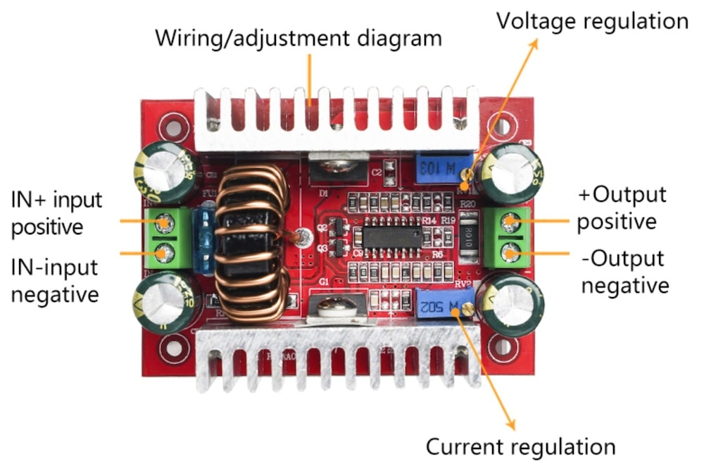](images/400W-15A-Step-up-Boost-Converter_1.jpeg) [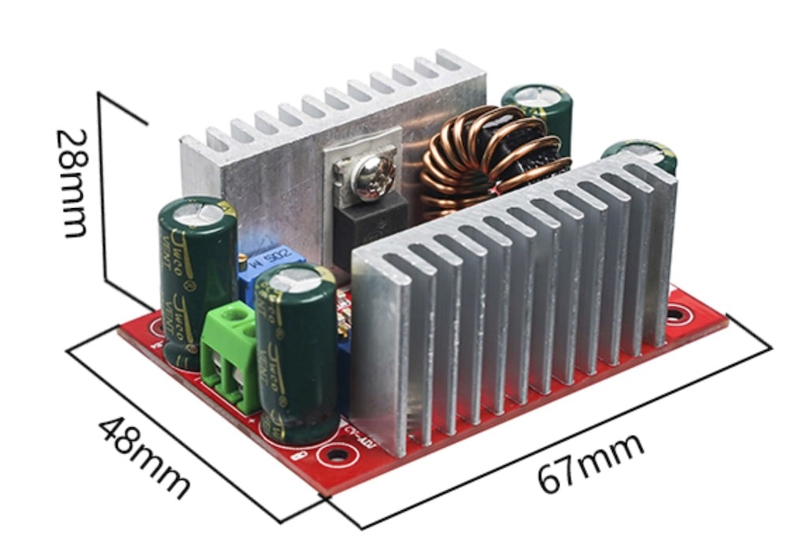](images/400W-15A-Step-up-Boost-Converter_2.jpeg) |
| DC-DC 1200W 20A Step-up Boost Converter | [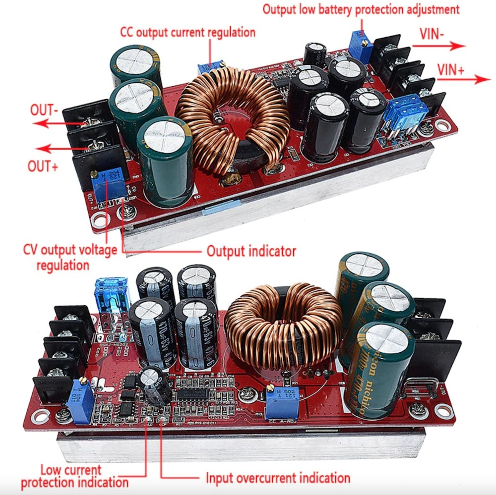](images/DC-DC-1200W-20A-Step-up-Boost-Converter_1.jpeg) [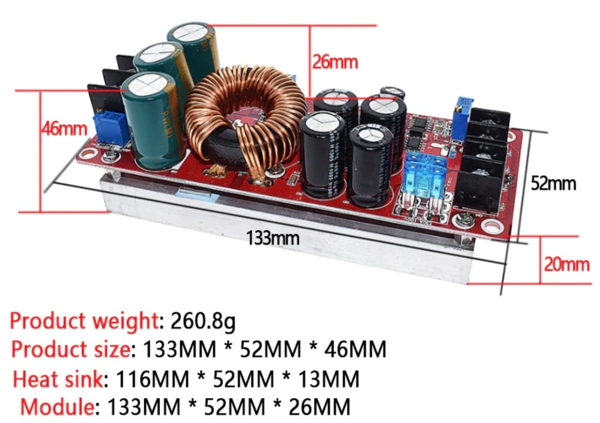](images/DC-DC-1200W-20A-Step-up-Boost-Converter_2.jpeg) |

## Tests

### DC-DC 400W 15A Step-up Boost Converter

#### Load tests

Each test during 15 minutes.  
Without load: input voltage **12.6V**, output voltage **16.01V**.  
Consumption without load: **10.6mA**

| Input current | Output current | Output voltage | MBR20100, t | NCE8290, t |
| - | - | - | - | - |
| 4.28A (53.9W) | 3A (48W) | 15.95V | 60 °C | - |
| 5.89A (74.2W) | 4A (63.5W) | 15.86V | 75 °C | - |
| 7.65A (96.39W)| 5A (79W) | 15.76V | 83 °C | 53 °C |

#### Voltage tests

| Output current | 11.6V -> 16.00V | 14.5V -> 16.01V |
| - | - | - |
| 1A | 15.99V | 15.99 |
| 2A | 15.97V | 15.98 |
| 3A | 15.94V | 15.96 |
| 4A | 15.91V | 15.95 |
| 5A | 15.75V | 15.88 |

Configured cut off on 5.3A output (will be decreased output to 11.75V)

#### Heatmap photos (5A output current)

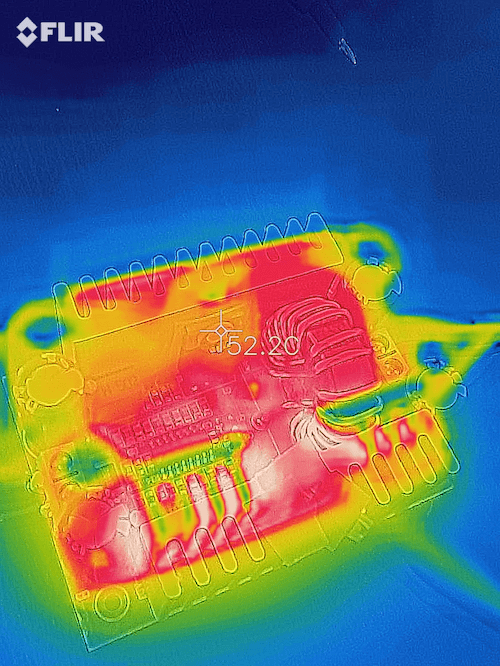 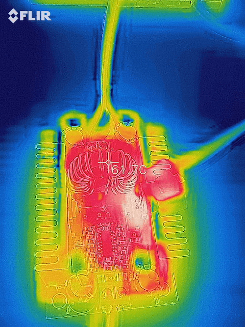 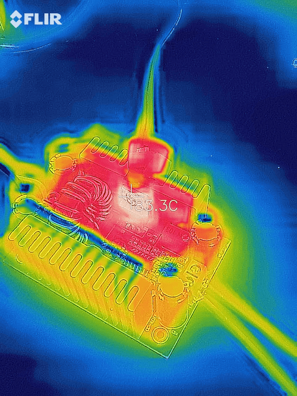

Where to buy: https://www.aliexpress.com/item/32999896390.html?spm=a2g0s.9042311.0.0.27424c4dMDav6W

### DC-DC 1200W 20A Step-up Boost Converter

#### Load tests

Each test during 15 minutes.  
Without load: input voltage **12.6V**, output voltage **16.00V**.  
Consumption without load: **25.8mA**

| Output current | Output voltage | temperature |
| - | - | - |
| 7A (111.7W) | 15.93V | 64 °C |
| 9A (143W) | 15.89V | 80 °C |

#### Voltage tests

| Output current | 11.6V -> 16.00V | 14.5V -> 16.00V |
| - | - | - |
| 3A | 15.96V | 15.97 |
| 5A | 15.95V | 15.95 |
| 6A | 15.94V | 15.95 |
| 7A | 15.93V | 15.94 |
| 8A | 15.92V | 15.93 |
| 9A | 15.92V | 15.92 |

Configured cut off on 9.5A output (will be decreased output to 11.6V)

#### Heatmap photos (9A output current)

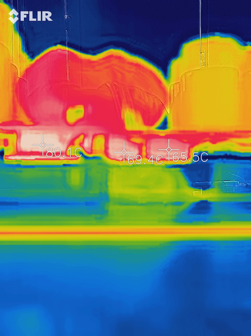 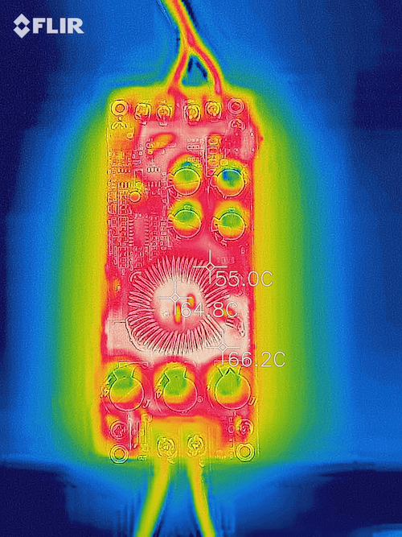

Where to buy: https://www.aliexpress.com/item/1005001354297652.html?spm=a2g0s.9042311.0.0.27424c4dMDav6W

## Device circuit

[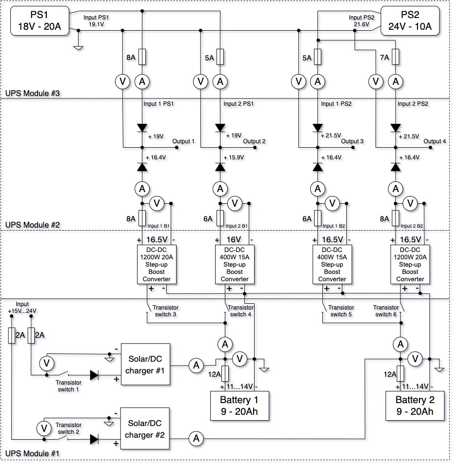](images/slvu_circuit.jpeg)

## Assembled device photos

[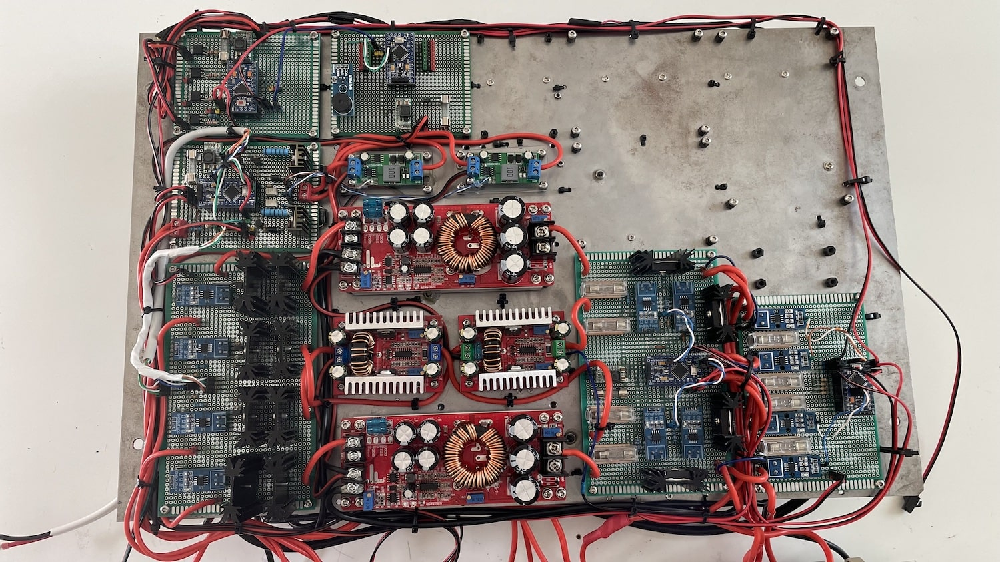](images/slvu_1.jpeg)
[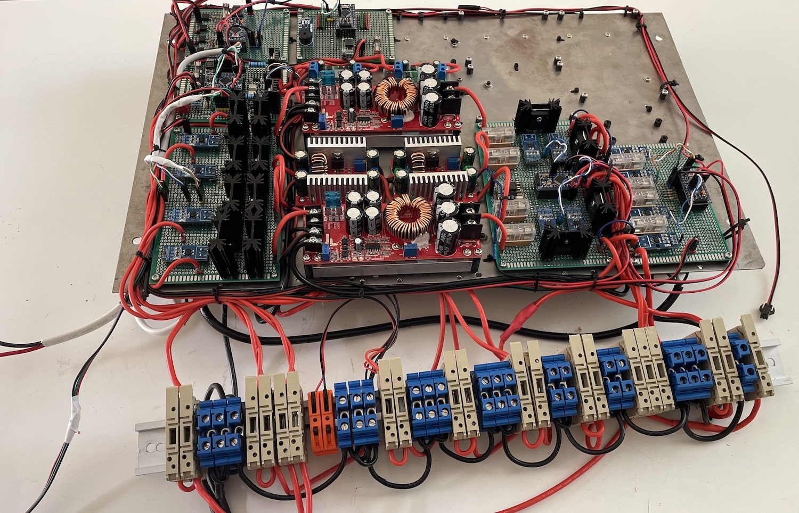](images/slvu_2.jpeg)
[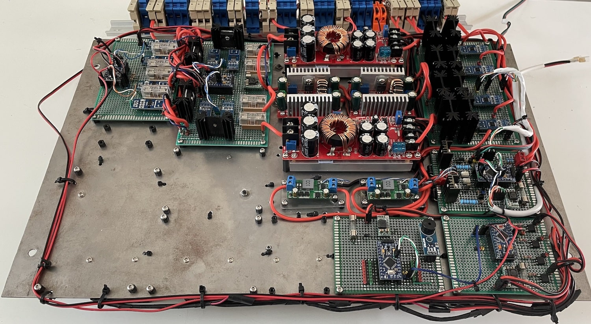](images/slvu_3.jpeg)

[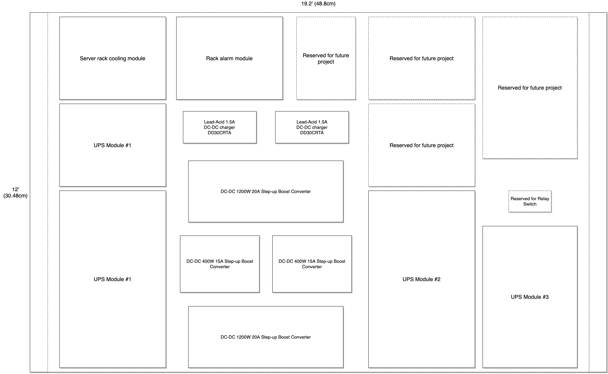](images/slvu_4.jpeg)
