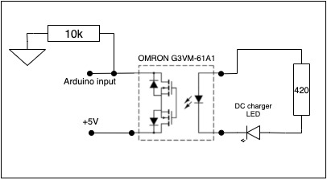

# Low voltage UPS for smart home - Module #1

## Main functions

- control charge process for 2 batteries from DC or Solar chargers;
- two batteries can be charged simultaneously;
- start batteries charge if voltage >5V and <12.5V;
- charging will be enabled if input voltage on charger >=15.0V;
- stop charge batteries if current consumption from them >0.1A;
- stop charge batteries if charging current <0.15A or was received signal from charger status LED;
- measuring batteries temperature, don't start batteries charge if temperature >42°C and stop charge if >45°C;
- measuring charger temperature, don't start batteries charge if charger temperature >50°C and stop charge if >60°C;
- enable batteries outputs if voltage >12.0V, disable if batteries discharged (less 11.5V)
- measuring batteries temperature, don't enable outputs if batteries temperature >42°C and disable outputs if >45°C;
- measuring voltage, current and power consumption on batteries and chargers with ability sending data to server via [PJON protocol](https://github.com/gioblu/PJON);
- module and outputs can be configured and controlled from server via [PJON protocol](https://github.com/gioblu/PJON)

## PJON Specification

- PJON TxRx Bus Server ID: _1_
- PJON Tx Bus Server ID: _6_
- PJON Bus Device ID: _16_
- PJON Strategy: _SoftwareBitBang_

## Requirements and components for module #1.1

- 1 x Arduino Pro Mini 328 - 5V/16MHz
- 2 x IRF4905 transistors
- 2 x BC547 transistors
- 2 x 12v Zener diode (1N4742A)
- 2 x SR240 diodes
- 2 x 1k resistors
- 2 x 2k 2W resistors
- 7 x 10k resistors
- 1 x 100k resistors
- 2 x 390 Ohm resistors
- 2 x [MOSFET relays OMRON G3VM-61A1](https://www.aliexpress.com/item/1005001989679623.html?spm=a2g0s.9042311.0.0.27424c4dnmIQ2j)
- 4 x DS18B20 (for batteries and chargers)
- 2 x 1 MOm resistors
- 1 x 1N4001 diode
- 1 x HW-613 Mini DC-DC 3A Step Down Power Supply Module (for ACS712 and Arduino devices, 5V output)
- 2 x 9x9x5mm aluminum heatsinks (19.1V -> 18.4V, 3A (~55W) - 40℃; 22.6V -> 21.8V, 3A (~65W) - 42℃)
- 1 x 0.5A fuse (arduino, ammeter, etc)
- 1 x 2A fuse (DC charger #1)
- 1 x 2A fuse (DC charger #2)
- 1 x 15A fuse (near battery)
- 1 x 15A fuse (near battery)

| Arduino PIN | Component | Notes |
| --- | --- | --- |
| D2 (Ext. Int.) | Transistor switch 3 | Output 1 |
| D3 (PWM) | Transistor switch 4 | Output 2 |
| D4 | Transistor switch 5 | Output 3 |
| D5 (PWM) | Transistor switch 6 | Output 4 |
| D6 (PWM) | 1-Wire | Temperature sensors |
| D7 | [PJON v13.0](https://github.com/gioblu/PJON/tree/13.0/src/strategies/SoftwareBitBang) | Communication with Server (TxRx) |
| D8 | Transistor switch 1 | Solar/DC charger #1 |
| D9 (PWM) | Transistor switch 2 | Solar/DC charger #2 |
| D10 (PWM) | OMRON G3VM-61A1 | DC charger status LED #1 |
| D11 (PWM) | OMRON G3VM-61A1 | DC charger status LED #2 |
| D12 | [PJON v13.0](https://github.com/gioblu/PJON/tree/13.0/src/strategies/SoftwareBitBang) | Communication with Server (TX only) |
| D13 | - | - |
| A0 | ACS712-20A | Solar/DC charger #1 |
| A1 | ACS712-20A | Transistor switch 3 and 4 |
| A2 | ACS712-20A | Transistor switch 5 and 6 |
| A3 | ACS712-20A | Solar/DC charger #2 |
| A4 | Voltmeter: r1=100k, r2=10k | Battery #1; 10k=9.76k, 100k=98.7k |
| A5 | Voltmeter: r1=100k, r2=10k | Battery #2; 10k=9.9k, 100k=99.5k |
| A6 | Voltmeter: r1=100k, r2=10k | Input to chargers. ?10k=9.9k, ?100k=98.6k |
| A7 | - | -|

## Requirements and components for module #1.2

To avoid increase temperature above 100℃ on transistors and work with load up to 150W is required 2 transistors per channel with related heatsinks.

- 8 x IRF4905 transistors
- 4 x BC547 transistors
- 4 x 1k resistors
- 10 x 10k resistors
- 2 x 100k resistors
- 4 x ACS712-20A modules
- 4 x 34x12x30mm heatsink for IRF4905, output 2 and 3 (12V -> 11.3V, 13.5A (~153W) - 89℃ on transistor and 101℃ on heatsink)
- 4 x 34x12x38mm heatsink for IRF4905, output 1 and 4 (12V -> 11.3V, 13.5A (~153W) - 83℃ on transistor and 93℃ on heatsink)

## Components photos and schematics

| Name | Schema / Photo |
| --- | --- |
| Switch (for module #1.1) |    |
| Switch (for module #1.2) |  |
| Voltmeter |  |
| ACS712 |   |
| HW-613 |   |
| DS18B20 |  |
| OMRON G3VM-61A1 |  |

## Commands

| Command | Description | EEPROM | Auto-push | Notes |
| --- | --- | --- | --- | --- |
| C-[1-2] | Read value of DC charger state | - | - | 0 - disabled 1 - enabled |
| C-[1-2]=[0,1] | Disable/enable DC charger | - | - | 0 - disable 1 - enable default: 0 |
| C-l-[1-2]=[0,1] | Disable/enable DC charger control by status LED | - | - | 0 - disable 1 - enable default: 1 |
| C-a | Read value of charger automode | - | - | 0 - disabled 1 - enabled |
| C-a=[0,1] | Disable/enable charger automode | + | - | 0 - disable 1 - enable default: 1 |
| C-a-m | Read value of charger automode messages | - | - | 0 - disabled 1 - "status" messages only 2 - "status" and "state" messages Status template: "C-a-m<B-[1-2]:\<status>" Possible "status": 0 - disabled 1 - everything is ok "I-[3,4]=value" - battery current consumption >0.1A "T-[1-4]=value" - temperature on batteries or DC charger not ok "C-p=2" - no output from DC charger |
| C-a-m=[0-2] | Disable/enable charger automode messages | + | - | 0 - disable 1 - "status" messages only 2 - "status" and "state" messages default: 0 |
| O-[1-4] | Read value of outputs status | - | - | 0 - disabled 1 - enabled |
| O-[1-4]=[0,1] | Disable/enable outputs | - | - | 0 - disable 1 - enable default: 0 |
| O-a | Read value of outputs control automode | - | - | 0 - disabled 1 - enabled |
| O-a=[0,1] | Disable/enable outputs control automode | + | - | 0 - disable 1 - enable default: 1 |
| O-a-m | Read value of outputs control automode messages | - | - | 0 - disabled 1 - "status" messages only 2 - "status" and "state" messages "O-a-m<B-[1-2]:\<status>" Possible "status:" 1 - everything is ok "V-[3,4]=value" - batteries voltage < 11.5V "T-[1-2]=value" - temperature on batteries not ok  |
| O-a-m=[0-2] | Disable/enable outputs control automode messages | + | - | 0 - disable 1 - "status" messages only 2 - "status" and "state" messages default: 0 |
| T-c-[1-4] | Read value of temperature control | - | - | 0 - disabled 1 - enabled |
| T-c-[1-4]=[0,1] | Disable/enable temperature control | + | - | 0 - disable 1 - enable default: 1 T-c-1 - Battery 1 T-c-2 - Battery 2 T-c-3 - DC charger 1 T-c-4 - DC charger 2  |
| T-[1-4] | Read value of temperature on batteries and chargers | - | + (auto-push every 1 minute) | °C T-1 - Battery 1 T-2 - Battery 2 T-3 - Charger 1 T-4 - Charger 2  |
| T-[1-4]-a | Read value of auto-push for temperature on batteries and chargers | - | - | 0 - disabled 1 - enabled |
| T-[1-4]-a=[0,1] | Disable/enable auto-push for read values of temperature on batteries and chargers | + | - | 0 - disable 1 - enable default: 0 |
| V-[1-3] | Read value of input voltage for chargers and batteries outputs | - | + (auto-push every 1 minute) | Volt |
| V-[1-3]-a | Read value of auto-push input voltage for chargers and batteries outputs | - | - | 0 - disabled 1 - enabled |
| V-[1-3]-a=[0,1] | Disable/enable auto-push for read values of input voltage for chargers and batteries outputs | + | - | 0 - disable 1 - enable default: 0 |
| I-[1-4] | Read value of current for chargers and batteries outputs | - | + (auto-push every 1 minute) | Amper |
| I-[1-4]-a | Read value of auto-push current for chargers and batteries outputs | - | - | 0 - disabled 1 - enabled |
| I-[1-4]-a=[0,1] | Disable/enable auto-push for read values of current for chargers and batteries outputs | + | - | 0 - disable 1 - enable default: 0 |
| P-[1-4] | Read value of power consumption for chargers and batteries outputs | - | + (auto-push every 1 minute) | Watt (Volt * Amper) |
| P-[1-4]-a | Read value of auto-push power consumption for chargers and batteries outputs | - | - | 0 - disabled 1 - enabled |
| P-[1-4]-a=[0,1] | Disable/enable auto-push for read values of power consumption for chargers and batteries outputs | + | - | 0 - disable 1 - enable default: 0 |

where, 
V-1 - Input voltage to chargers
[I,P]-1 - DC charger 1 
[I,P]-2 - DC charger 2 
[V,I,P]-3 - Battery 1 
[V,I,P]-4 - Battery 2 
***EEPROM*** - memory values are kept when the board is turned off 
***Auto-push*** - periodically send data to server

## Charge logic diagram

## Device Photos

### Module board 1.1

### Module board 1.2

