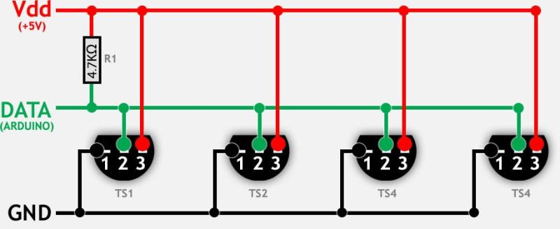
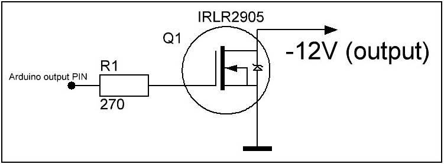
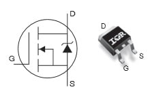
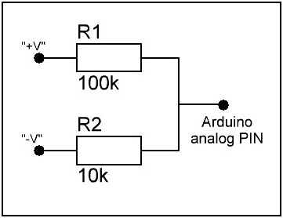
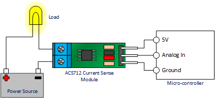
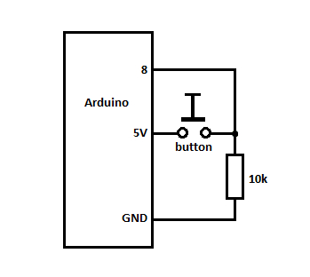
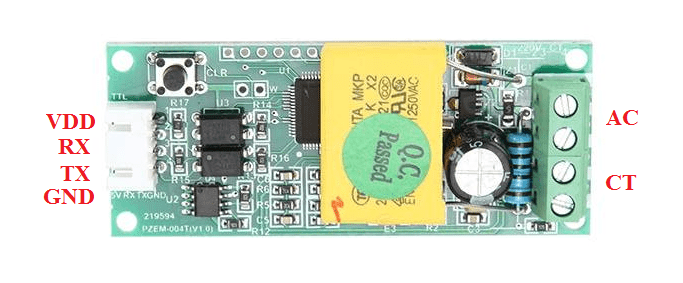
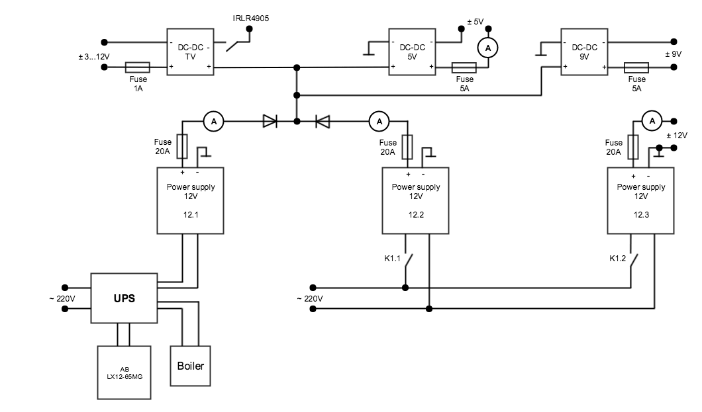

# Power supply for smart flat

- [Power supply for smart flat](#power-supply-for-smart-flat)
  - [Description](#description)
    - [Controller main functions](#controller-main-functions)
  - [Requirements and components](#requirements-and-components)
    - [Components](#components)
  - [Commands](#commands)
  - [Scematic](#scematic)

## Description

- **Power supply 12V**
  - 3 х [12V 20А (240W)](https://www.aliexpress.com/snapshot/0.html?spm=a2g0s.9042647.6.2.XV7h5b&orderId=85391266646669&productId=32641174763) (1st connected to UPS, 2nd (for additional power) and 3rd - connected directly to ~220V)
  - 3 х 20А fuses
  - 1 х [MBR4045WT](https://www.vishay.com/docs/94295/mbr4045wt.pdf) (diode Schottky)
  - 1 х 12V relay for 2nd (reserve) and 3rd (220V line) power supplies

- **Power supply 9V**
  - 1 х 9В 5А DC-DC module
  - 1 х 5А fuse

- **Power supply 5V**
  - 1 х [5В 5А DC-DC module](https://www.aliexpress.com/item/24V-12V-To-5V-5A-DC-DC-Buck-Step-Down-Power-Supply-Module-Synchronous-Rectification-Power/32689938167.html?spm=a2g0s.9042311.0.0.rEmmiM)
  - 1 х 5А fuse

- **Power supply 3V - 12V (for TV amplifier)**
  - 1 х [Step-down 3A DC-DC Converter](https://www.aliexpress.com/item/J34-Free-Shipping-3pcs-lot-Standard-Power-Supply-Module-Adjustable-Step-down-3A-DC-DC-Converter/32578790816.html?spm=a2g0s.9042311.0.0.H9LRbI)
  - 1 х 1А fuse

### Controller main functions

- voltage, current and power consuming monitoring on each power source;
- measuring temperature on all 12V power supplies;
- measuring input (in apartment): _voltage_, _current_, _power_ and _energy_ via _PZEM-004T_ module;
- enabling a backup power source (in the event of a main power supply failure or the need for additional power);
- turn On/Off (by button or remotely) power supply connected to 220V line;
- turn On/Off (by button or remotely) power supply for TV amplifier;
- device can be controlled remotely and send data to some device (like server) by [PJON](https://github.com/gioblu/PJON) protocol

## Requirements and components

**Controller**: Arduino Pro Mini 328 - 5V/16MHz

| Arduino PIN | Component | Notes |
| --- | --- | --- |
| D2 (Ext. Int.) | DS18B20   DS18B20   DS18B20 | Temperature sensor (power supply 12.1)   Temperature sensor (power supply 12.2)   Temperature sensor (power supply 12.3) |
| D3 (PWM) | PJON v10.1 ([SoftwareBitBang](https://github.com/gioblu/PJON/tree/master/strategies/SoftwareBitBang "SoftwareBitBang")) | Communication with Server |
| D4  | Relay 1 | On/Off power supply 12.2 (reserve) |
| D5 (PWM) | Relay 2 | On/Off power supply 12.3 (220V line) |
| D6 (PWM) | Button | On/Off power supply 12.3 (220V line) |
| D7  | PZEM-004T (TX) | Monitor output: V, A, W and Wh |
| D8  | PZEM-004T (RX) | Monitor output: V, A, W and Wh |
| D9 (PWM) |     |     |
| D10 (PWM) |     |     |
| D11 (PWM) |     |     |
| D12 | Button | On/Off TV DC-DC converter |
| D13 | IRLR2905 | On/Off TV DC-DC converter |
| A0  | Voltmeter: r1=100k, r2=10k | Voltage of power supply 12.1 (104.4k, 9.97k) |
| A1  | Voltmeter: r1=100k, r2=10k | Voltage of power supply 12.2 (100.7k, 9.86k) |
| A2  | Voltmeter: r1=100k, r2=10k | Voltage of power supply 12.3 (100.7k, 9.92k) |
| A3  | Voltmeter: r1=100k, r2=10k | Voltage of DC-DC 5V (97.5k, 9.86k) |
| A4  | ACS712-20 | Current of power supply 12.1 |
| A5  | ACS712-20 | Current of power supply 12.2 |
| A6  | ACS712-20 | Current of power supply 12.3 |
| A7  | ACS712-5 | Current of DC-DC 5V |

### Components

| Name | Scema/ Photo |
| --- | --- |
| DS18B20 |  |
| IRLR2905 |   |
| Voltmeter |  |
| ACS712 |  |
| Button |  |
| PZEM-004T |  |

## Commands

| Command | Description | EEPROM | Auto push | Note |
| --- | --- | --- | --- | --- |
| T-\[1-3\] | Read temperature of sensors 1-3 | -   | \+ (auto push every 1 minute) | °C, 12V power supplies |
| T-\[1-3\]-a | Read value of "auto push" for 1-3 sensors | -   | -   | 0 - disabled; 1 - enabled |
| T-\[1-3\]-a-\[0,1\] | Disable/Enable "auto push" for 1-3 sensors | +   | -   | 0 - disable (default); 1 - enable |
| P-\[v,i,p\]-\[1-4\] | Read \[voltage, current, power consuming\] on PS \[12.1, 12.2, 12.3, 5V\] | -   | \+ (auto push every 1 minute) | \[V,A,W\] |
| P-\[v,i,p\]-\[1-4\]-a | Read value of "auto push" for \[v,i,p\] | -   | -   | 0 - disabled; 1 - enabled |
| P-\[v,i,p\]-\[1-4\]-a-\[0,1\] | Disable/Enable "auto push" for \[v,i,p\] | +   | -   | 0 - disable (default); 1 - enable |
| I-\[v,i,p,e\] | Read input (in apartment) \[voltage, current, power, energy\] | -   | \+ (auto push every 1 minute) | \[Volt, Amper, Watt, Watt-hour\] |
| I-\[v,i,p,e\]-a | Read value of "auto push" for \[voltage, current, power, energy\] | -   | -   | 0 - disabled; 1 - enabled |
| I-\[v,i,p,e\]-a-\[0,1\] | Disable/Enable "auto push" for \[voltage, current, power, energy\] | +   | -   | 0 - disable (default); 1 - enable |
| S-\[1-3\] | Read status of switches \[TV DC-DC, relay power supply 12.2, 12.3 \] | -   | -   | 0 - turned OFF; 1 - turned ON |
| S-\[1-3\]-\[0,1\] | OFF/ON switches \[TV DC-DC, relay power supply 12.2, 12.3 \] | +   | -   | 0 - turn OFF (default); 1 - turn ON |
| E   | Read value of events | -   | -   | 0 - disabled; 1 - enabled |
| E-\[0,1\] | Disable/Enable events (send status of switch when button pressed) | +   | -   | 0 - disable (default); 1 - enable |

## Scematic

